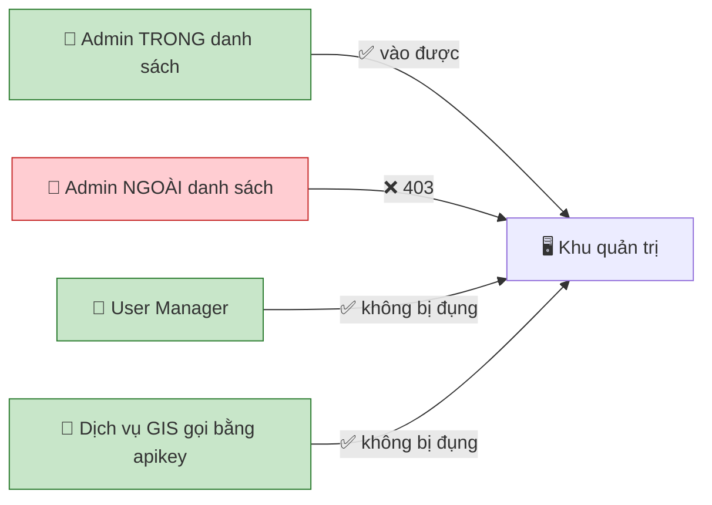
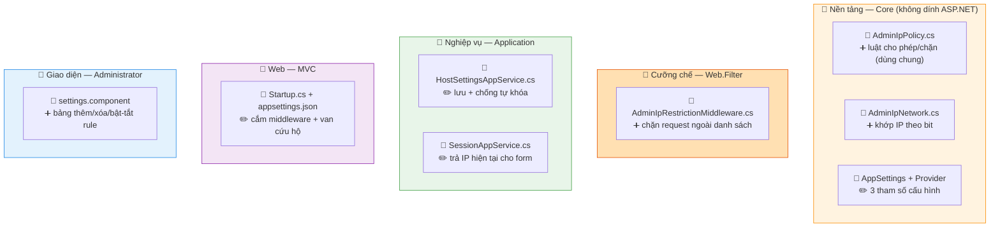
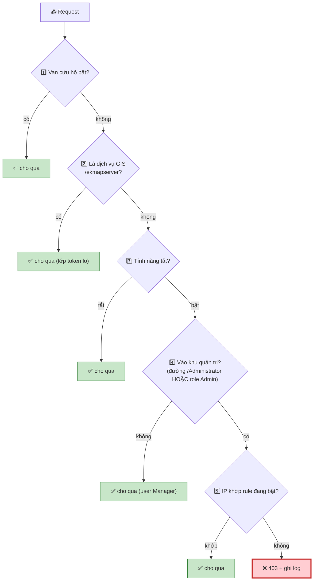
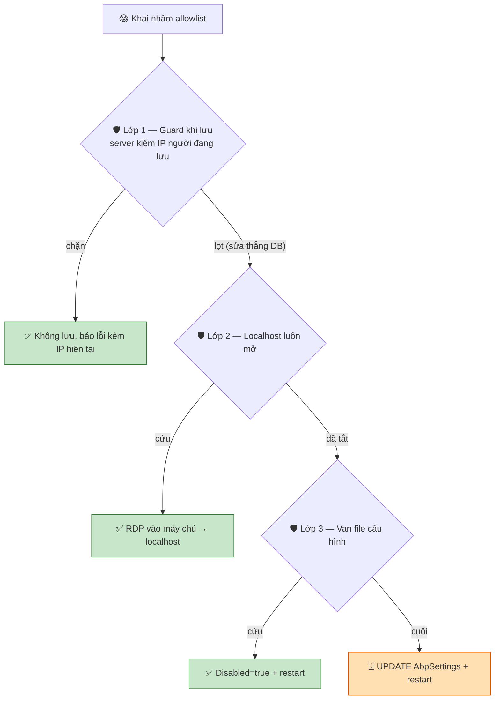
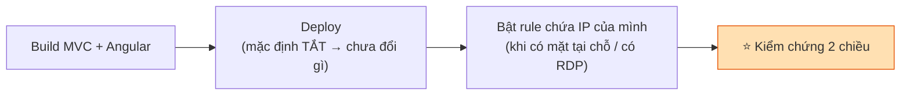

# Giới hạn địa chỉ mạng truy cập khu vực quản trị

> Chỉ các IP / dải mạng **đã khai trước** mới vào được khu vực quản trị. Mọi IP khác bị chặn (**default-deny**). Không migration, không cần SQL.

## 1. Làm gì — ai bị ảnh hưởng



!!! danger "Danh sách ĐƯỢC PHÉP, không phải danh sách BỊ CHẶN"
    Không khớp gì cả → **CHẶN**. Lý do: kẻ tấn công đến từ **bất kỳ IP nào**, không liệt kê hết được; người được phép thì **hữu hạn, biết trước**. → Hệ quả: **khai thiếu IP của chính mình = tự khóa** (xem §5).

## 2. File nào — sửa gì

> ➕ thêm mới · ✏️ sửa



## 3. Cách hoạt động — 5 cửa gạt

Mỗi cửa gạt ra là **cho qua luôn**; chỉ số ít request tới bước so IP.



!!! danger "Chặn theo ĐƯỜNG DẪN thôi là THỦNG"
    Trang `/Administrator` chỉ là cái vỏ. Chức năng quản trị thật đi qua API `/api/services/app/HostSettings/UpdateAllSettings`... — **không đường nào bắt đầu bằng `/Administrator`**. Vì vậy cửa 4 chặn theo **cả đường dẫn lẫn danh tính Admin** (role trong cookie), nếu không kẻ tấn công gọi thẳng API là lách được.

## 4. Cấu hình (3 tham số, lưu trong AbpSettings)

| Tham số | Mặc định |
|---|---|
| Bật/tắt giới hạn | Tắt (`false`) |
| Danh sách rule (CIDR + mô tả + bật/tắt) | Rỗng (`[]`) |
| Luôn cho phép localhost | Bật (`true`) |

Mô tả **bắt buộc** cho mỗi rule (6 tháng sau không ai nhớ `10.0.0.0/24` là gì → không ai dám xóa). Deploy xong 3 tham số tự có mặc định, bảng vẫn trống — **không cần chạy SQL**.

## 5. Chống tự khóa — 3 lớp



!!! danger "Nếu lỡ tự khóa — theo thứ tự"
    1. Truy cập từ **chính máy chủ** (localhost luôn mở).
    2. `"AdminIpRestriction": { "Disabled": true }` trong `appsettings.json` → restart.
    3. Đường cuối:
       ```sql
       UPDATE AbpSettings SET Value='false'
       WHERE Name='App.Security.AdminIpRestriction.IsEnabled';
       ```
       **Phải restart** để nhả cache setting.

## 6. Hai bẫy về mạng (hỏi bên vận hành trước khi bật)

!!! warning "Có reverse proxy không?"
    Nếu chạy sau proxy mà **không** khai `ForwardedHeaders:KnownProxies` = IP proxy → server thấy **mọi request đến từ IP proxy** → chính sách vô nghĩa (cho qua tất cả hoặc chặn tất cả). Không proxy thì để **rỗng**. Đây là câu hỏi vận hành, không suy từ code được.

!!! warning "NAT — admin không tự biết IP của mình"
    `ipconfig` cho IP nội bộ (`192.168.1.25`), nhưng nếu server ở ngoài Internet thì server thấy **IP công cộng** của cả văn phòng. Khai nhầm IP nội bộ = tự khóa. → Form **bắt buộc hiện "địa chỉ hiện tại của bạn"**. IP động (cáp quang nhà) đổi thường xuyên → nên dùng **IP tĩnh** hoặc **VPN công ty**.

## 7. Triển khai & kiểm chứng



- Máy **ngoài** allowlist (4G) mở `/Administrator` → phải **403**.
- apikey gọi `/ekmapserver/...` từ IP ngoài → phải **200** (dịch vụ GIS không bị vạ lây).

> Đã có **52 unit test** phủ phép khớp IP (chạy không cần web/DB).
