# Giới hạn địa chỉ mạng được phép truy cập khu vực quản trị hệ thống

**Ngày:** 2026-07-17 · **Trạng thái:** ✅ Đã triển khai (52 unit test pass) · **Không có migration, không cần chạy SQL**

---

## 1. Chức năng này làm gì

> Chỉ những địa chỉ IP / dải mạng **đã khai báo trước** mới truy cập được **khu vực quản trị hệ thống** từ bên ngoài. Mọi địa chỉ khác bị chặn.

Yêu cầu:

| | Yêu cầu | Đáp ứng ở |
|---|---|---|
| **a)** | **Giao diện** cho phép cấu hình danh sách địa chỉ IP / dải mạng được phép truy cập khu vực quản trị hệ thống từ bên ngoài | [§6 — màn hình cấu hình](#ui) |
| **b)** | **Chức năng** cho phép cấu hình danh sách nói trên | [§6.2 — lưu & validate](#ui) + [§5 — cưỡng chế](#luong-cuong-che) |

!!! note "Vì sao (b) bao gồm cả phần cưỡng chế"
    Câu (b) nói *"chức năng cho phép cấu hình"*. Đọc sát chữ thì đó chỉ là phần backend lưu cấu hình. Nhưng **cấu hình một danh sách mà không cưỡng chế thì chỉ còn cái vỏ** — danh sách nằm im, không chặn ai. Nên (b) được hiểu là "chức năng đằng sau giao diện", gồm cả lưu, validate và thi hành.

### Ai bị ảnh hưởng, ai không

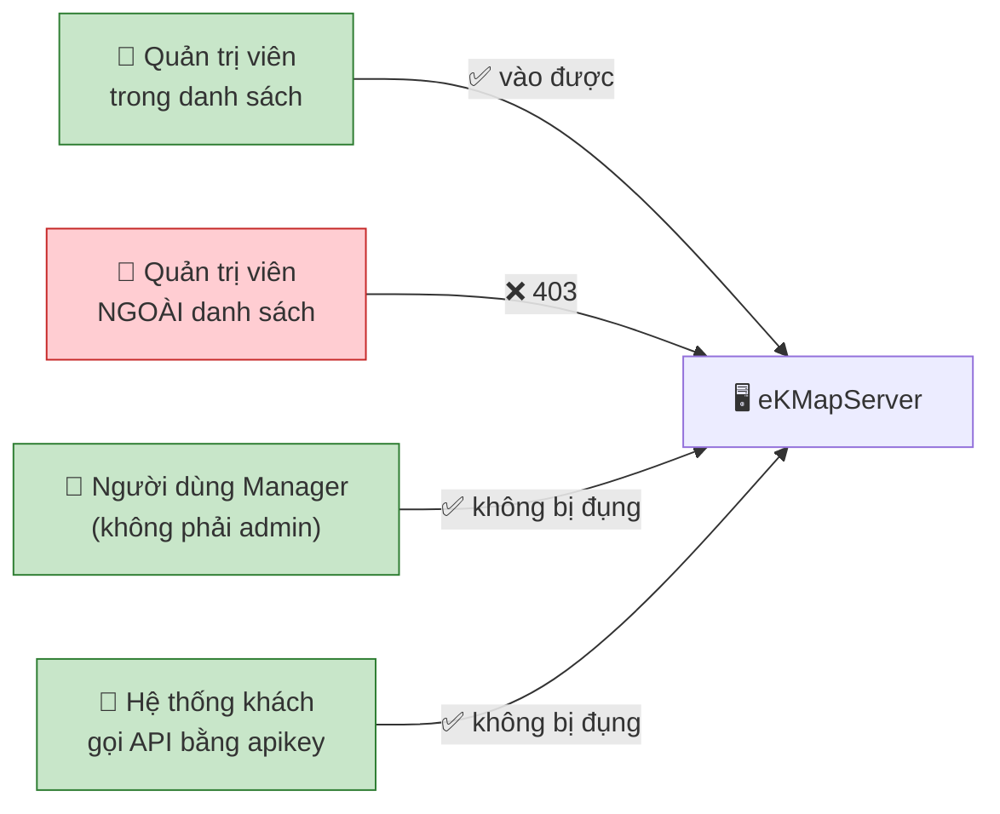

!!! danger "Đây là danh sách ĐƯỢC PHÉP, không phải danh sách BỊ CHẶN"
    Khác biệt nằm ở **mặc định khi không khớp gì cả**:

    ```mermaid
    flowchart TD
        Q{"IP có trong danh sách?"}
        Q -->|"có"| A["✅ cho qua"]
        Q -->|"KHÔNG"| B["❌ CHẶN"]
        style B fill:#ffcdd2,stroke:#c62828
    ```

    Gọi là **default-deny**. Lý do bắt buộc phải vậy: kẻ tấn công đến từ **bất kỳ IP nào trên đời** — không liệt kê hết được. Còn người được phép thì **hữu hạn và biết trước** (văn phòng, VPN, vài IP tĩnh). Nên liệt kê cái hữu hạn, chặn phần còn lại.

    → Hệ quả trực tiếp: **khai thiếu IP của chính mình là tự khoá vĩnh viễn**. Xem [§7](#self-lockout).

---

## 2. Bản đồ code — cái gì nằm ở đâu {#ban-do-code}

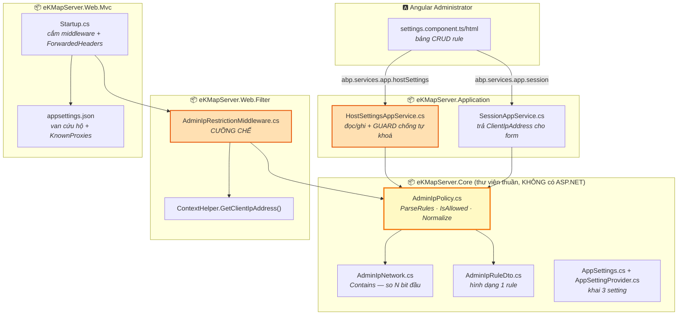

!!! question "Vì sao `AdminIpPolicy` nằm ở `Core` mà không nằm cạnh middleware?"
    Vì **hai nơi cùng cần nó**, và chúng ở hai tầng khác nhau:

    ```mermaid
    flowchart LR
        MW["Middleware<br/>(Web.Filter)"] -->|"cưỡng chế"| P["AdminIpPolicy<br/>(Core)"]
        HS["AppService<br/>(Application)"] -->|"guard khi lưu"| P

        style P fill:#fff9c4,stroke:#f57f17,stroke-width:3px
    ```

    Chiều phụ thuộc project là `Application ← Web.Core ← Web.Filter`. Đặt policy ở `Web.Filter` thì **AppService không gọi được** ⇒ mất guard chống tự khoá. `Core` là nơi duy nhất cả hai với tới.

    Hệ quả: `Core` không có ASP.NET Core ⇒ **không dùng được `HttpOverrides.IPNetwork`** ⇒ tự viết `AdminIpNetwork` (`net5.0` cũng chưa có `System.Net.IPNetwork`, mãi .NET 8 mới có). Bù lại: **52 test** phủ kín phép so bit.

---

## 3. Ba setting — toàn bộ dữ liệu của chức năng

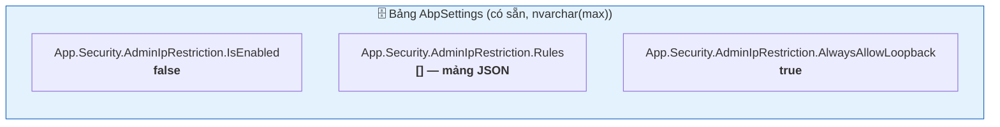

Một rule trông như thế này:

```json
[
  { "cidr": "192.168.1.0/24", "description": "Văn phòng Hà Nội",        "isActive": true,  "createdBy": 1, "createdTime": "2026-07-17T10:00:00" },
  { "cidr": "203.0.113.9",    "description": "IP tĩnh anh A làm từ xa", "isActive": true,  "createdBy": 1, "createdTime": "2026-07-17T10:05:00" },
  { "cidr": "10.0.0.0/8",     "description": "VPN — tạm tắt",           "isActive": false, "createdBy": 1, "createdTime": "2026-07-16T09:00:00" }
]
```

### Vòng đời một rule

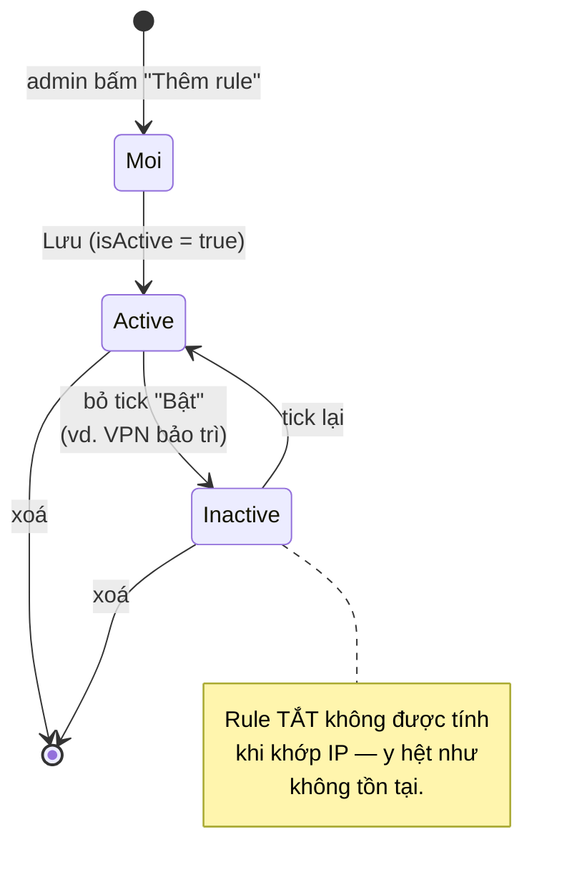

!!! warning "Vì sao `description` bắt buộc"
    Nhìn `10.0.0.0/24` sáu tháng sau, không ai nhớ đó là mạng gì → **không ai dám xoá** → danh sách phình mãi → mất hết ý nghĩa bảo vệ. Ép mô tả là **kiểm soát vận hành**, không phải hình thức.

!!! success "Không cần chạy SQL nào {#khong-can-sql}"
    `AbpSettings` **không phải danh mục setting** — nó chỉ lưu **giá trị đã bị đổi khác mặc định**.

    ```mermaid
    flowchart TD
        Q1{"Có row trong<br/>AbpSettings?"} -->|"có"| V1["dùng giá trị đó"]
        Q1 -->|"không"| Q2{"appsettings.json có<br/>key App:&lt;tên setting&gt;?"}
        Q2 -->|"có"| V2["dùng giá trị đó"]
        Q2 -->|"không"| V3["dùng default hardcode<br/>trong AppSettingProvider<br/><b>false / [] / true</b>"]

        style V3 fill:#c8e6c9,stroke:#2e7d32
    ```

    → Deploy code xong, 3 setting **tự có giá trị**, bảng `AbpSettings` vẫn trống trơn. Row đầu tiên chỉ sinh khi admin bấm Lưu.

---

## 4. Hai lớp chính sách IP — khác trục, không được trộn {#hai-lop}

Hệ thống đã có **một** lớp allowlist IP từ trước. Lớp mới **không** thay thế nó.

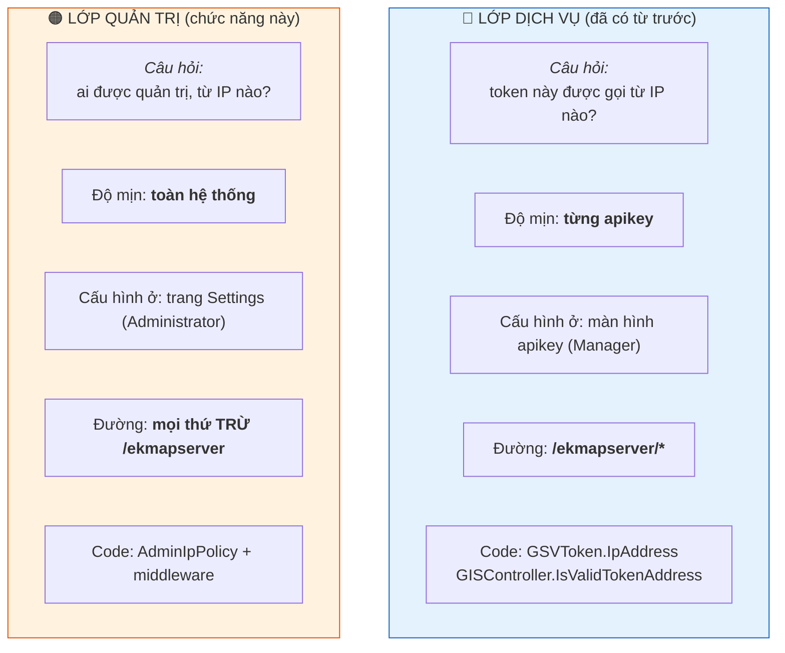

→ Vì vậy middleware **loại trừ `/ekmapserver`**: surface đó đã có lớp của nó quản. Áp thêm allowlist quản trị lên đó nghĩa là bắt mọi hệ thống khách phải nằm trong dải mạng của quản trị viên — **vô nghĩa nghiệp vụ và chết dịch vụ ngay khi bật**.

!!! bug "Bug thật trong lớp dịch vụ — đừng sao chép"
    `GISController.Validation.cs:69` khớp IP bằng **tiền tố chuỗi**, và còn ngược chiều:

    ```csharp
    if (IpAdress.StartsWith(ip)) { return null; }   // ❌ SAI
    ```

    ```mermaid
    flowchart LR
        A["allowlist: 192.168.1.10"] --> C{"StartsWith?"}
        B["client: 192.168.1.1"] --> C
        C -->|"'192.168.1.10'.StartsWith('192.168.1.1')<br/>= TRUE"| D["❌ CHO QUA<br/>một máy KHÁC hoàn toàn"]
        style D fill:#ffcdd2,stroke:#c62828
    ```

    Lớp quản trị **bắt buộc** khớp trên bit ([§8](#matching)). Lỗi ở lớp token nằm ngoài phạm vi — cần sửa riêng.

---

## 5. Luồng CƯỠNG CHẾ — một request đi từ đâu đến đâu {#luong-cuong-che}

### 5.1. Toàn cảnh: request đi qua những trạm nào

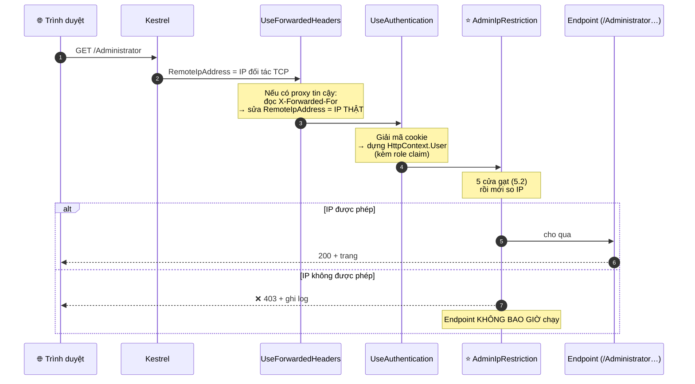

!!! info "Vì sao middleware phải nằm đúng chỗ đó"
    ```mermaid
    flowchart LR
        A["UseForwardedHeaders"] --> B["UseAuthentication"] --> C["⭐ AdminIpRestriction"] --> D["UseAuthorization"] --> E["Endpoint"]
        style C fill:#ffe0b2,stroke:#e65100,stroke-width:3px
    ```

    | Mốc | Vì sao |
    |---|---|
    | **Sau** `UseForwardedHeaders` | Cần IP đã được sửa đúng, không phải IP proxy |
    | **Sau** `UseAuthentication` | Cần `HttpContext.User` để biết ai là Admin. Đặt trước ⇒ `User` luôn ẩn danh ⇒ **mất một nửa phạm vi cưỡng chế, mà lại IM LẶNG** |
    | **Trước** `UseAuthorization` + endpoint | Từ chối phải xảy ra **trước khi code nghiệp vụ chạy** |

### 5.2. Bên trong middleware: 5 cửa gạt

Mỗi cửa gạt ra là **cho qua luôn** — chỉ số ít request thật sự đi tới phép so IP.

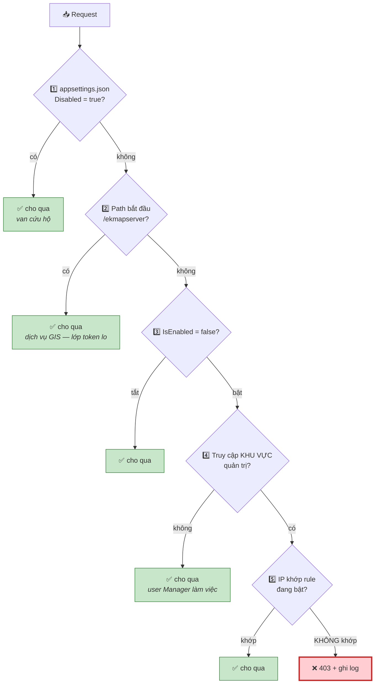

**Cửa 4 — "khu vực quản trị hệ thống" nhận diện thế nào** {#khu-vuc}

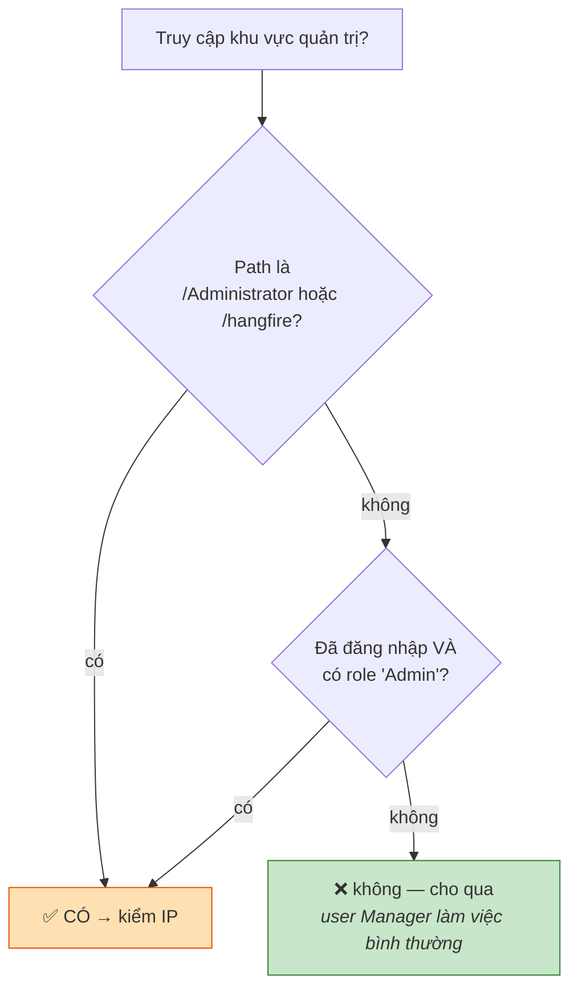

!!! danger "Vì sao chặn theo ĐƯỜNG DẪN thôi là THỦNG"
    Trang `/Administrator` **chỉ là cái vỏ HTML + JS**. Mọi việc thật sự đi qua đường khác — trích từ chính app đang chạy (`/AbpServiceProxies/GetAll`):

    ```
    /api/services/app/HostSettings/UpdateAllSettings   ← SỬA CẤU HÌNH HỆ THỐNG
    /api/services/app/User/Create                      ← TẠO TÀI KHOẢN
    /api/services/app/Role/Create                      ← TẠO VAI TRÒ
    /api/services/app/AuditLog/DeleteLog               ← XOÁ NHẬT KÝ
    ```

    **Không đường nào bắt đầu bằng `/Administrator`.**

    ```mermaid
    flowchart TD
        A["👤 Admin ngoài allowlist<br/>(vẫn giữ cookie hợp lệ)"] --> B["① GET /Administrator"]
        B --> B1["✅ 403 — chặn được cái vỏ"]
        A --> C["② curl POST /api/services/app/<br/>HostSettings/UpdateAllSettings<br/>+ cookie admin"]
        C --> D{"Chỉ chặn theo đường dẫn?"}
        D -->|"CÓ"| E["❌ path không phải /Administrator<br/>⇒ CHO QUA<br/>⇒ sửa được cấu hình từ IP ngoài"]
        D -->|"+ cửa danh tính"| F["✅ cookie mang role Admin<br/>⇒ kiểm IP ⇒ 403"]

        style E fill:#ffcdd2,stroke:#c62828,stroke-width:3px
        style F fill:#c8e6c9,stroke:#2e7d32
    ```

    **Khoá cửa chính, để ngỏ cửa sổ.** Kẻ tấn công không cần cái vỏ Angular — họ gọi thẳng API.

!!! question "Sao không gộp `/api/services/app` vào danh sách khu vực cho gọn?"
    Vì **user Manager cũng gọi đúng tiền tố đó** (`/api/services/app/GSVMap/...`). ABP đặt **mọi** app service dưới một tiền tố duy nhất — không tách được bằng đường dẫn. Gộp vào là chặn oan Manager.

| Điều kiện | Bắt được gì | Vì sao chưa đủ một mình |
|---|---|---|
| **Đường dẫn** (`/Administrator`, `/hangfire`) | Cửa vào chính, **kể cả khi chưa đăng nhập** | Không bao được API quản trị ở `/api/services/app/*` |
| **Danh tính Admin** | Mọi request của tài khoản quản trị, **mọi đường dẫn** — kể cả API nói trên | Không bao được lúc **chưa** có danh tính |

!!! info "Cửa danh tính KHÔNG mở rộng phạm vi ra ngoài yêu cầu"
    Câu hỏi mấu chốt: *gọi `HostSettings/UpdateAllSettings` có phải là "truy cập khu vực quản trị hệ thống" không?* — **Có.** Đó chính là chức năng quản trị, chỉ khác cái URL.

    Yêu cầu muốn bảo vệ **năng lực quản trị**, không phải bảo vệ một trang HTML. Cửa danh tính chỉ **nhận diện đúng và đủ** khu vực đó, kể cả khi nó được truy cập qua URL không mang chữ "Administrator".

    Bỏ cửa này thì vẫn "qua bài kiểm tra" nếu người duyệt chỉ thử mở `/Administrator` từ ngoài — nhưng tính năng **thực chất là thủng**.

!!! check "Role claim nằm sẵn trong cookie — `IsInRole` không tốn query"
    Đã kiểm chứng: `UserClaimsPrincipalFactory : AbpUserClaimsPrincipalFactory<User, Role>` kế thừa factory của ASP.NET Identity, nên role claim được nhét vào cookie lúc đăng nhập.

    Tương tự, đọc setting mỗi request **không chạm DB**: `Abp.dll` có `AbpApplicationSettingsCache`.

!!! danger "`StartsWithSegments` chứ KHÔNG phải `string.StartsWith`"
    ```mermaid
    flowchart LR
        A["/ekmapserverEVIL/..."] --> B{"string.StartsWith<br/>('/ekmapserver')"}
        B -->|"TRUE 😱"| C["❌ lách sạch chính sách"]
        A --> D{"PathString.StartsWithSegments"}
        D -->|"FALSE ✅"| E["bị chặn đúng"]
        style C fill:#ffcdd2,stroke:#c62828
        style E fill:#c8e6c9,stroke:#2e7d32
    ```

    `StartsWithSegments` khớp theo **ranh giới `/`** và **không phân biệt hoa thường**. Đây đúng **cùng loại lỗi** với bug `StartsWith` ở lớp token ([§4](#hai-lop)) — trong repo này nó đã cắn một lần rồi.

### 5.3. Hình dạng phản hồi khi bị chặn {#deny-response}

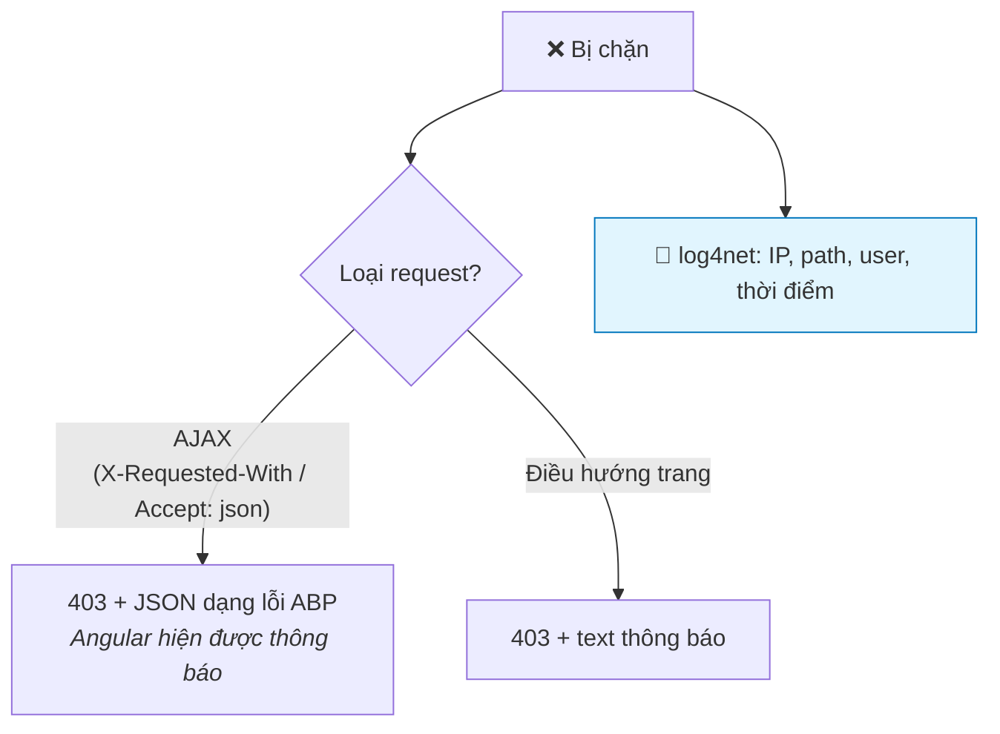

!!! warning "Không tiết lộ chi tiết chính sách cho phía bị chặn"
    Thông báo chỉ là *"Địa chỉ mạng của bạn không được phép truy cập chức năng quản trị."* — **không** kèm allowlist, không kèm "dải được phép là X". Đây là mặt tiền đối diện kẻ tấn công tiềm năng; chi tiết chỉ nằm trong **log server**.

    Log là bắt buộc: không có nó thì ca *"bị tấn công"* và ca *"admin thật bị chặn oan"* **nhìn giống hệt nhau**.

---

## 6. Luồng CẤU HÌNH — admin thêm rule và lưu {#ui}

### 6.1. Màn hình (tab *Securitysettings*, trang Settings)

```
┌─ Giới hạn địa chỉ mạng quản trị ─────────────────────────────────────────┐
│ ☑ Bật giới hạn địa chỉ mạng được phép quản trị từ xa                     │
│                                                                          │
│  Bật │ Dải mạng / IP      │ Mô tả                    │                   │
│  ────┼────────────────────┼──────────────────────────┼────────────────── │
│   ☑  │ 192.168.1.0/24     │ Văn phòng Hà Nội         │ 🗑                │
│   ☑  │ 203.0.113.9        │ IP tĩnh anh A làm từ xa  │ 🗑                │
│   ☐  │ 10.0.0.0/8         │ VPN — tạm tắt            │ 🗑                │
│                                                          [ + Thêm rule ] │
│                                                                          │
│  ☑ Luôn cho phép localhost (127.0.0.1, ::1)                              │
│                                                                          │
│  ✅ Địa chỉ hiện tại của bạn: 192.168.1.25 — đang được cho phép bởi rule │
│     "Văn phòng Hà Nội".                                                  │
│                                                                          │
│  ℹ Chính sách này KHÔNG áp dụng cho dịch vụ GIS (/ekmapserver).          │
└──────────────────────────────────────────────────────────────────────────┘
```

Bốn chi tiết là **yêu cầu chức năng**, không phải trang trí:

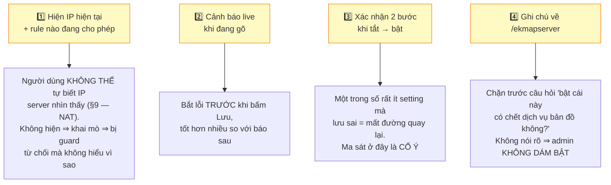

### 6.2. Bấm Lưu thì chuyện gì xảy ra

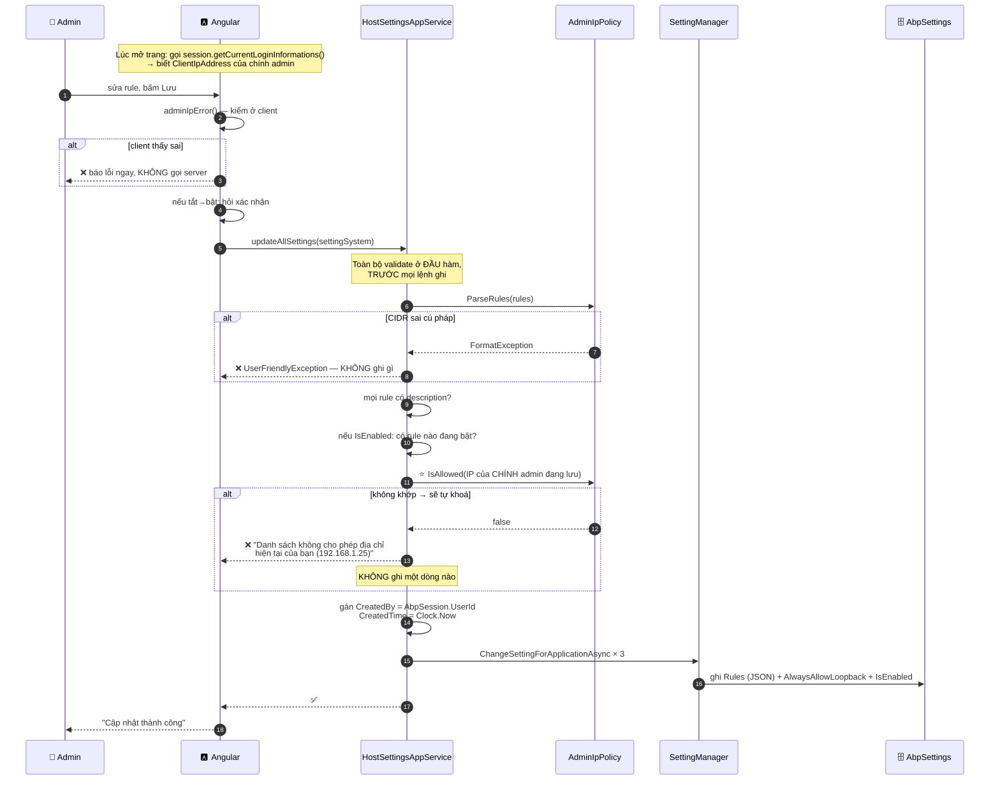

!!! danger "Vì sao guard ở SERVER là bắt buộc, client chặn không đủ"
    ```mermaid
    flowchart TD
        A["Admin gõ '10.0.0.0/8'"] --> B{"Cú pháp đúng?"}
        B -->|"ĐÚNG — form thấy hợp lệ"| C["Client cho qua ✅"]
        C --> D{"Nhưng IP thật của admin<br/>có nằm trong 10.0.0.0/8?"}
        D -->|"KHÔNG — admin đang ở 192.168.1.25"| E["❌ TỰ KHOÁ"]
        E --> F["Chỉ SERVER biết IP thật<br/>của người đang bấm Lưu"]

        style E fill:#ffcdd2,stroke:#c62828
        style F fill:#fff9c4,stroke:#f57f17,stroke-width:3px
    ```

    Client **không thể** biết. Và POST thẳng qua Postman thì bỏ qua client hoàn toàn.

!!! note "`createdBy` do SERVER gán"
    Client gửi lên bao nhiêu cũng bị ghi đè bằng `AbpSession.UserId`. Nếu tin client thì dấu vết *"ai thêm rule này"* giả mạo được ⇒ vô giá trị. Rule đã có từ trước thì **giữ nguyên dấu vết gốc**, không bị làm mới mỗi lần lưu.

---

## 7. Chống tự khoá — ba lớp {#self-lockout}

Đây là rủi ro lớn nhất của chức năng, và là **cái giá của mô hình allowlist** ([§1](#1-chức-năng-này-làm-gì)).

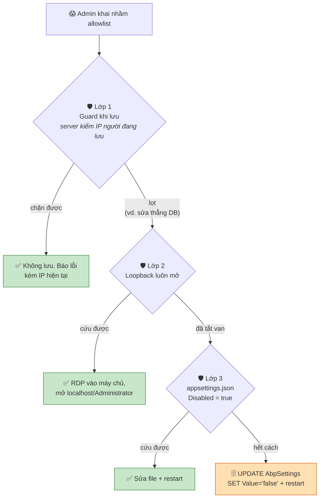

| Lớp | Chặn tình huống | Vì sao an toàn |
|---|---|---|
| **1. Guard khi lưu** | Gõ nhầm / quên IP của mình — **tuyệt đại đa số ca** | — |
| **2. Loopback luôn mở** | Cần cứu hộ tại chỗ | Vào được `127.0.0.1` nghĩa là **đã ngồi trước máy chủ** |
| **3. Van file cấu hình** | Cứu hộ cuối | Sửa được file nghĩa là **đã vào được máy chủ** — không phải đường leo thang từ xa |

!!! danger "Ca tự khoá tinh vi mà mô hình `isActive` tạo ra"
    ```mermaid
    flowchart LR
        A["Admin ở 192.168.1.25"] --> B["Rule 'Văn phòng' 192.168.1.0/24<br/>➡️ bỏ tick 'Bật'"]
        B --> C["Cú pháp vẫn đúng ✅<br/>Rule vẫn còn trong danh sách ✅"]
        C --> D["❌ Nhưng rule TẮT không được tính<br/>⇒ tự khoá"]
        style D fill:#ffcdd2,stroke:#c62828
    ```

    Guard bắt được vì nó gọi **đúng `AdminIpPolicy.IsAllowed` mà middleware dùng** — cùng một hàm, cùng một luật, không thể lệch nhau.

---

## 8. Cơ chế khớp IP {#matching}

### 8.1. IP là một CON SỐ, không phải chuỗi

```
192.168.1.25  →  11000000.10101000.00000001.00011001  →  3232235801
                 └─192─┘ └─168──┘ └──1───┘ └──25──┘
```

### 8.2. `/24` nghĩa là "24 bit đầu phải giống"

```
192.168.1.0/24
11000000.10101000.00000001 . 00000000
└────── 24 bit khoá ──────┘  └8 bit tự do┘  →  2⁸ = 256 địa chỉ (.0 → .255)
```

| CIDR | Bit tự do | Số IP | Thường là |
|---|---|---|---|
| `/32` | 0 | **1** | đúng một máy |
| `/24` | 8 | 256 | một văn phòng nhỏ |
| `/16` | 16 | 65.536 | mạng lớn |
| `/8` | 24 | ~16,7 triệu | cả dải `10.x.x.x` |
| `/0` | 32 | **tất cả** | mọi IP |

**Prefix càng lớn ⇒ dải càng nhỏ.**

### 8.3. Khớp = một phép AND rồi so sánh

```
Client 192.168.1.25 :  11000000.10101000.00000001.00011001
Mask   /24          :  11111111.11111111.11111111.00000000
AND                 =  11000000.10101000.00000001.00000000  = 192.168.1.0  ✅ KHỚP

Client 192.168.2.1  :  11000000.10101000.00000010.00000001
AND mask            =  11000000.10101000.00000010.00000000  = 192.168.2.0  ❌ ≠ 192.168.1.0
```

Phép AND chỉ là *"xoá sạch phần bit tự do, giữ phần mạng"*. Rồi so hai số. Đó là toàn bộ `AdminIpNetwork.Contains`.

!!! warning "Mặt nạ KHÔNG cố định `255.255.255.0` — mỗi rule mang mặt nạ riêng"
    Ví dụ trên dùng `/24` nên mặt nạ là `255.255.255.0`. **Đó chỉ là một trường hợp.** Mặt nạ lấy từ prefix của **chính rule đang xét**, nên mỗi rule một khác:

    | Rule | Mặt nạ tương đương | So bao nhiêu |
    |---|---|---|
    | `10.0.0.0/8` | `255.0.0.0` | 1 byte đầu |
    | `192.168.0.0/16` | `255.255.0.0` | 2 byte đầu |
    | `192.168.1.0/24` | `255.255.255.0` | 3 byte đầu |
    | `192.168.1.0/28` | `255.255.255.240` | 3 byte + 4 bit |
    | `203.0.113.9` (→ `/32`) | `255.255.255.255` | cả 4 byte |

    Code không hardcode mặt nạ nào cả — nó tính từ `PrefixLength` (`AdminIpNetwork.cs:60-73`):

    ```csharp
    var fullBytes = PrefixLength / 8;      // số byte so nguyên vẹn
    var remainingBits = PrefixLength % 8;  // số bit lẻ ở byte kế tiếp
    // ... so fullBytes byte đầu, rồi mask byte lẻ:
    var mask = (byte)(0xFF << (8 - remainingBits));
    ```

    **Vì sao phải nhớ điều này:** nếu ai đó mô tả cơ chế là "AND với `255.255.255.0`" rồi đem đi hiện thực lại hoặc đi giải trình, thì rule `/16` sẽ bị hiểu sai thành `/24` ⇒ **chặn nhầm người hợp lệ**, mà triệu chứng lại rất khó ngờ vì phần lớn rule trong thực tế đúng là `/24`.

    Cũng lưu ý: **duyệt qua từng rule**, mỗi rule mask theo prefix của nó. Không phải mask client IP một lần rồi so với cả danh sách.

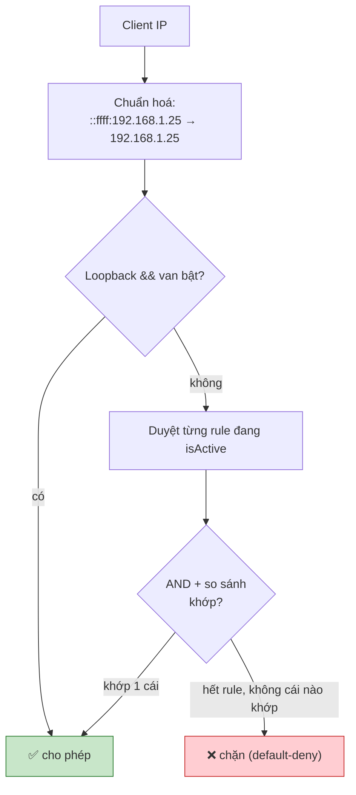

### 8.4. Chuẩn hoá: mọi thứ về một dạng CIDR

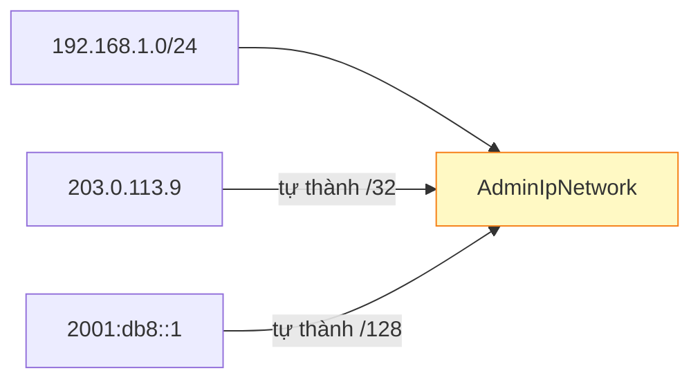

Nhờ vậy phía sau chỉ còn **một phép khớp duy nhất**, không phân nhánh theo kiểu nhập. *(Dạng dải `a-b` cố ý không hỗ trợ — dải nào cũng biểu diễn được bằng vài CIDR, bớt tiện một chút đổi lấy bề mặt lỗi nhỏ hơn.)*

!!! bug "Bẫy `::ffff:192.168.1.25` — IPv4 bọc trong IPv6"
    ```mermaid
    flowchart LR
        A["Client IPv4 nối vào<br/>Kestrel dual-stack"] --> B[".NET trả<br/>::ffff:192.168.1.25<br/><i>AddressFamily = IPv6</i>"]
        B --> C{"So với rule<br/>192.168.1.0/24 (IPv4)"}
        C -->|"KHÔNG gỡ bọc"| D["❌ khác AddressFamily<br/>⇒ chặn nhầm ADMIN THẬT<br/>mà log hiện chuỗi trông rất đúng"]
        C -->|"gỡ bọc trước"| E["✅ khớp đúng"]
        style D fill:#ffcdd2,stroke:#c62828
        style E fill:#c8e6c9,stroke:#2e7d32
    ```

---

## 9. Hai cạm bẫy về mạng {#cam-bay}

### 9.1. Reverse proxy che mất IP thật — **`ForwardedHeaders` là bắt buộc**

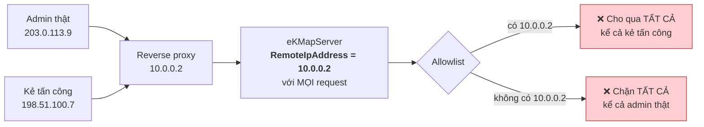

Chính sách khi đó **không bảo vệ gì mà vẫn báo cáo là đã bật** — tệ hơn cả không có.

Proxy giải quyết bằng header `X-Forwarded-For: <IP thật>`. Nhưng header là **chữ do người gửi tự đặt**:

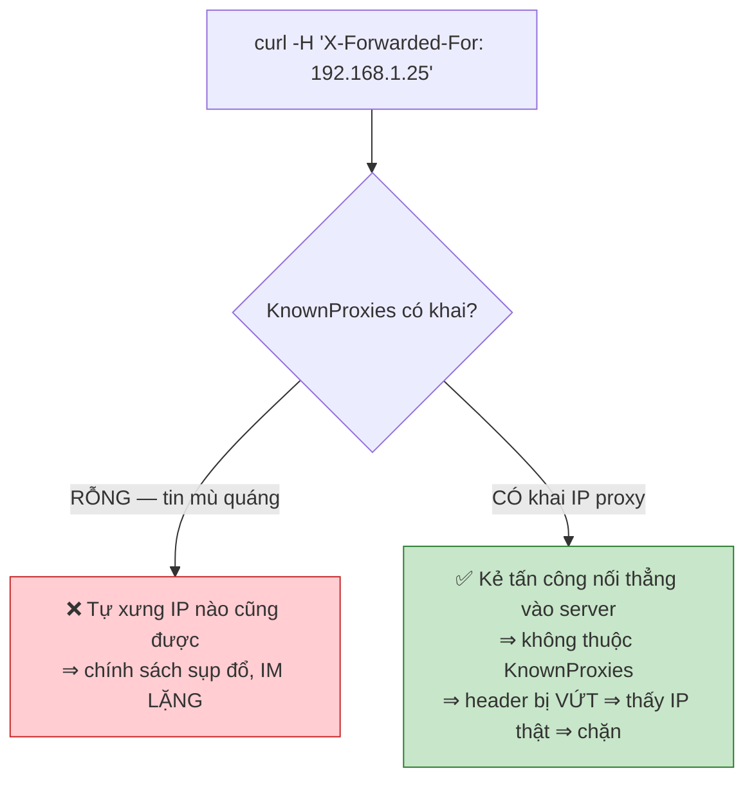

!!! danger "Hai cấu hình LOẠI TRỪ nhau — phải chọn theo thực tế triển khai"
    | Triển khai | `ForwardedHeaders:KnownProxies` | Hậu quả nếu chọn sai |
    |---|---|---|
    | **Không có proxy** | để **rỗng** `[]` → `UseForwardedHeaders` không kích hoạt | Khai thừa ⇒ ai cũng giả mạo IP bằng header |
    | **Có proxy** | khai IP proxy, vd `["10.0.0.2"]` | Khai thiếu ⇒ **chặn nhầm cả nhà** |

    Mặc định trong repo là **mảng rỗng** — an toàn cho triển khai không proxy. **Đây là câu hỏi cho bên vận hành, không suy ra được từ code.**

    *Kiểm chứng sau khi triển khai:* bật log ([§5.3](#deny-response)) rồi đối chiếu IP ghi được với IP thật của một máy đã biết.

### 9.2. NAT — vì sao admin không biết IP của chính mình

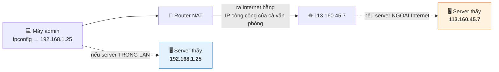

| eKMapServer đặt ở | Server thấy IP | Allowlist phải khai |
|---|---|---|
| **Trong LAN văn phòng** | `192.168.1.25` (nội bộ) | `192.168.1.0/24` |
| **Trên Internet / datacenter** | `113.160.45.7` (công cộng) | `113.160.45.7/32` |

→ Admin gõ `ipconfig` thấy `192.168.1.25` và **tưởng** đó là IP cần khai. Nếu server ở ngoài Internet thì **khai vào là tự khoá**. Họ không có cách nào tự biết.

**Đây chính là lý do form BẮT BUỘC phải hiện "địa chỉ hiện tại của bạn".**

Các dải **nội bộ** (không bao giờ xuất hiện trên Internet — RFC1918):

```
10.0.0.0/8        →  10.x.x.x
172.16.0.0/12     →  172.16.x.x – 172.31.x.x
192.168.0.0/16    →  192.168.x.x
127.0.0.0/8       →  loopback — chính máy đó (van cứu hộ)
```

!!! warning "IP động — bẫy vận hành quan trọng nhất"
    Internet cáp quang gia đình thường cấp **IP động**: nhà mạng đổi IP sau mỗi lần reset modem hoặc sau vài ngày.

    ```mermaid
    flowchart LR
        A["Khai IP nhà của một người<br/>vào allowlist"] --> B["Hôm sau nhà mạng đổi IP"]
        B --> C["❌ Người đó mất quyền quản trị<br/>mà không ai làm gì sai"]
        style C fill:#ffcdd2,stroke:#c62828
    ```

    Chỉ hai cách bền:

    | Cách | Ghi chú |
    |---|---|
    | **IP tĩnh** | Đăng ký gói có IP tĩnh với nhà mạng (thường mất phí) |
    | **VPN** ⭐ | Người làm từ xa quay VPN vào công ty ⇒ ra bằng IP công ty ⇒ allowlist chỉ cần khai dải công ty. **Phổ biến hơn** |

---

## 10. Danh sách file {#file-list}

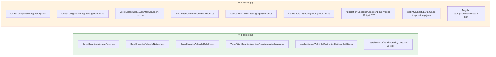

Chi tiết đáng lưu ý:

| File | Điểm cần biết |
|---|---|
| `ContextHelper.cs` | **Thêm** `GetClientIpAddress()`, **không sửa** `GetIpAdress()` cũ — `IPLimiter`/`AuditLogger` đang dùng |
| `HostSettingsAppService.cs` | Inject **`IClientInfoProvider`** (abstraction của ABP) chứ không phải `IHttpContextAccessor` — để tầng `Application` không dính ASP.NET Core |
| `AppSettingProvider.cs` | `isVisibleToClients` **để mặc định = false** ⚠ |
| `eKMapServerTestModule.cs` | **Sửa lỗi có sẵn**: gọi `eKMapServerEntityFrameworkModule` (tên cũ) ⇒ test project **không biên dịch được từ lâu**. Đổi thành `…EntityFrameworkCoreModule` |

!!! danger "`isVisibleToClients` PHẢI là `false`"
    ```mermaid
    flowchart LR
        A["isVisibleToClients: true"] --> B["Server nhồi allowlist vào<br/>abp.setting.values"]
        B --> C["❌ MỌI user đăng nhập,<br/>kể cả role thấp nhất,<br/>mở DevTools là thấy<br/>toàn bộ dải mạng nội bộ"]
        style C fill:#ffcdd2,stroke:#c62828
    ```

    Đó là **bản đồ chỉ đường cho kẻ tấn công**. Chính sách cưỡng chế ở **server**, client không cần biết. Trang Settings vẫn đọc được qua `hostSettings.getAllSettings()` — API cấp host-admin, đã có `[AbpAuthorize]`.

---

## 11. Triển khai {#deploy}

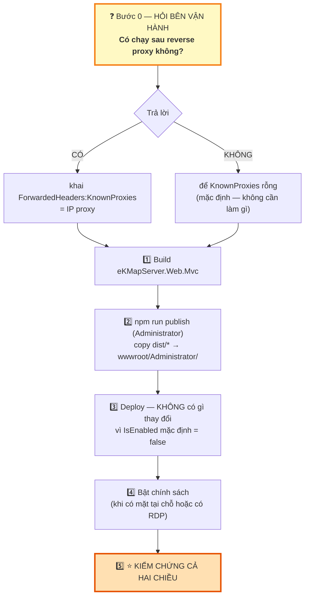

### Bước 4 — bật chính sách

1. Settings → tab *Securitysettings*
2. **Đọc "Địa chỉ hiện tại của bạn"** trên form
3. Thêm rule **chứa địa chỉ đó**, ghi mô tả rõ ràng
4. Giữ **"Luôn cho phép localhost"** bật
5. Bật `IsEnabled` → Lưu → xác nhận

### Bước 5 — kiểm chứng (chưa làm thì coi như CHƯA BIẾT chính sách có đúng không)

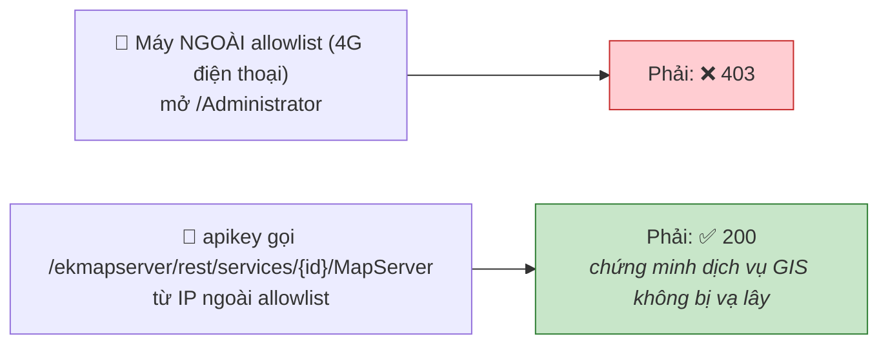

!!! danger "Nếu lỡ tự khoá — theo thứ tự"
    1. Truy cập từ **chính máy chủ** (loopback luôn mở)
    2. `"AdminIpRestriction": { "Disabled": true }` trong `appsettings.json` → restart
    3. Đường cuối — sửa DB:
       ```sql
       UPDATE AbpSettings SET Value = 'false'
       WHERE Name = 'App.Security.AdminIpRestriction.IsEnabled';
       ```
       **Cần restart** để `SettingManager` nhả cache — chính cái cache làm nó nhanh cũng làm nó không đổi ngay.

---

## 12. Kiểm thử {#test}

**52/52 unit test pass** — `eKMapServer.Tests/Security/AdminIpPolicy_Tests.cs`. Chạy được **không cần dựng web, không cần DB** (đó là lý do `AdminIpPolicy` tách khỏi HTTP và khỏi nơi lưu trữ).

```mermaid
flowchart TD
    subgraph U["✅ Unit test — 52 pass"]
        u1["Khớp CIDR + biên dải<br/>(.0, .255, ngoài dải)"]
        u2["⭐ Hồi quy bug StartsWith<br/>allowlist .10 phải CHẶN client .1"]
        u3["Prefix lẻ /28, /9<br/>(nhánh mask bit)"]
        u4["Chuẩn hoá IP đơn → /32"]
        u5["Rule inactive KHÔNG tính"]
        u6["IPv4-mapped ::ffff:"]
        u7["Không khớp chéo IPv4↔IPv6"]
        u8["Loopback (van bật/tắt)"]
        u9["Fail-closed (client null)"]
        u10["Parse lỗi: 192.168.1 / /33 / abc"]
        u11["JSON round-trip"]
    end
    style U fill:#e8f5e9,stroke:#2e7d32
```

### Kiểm thử tích hợp (cần chạy thật khi triển khai)

| Nhóm | Kịch bản | Mong đợi |
|---|---|---|
| **Cưỡng chế** | Admin trong danh sách → `/Administrator` | ✅ vào được |
| | Admin ngoài danh sách → `/Administrator` | ❌ 403 + 1 dòng log |
| | AJAX `hostSettings.getAllSettings()` từ IP ngoài | ❌ 403 JSON |
| | `/hangfire` từ IP ngoài | ❌ 403 |
| **Không vạ lây** ⭐ | apikey gọi `/ekmapserver/...` từ IP ngoài | ✅ 200 |
| | User Manager ngoài allowlist dùng Manager | ✅ bình thường |
| | User thường ngoài allowlist đăng nhập | ✅ đăng nhập được |
| **Lách** ⭐ | `/ekmapserverEVIL/...` từ IP ngoài, danh tính Admin | ❌ 403 |
| | `curl -H "X-Forwarded-For: 192.168.1.25"` không qua proxy tin cậy | ❌ 403 |
| **Cứu hộ** | RDP vào máy chủ → `localhost/Administrator` | ✅ vào được |
| | `"Disabled": true` + restart | ✅ vào được |
| **Chống tự khoá** ⭐ | Từ `192.168.1.25`, lưu allowlist chỉ có `10.0.0.0/8` | ❌ từ chối, in `192.168.1.25`, **không ghi DB** |
| | Tắt `isActive` đúng rule đang cho phép mình | ❌ từ chối |
| | POST `createdBy = 999` | Bỏ qua, server ghi `AbpSession.UserId` |
| **Rò rỉ** ⭐ | User thường xem `abp.setting.values` + `GetCurrentLoginInformations` | Không thấy `Rules` ở cả hai đường |

**Kiểm tra trong DB:**
```sql
SELECT Name, Value FROM AbpSettings
WHERE Name LIKE 'App.Security.AdminIpRestriction.%';
```
Không có row ⇒ đang dùng mặc định `false / [] / true` (chính sách chưa bật).

---

## 13. Đăng nhập KHÔNG bị chặn theo đường dẫn {#login}

Một quyết định cố ý, dễ bị hiểu là thiếu sót:

```mermaid
flowchart TD
    Q["Có chặn /Account/Login theo path không?"] --> A["❌ KHÔNG"]
    A --> R["Lúc đó CHƯA BIẾT ai đang đăng nhập<br/>⇒ chặn theo path sẽ chặn luôn<br/>user Manager (không phải admin)<br/>⇒ vượt phạm vi yêu cầu"]
    R --> S["Điều kiện DANH TÍNH đã đủ:"]
    S --> S1["Admin ở IP xấu đăng nhập được,<br/>nhận cookie"]
    S1 --> S2["Nhưng MỌI request sau đó mang<br/>danh tính Admin đều bị chặn,<br/>ở MỌI đường dẫn"]
    S2 --> S3["⇒ Cookie đó VÔ DỤNG cho quản trị"]
    S --> S4["✅ User Manager ở IP bất kỳ<br/>vẫn làm việc bình thường"]

    style S3 fill:#c8e6c9,stroke:#2e7d32
    style S4 fill:#c8e6c9,stroke:#2e7d32
```

**Hardening tuỳ chọn (làm sau, không chặn tính năng):** móc vào `AccountController.Login` **sau khi xác thực thành công, trước khi cấp cookie** — nếu user là Admin và IP không hợp lệ thì từ chối, không cấp cookie. Lúc này đã biết danh tính nên **không** ảnh hưởng user Manager.

---

## 14. Ngoài phạm vi {#out-of-scope}

| Hạng mục | Ghi chú |
|---|---|
| **Dịch vụ GIS `/ekmapserver/*`** | Đã có allowlist IP **theo từng token** ([§4](#hai-lop)). Muốn siết thì siết ở **màn hình apikey** |
| **`eKMapServer.Web.Host`** | Pipeline riêng, **cũng host `Web.Services`**. Nếu host này mở ra ngoài thì chính sách đang thủng một cửa ⇒ **cần xác nhận với bên vận hành**. Bịt bằng cách cắm cùng middleware; `AdminIpPolicy` tái dùng nguyên vẹn |
| **Bug `StartsWith` ở `IsValidTokenAddress`** | Lỗ hổng thật ở lớp token — sửa riêng |
| **`IPLimiter`** | Rate limiter chống DoS (chặn theo **tần suất**), khác mục đích hoàn toàn — giữ nguyên, không gộp |
| **Dải `a-b`** | Cố ý bỏ; dùng CIDR |
| **Chuyển sang bảng riêng** | Khi list phình to hoặc cần query. Chi phí thấp nhờ `AdminIpPolicy` tách khỏi nơi lưu trữ |
| **Giới hạn IP theo từng tài khoản** | Chính sách này ở cấp hệ thống |
| **GeoIP / theo quốc gia** | Cần dữ liệu ngoài |
| **3 test template fail** | `eKMapServerEntityFrameworkCoreModule` cần `IWebHostEnvironment` mà test module không đăng ký — **lỗi có sẵn**, lộ ra sau khi test project biên dịch lại được |
