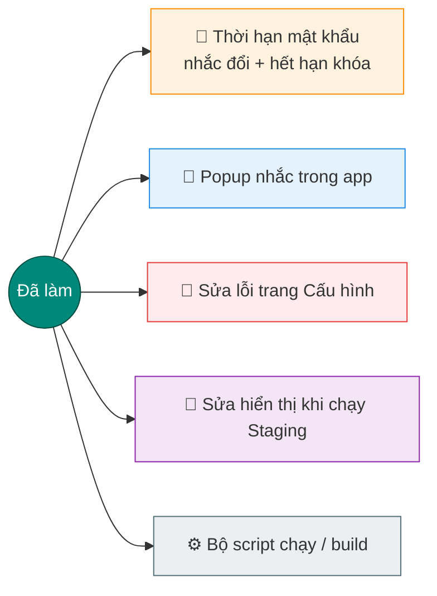
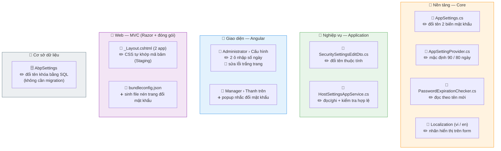
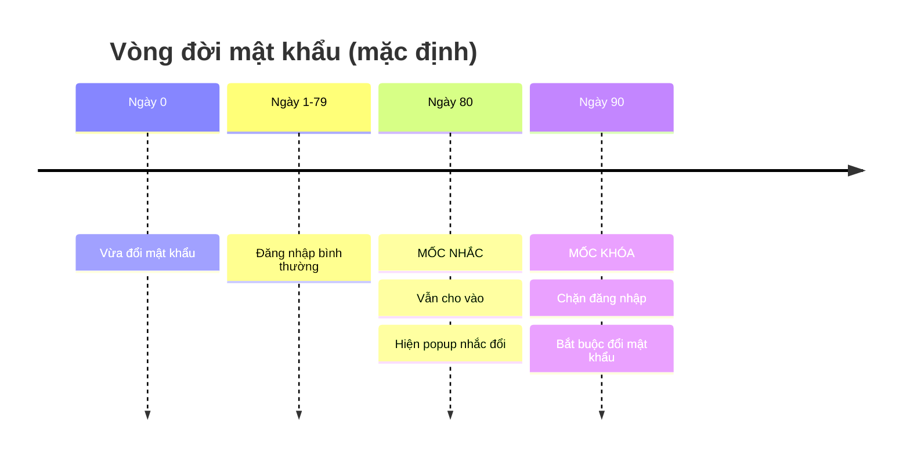
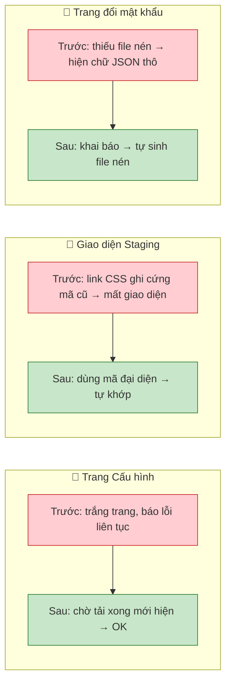
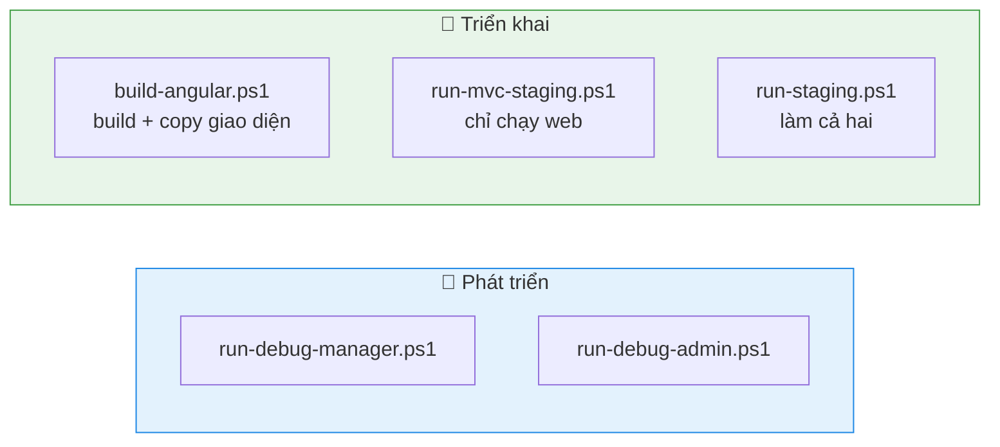

# Tổng quan công việc — Administrator & Bảo mật mật khẩu

## 1. Nhìn nhanh — đã làm gì

---

## 2. File nào — sửa gì (nhìn là thấy)

> Chú thích:  ✏️ = sửa   ·   ➕ = thêm mới   ·   🐞 = sửa lỗi

---

## 3. Tính năng thời hạn mật khẩu

| Mốc | Số ngày mặc định | Khi tới mốc |
|---|---|---|
| 🔔 Nhắc đổi | 80 | Hiện popup — **vẫn cho vào** |
| 🔒 Hết hạn | 90 | **Chặn** — bắt buộc đổi mới vào được |

!!! note "📷 Ảnh màn hình"
    Chèn ảnh form **Cấu hình hệ thống → Hết hạn mật khẩu** (2 ô nhập số ngày) tại đây.

---

## 4. Ba lỗi đã xử lý (khi chạy Staging)

!!! note "📷 Ảnh màn hình"
    Chèn ảnh **trước** (trắng trang / JSON thô) và **sau** (hiển thị đúng) tại đây.

---

## 5. Bộ script chạy / build

