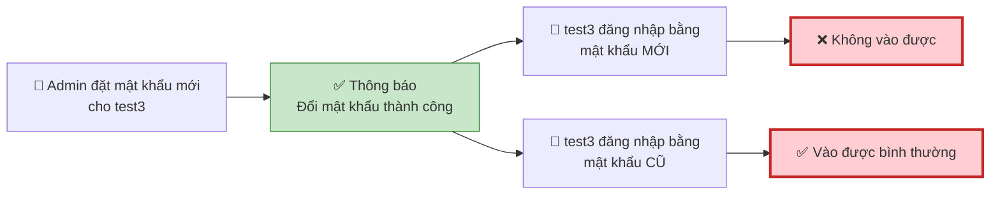
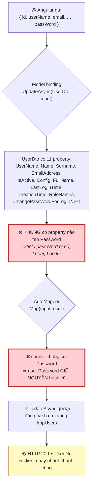
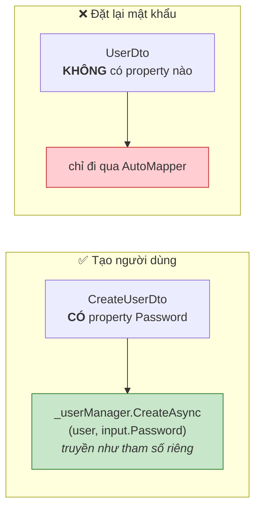
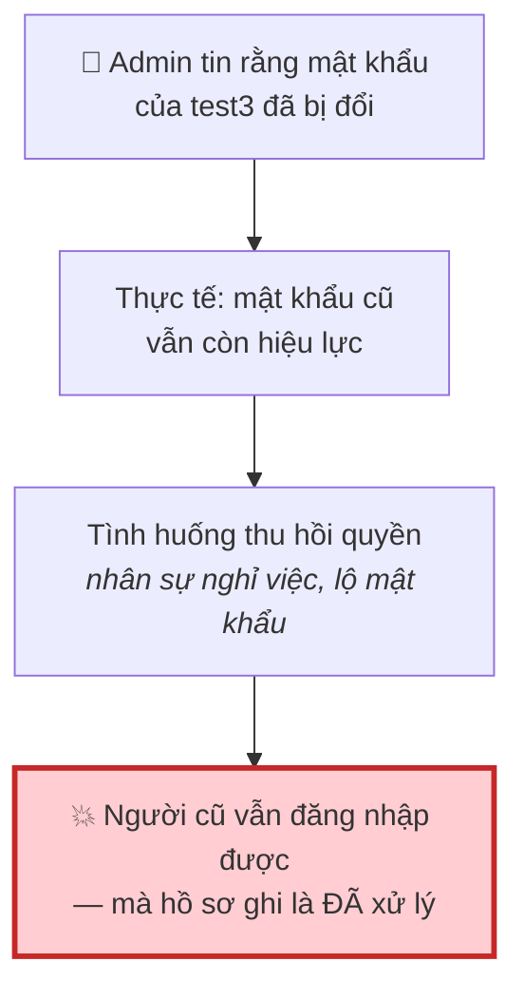
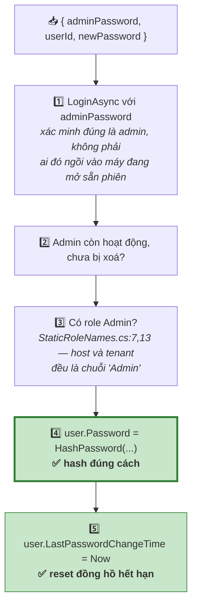
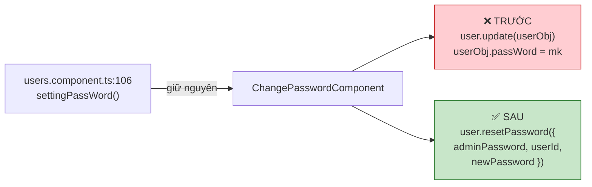
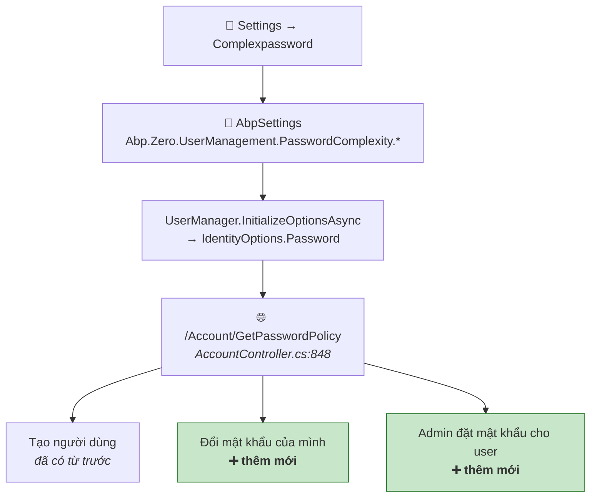
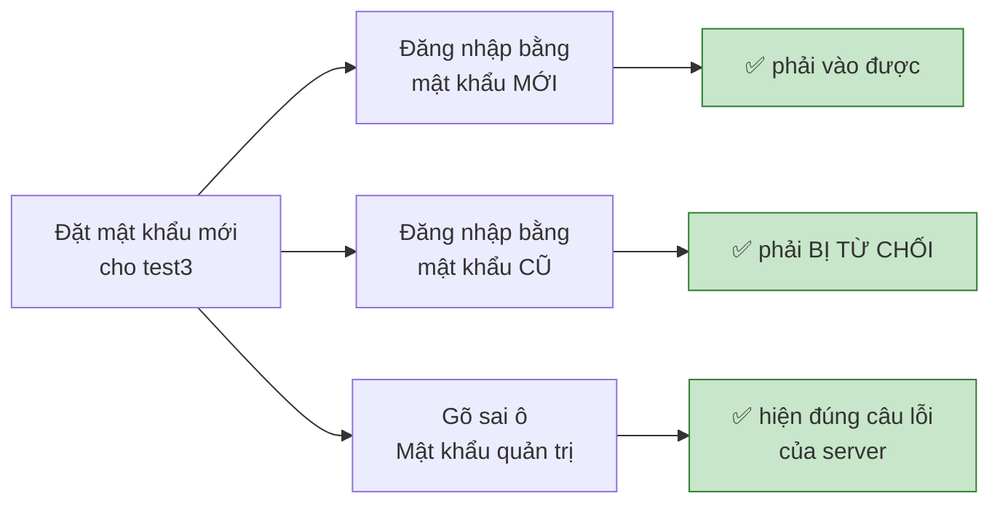
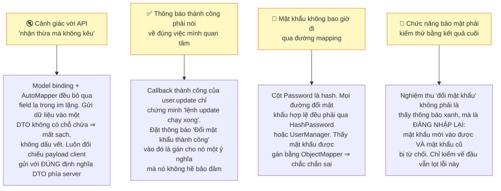

# Sự cố: "Thiết lập mật khẩu" báo thành công nhưng mật khẩu không đổi

**Ngày:** 2026-07-24 · **Phạm vi:** app Angular Administrator · **Mức độ:** 🔴 Cao (an toàn thông tin) · **Trạng thái:** ✅ Đã sửa phía client, chờ build

---

## 1. Triệu chứng

Admin vào **Người dùng → ⚙️ Thiết lập mật khẩu**, đặt mật khẩu mới cho tài khoản `test3`. Hệ thống hiện thông báo xanh *"Đổi mật khẩu thành công"*.

Thông báo thành công là **thật** — nhưng nó nói về một việc khác, không phải việc đổi mật khẩu.

---

## 2. Nguyên nhân: mật khẩu rơi mất ngay tại cửa vào API

Màn hình gọi nhầm API. Nó dùng `user.update` — API cập nhật **thông tin tài khoản**, vốn không có chỗ nào để chứa mật khẩu.

!!! danger "Ba cơ chế cùng im lặng nên lỗi trở nên vô hình"
    **1. JSON thừa không gây lỗi.** ASP.NET Core mặc định bỏ qua field lạ trong body. Gửi `passWord` vào DTO không có chỗ chứa thì nó biến mất — không exception, không warning.

    **2. AutoMapper không đụng tới cái nó không biết.** `ObjectMapper.Map(input, user)` map vào entity **đã tồn tại**; property không có nguồn tương ứng thì giữ nguyên giá trị cũ.

    **3. Thông báo thành công nói về việc khác.** `user.update` *có* thành công thật — tên, email, vai trò đều được ghi. Chỉ mỗi mật khẩu là không.

### Ví von

API `user.update` là **một tờ đơn in sẵn** với đúng 11 ô. Màn hình điền đủ 11 ô rồi **viết thêm mật khẩu mới ra lề giấy**, vì tờ đơn không có ô nào cho mật khẩu. Nhân viên ở quầy chỉ nhập những gì nằm trong ô — chữ ngoài lề không ai đọc, cũng không ai báo lỗi. Xong việc họ nói *"đã cập nhật xong"*, và câu đó không sai.

### Vì sao "Tạo người dùng" lại chạy đúng

Sâu xa hơn: `AbpUsers.Password` lưu **hash**, không phải mật khẩu thô. Không có đường nào để AutoMapper set đúng nó — mọi đường đổi mật khẩu hợp lệ đều buộc phải đi qua `_passwordHasher.HashPassword(...)` hoặc `_userManager`. Màn hình đi đường mapping, nên **về nguyên tắc nó không bao giờ có khả năng đổi được mật khẩu** — đây không phải hỏng ở một trường hợp biên nào.

---

## 3. Vì sao nghiêm trọng về mặt ATTT

Đây là dạng lỗi tệ nhất trong nhóm kiểm soát truy cập: **báo cáo nói đã khoá, thực tế vẫn mở**. Nó không chỉ là chức năng hỏng, mà là chức năng tạo ra niềm tin sai.

---

## 4. Cách đã xử lý {#cach-xu-ly}

### Chọn đúng API

Trong 4 API liên quan, chỉ một cái làm được việc này:

| API | Đổi mật khẩu cho **người khác**? | Vì sao |
|---|---|---|
| `user.update` | ❌ | Đang dùng — DTO không có ô mật khẩu, chính là lỗi này |
| `user.create` | ❌ | Chỉ dùng lúc tạo mới |
| `user.changePassword` (`UserAppService.cs:214`) | ❌ | Luôn lấy `_abpSession.UserId` ⇒ chỉ đổi được của **chính mình**, lại bắt nhập mật khẩu cũ mà admin không biết |
| `user.resetPassword` (`UserAppService.cs:238`) | ✅ | Nhận thẳng `userId` của người cần đổi |

!!! note "`ChangePassword` và `ResetPassword` khác nhau ở câu hỏi *lấy gì để chứng minh quyền*"
    - `ChangePassword`: *"Chứng minh bạn là chủ tài khoản này"* → gõ **mật khẩu cũ của chính mình**.
    - `ResetPassword`: *"Chứng minh bạn là admin"* → gõ **mật khẩu của admin đang đăng nhập**. Vì admin không biết mật khẩu cũ của `test3`, nếu bắt gõ mật khẩu cũ thì bế tắc.

    Cả hai đều gán `user.Password = _passwordHasher.HashPassword(...)` rồi cập nhật `LastPasswordChangeTime` — đây chính là hai bước mà `user.update` không hề chạm tới.

### `ResetPassword` làm gì

Bước 5 quan trọng hơn vẻ ngoài: `PasswordExpirationChecker` đọc đúng field này. Không cập nhật thì user vừa được đặt mật khẩu mới đã bị cảnh báo sắp hết hạn ngay.

### Thay đổi cụ thể

`pages/users/changepassword.component.ts`

- `save()` gọi `resetPassword` với đúng payload `ResetPasswordDto`. Lưu ý `userObj` có `id` chứ không có `userId` — truyền nguyên `userObj` sẽ bị server chặn vì thiếu `adminPassword` (`[Required]`).
- Bỏ `userObj.passWord = ""` trong `ngOnInit` — vô tác dụng, lại còn sửa vào chính object của dòng đang hiển thị trong bảng.
- Thêm kiểm tra chính sách mật khẩu (xem §5).
- Bỏ `abp.message.error('Crefailed')`: ABP đã tự hiện thông báo lỗi thật của server (`abp.jquery.js:153`), giữ lại sẽ ra **hai** hộp thoại. Nhờ vậy admin gõ sai mật khẩu quản trị sẽ thấy đúng câu *"Your 'Admin Password' did not match…"* thay vì một dòng chung chung.

`pages/users/changepassword.component.html`

- Thêm ô **"Mật khẩu quản trị"** (bắt buộc, vì API đòi).
- Nút Lưu khoá khi: mật khẩu chưa đạt chính sách · hai ô chưa khớp · chưa nhập mật khẩu quản trị.

!!! tip "Tên hàm gây hiểu nhầm"
    `resetPassword` ở đây chỉ là **tên hàm phía server**, không có nghĩa gửi mail đặt lại hay sinh mật khẩu ngẫu nhiên. Admin vẫn tự gõ mật khẩu mới, giao diện không đổi cách dùng.

---

## 5. Sửa đổi kèm theo trong cùng bản cập nhật

### Thống nhất kiểm tra chính sách mật khẩu ở 3 màn hình

Trước bản này, chỉ màn **Tạo người dùng** kiểm tra mật khẩu theo chính sách đang cấu hình. Hai màn còn lại thì không.

Cả ba giờ dùng chung một bộ: nạp chính sách từ `/Account/GetPasswordPolicy`, hiện icon trạng thái, thanh độ mạnh, và dòng báo lỗi liệt kê đúng điều kiện còn thiếu. Bổ sung thêm kiểm tra `requiredUniqueChars` (số ký tự khác nhau) mà bản cũ bỏ sót.

### Sửa thứ tự tham số của hộp thoại cảnh báo hết hạn mật khẩu

`abp.message.confirm` có chữ ký `(message, title, callback)` (`abp.sweet-alert.js:87`), nhưng cả hai app đang truyền ngược — nội dung và tiêu đề hộp thoại đổi chỗ cho nhau. Đã sửa ở `topbar.component.ts` của **Administrator** và **Manager**, kèm bỏ `.replace('{0}', …)` thừa ở biến `title`.

---

## 6. Kiểm chứng

Kiểm ở tầng dữ liệu: so cột `Password` của `test3` trong `AbpUsers` trước và sau khi bấm Lưu.

- **Trước bản sửa:** giá trị **giống hệt** — đây là bằng chứng trực tiếp của lỗi.
- **Sau bản sửa:** giá trị đổi, và `LastPasswordChangeTime` bằng thời điểm vừa thao tác.

Đối chiếu thêm với `AbpAuditLogs`: bản ghi `UserAppService.UpdateAsync` cũ **có** chứa `passWord` trong cột `Parameters` — chứng minh client đã gửi đi thật, và server đã lặng lẽ vứt đi.

---

## 7. Còn tồn đọng {#ton-dong}

!!! warning "Chính sách mật khẩu mới chỉ được đảm bảo ở phía client"
    Cả `ChangePassword` lẫn `ResetPassword` đều gán hash thẳng vào entity, **không chạy `UserManager.PasswordValidators`**. Riêng `ChangePassword` còn kiểm tra bằng một regex hardcode (`AccountAppService.cs:12`: ≥8 ký tự, có số + chữ thường + chữ hoa, ký tự đặc biệt chỉ chấp nhận `!@#$%^&*()`) — hoàn toàn độc lập với cấu hình trong Settings.

    Hệ quả khi admin **nới lỏng** chính sách (ví dụ bỏ yêu cầu chữ hoa, hạ độ dài xuống 6): client cho qua nhưng server vẫn chặn bằng regex cũ, người dùng nhận một dòng lỗi tiếng Anh khó hiểu. Muốn dứt điểm phải sửa C#: thay regex bằng `ValidateNewPasswordAsync` (`AccountController.cs:831`) — nơi đã làm đúng cho luồng đổi mật khẩu bắt buộc.

!!! note "Mật khẩu do admin đặt không phải mật khẩu tạm — đã cân nhắc và chấp nhận"
    `ResetPassword` **không** bật `ChangePassWordForLogInNext`, và **có** làm mới `LastPasswordChangeTime`. Nên người dùng thoát cả hai điều kiện ép đổi mật khẩu lúc đăng nhập (`AccountController.cs:153` và `:158`), dùng luôn mật khẩu đó cho tới khi hết hạn theo `PasswordExpirationDays`.

    Nghĩa là suốt thời gian đó admin vẫn biết mật khẩu của tài khoản kia. Đã đưa ra phương án (thêm một dòng `user.ChangePassWordForLogInNext = true`, hoặc thêm checkbox cho admin tự chọn như màn Tạo người dùng) và **quyết định chưa làm** trong bản này.

---

## 8. Bài học

---

*Xem thêm: [Hết hạn mật khẩu & Đổi mật khẩu bắt buộc](password-expiration-feature.md) — cơ chế `LastPasswordChangeTime` và hai điều kiện ép đổi mật khẩu lúc đăng nhập.*
