# Cập nhật DB đang chạy lên schema hiện tại

**Ngày:** 2026-07-17 · **Script:** `Test by SQL/update_db_to_current.sql` · **Trạng thái:** 🔶 Đã viết, **chưa chạy** trên DB nào

---

## 1. Bài toán

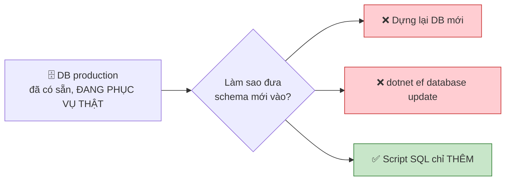

---

## 2. Những gì được thêm mới

**Tổng: 3 cột + 1 bảng.** Chỉ `ADD` và `CREATE` — không `ALTER COLUMN`, không `DROP`, không rebuild bảng nào.

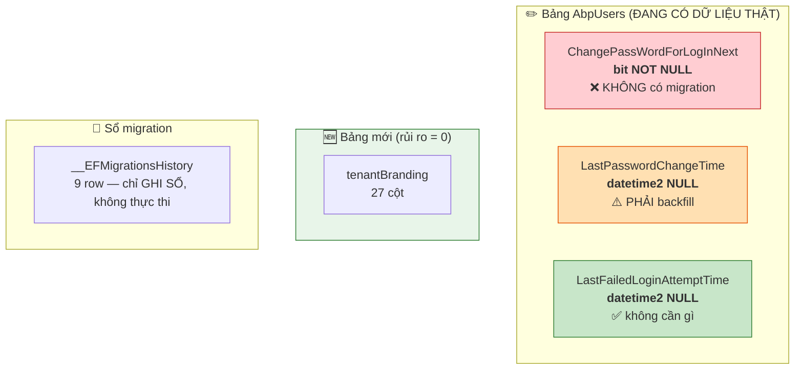

### KHÔNG đụng tới

| Hạng mục | Vì sao |
|---|---|
| **`AbpSettings`** | Chỉ là row key–value trong bảng có sẵn — **không đổi schema**. Các setting mới (`SessionTimeOut`, `UserLockOut`, `PasswordExpirationDays`, `AdminIpRestriction`) đều có default trong `AppSettingProvider` ⇒ **không có row nào cũng chạy đúng** |
| **41 lệnh `AlterColumn`** | Từng bị EF sinh ra do lệch ModelSnapshot ([chi tiết](migration-identity-columns-issue.md)) — đã xoá sạch khỏi migration và **lệch snapshot đã sửa tận gốc** ([§6.3](#snapshot-da-sua)). **Không** đưa lại vào script |
| **[Giới hạn IP quản trị](admin-ip-restriction-feature.md)** | Settings thuần — không phát sinh thay đổi DB |

---

## 3. Hai cái bẫy — cả hai đều VÔ HÌNH nếu chỉ nhìn danh sách migration

### 3.1. `InitialBaseline` là ảnh chụp — **không được chạy** {#baseline}

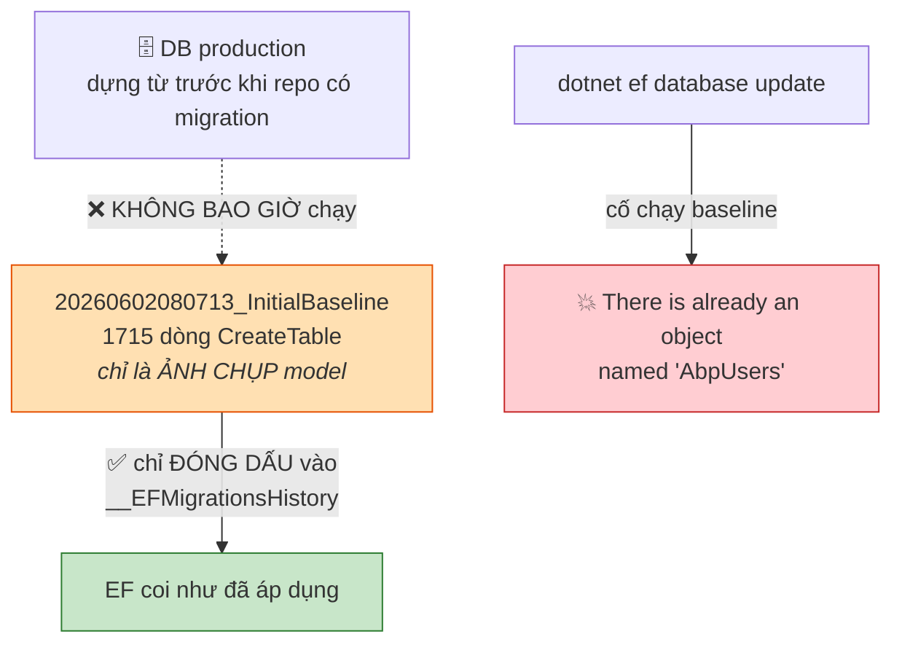

*(Nếu lỡ chạy: EF chạy mỗi migration trong transaction ⇒ **rollback sạch, DB không đổi gì**. Cứ chạy script này rồi thử lại.)*

### 3.2. `ChangePassWordForLogInNext` không có migration {#khong-co-migration}

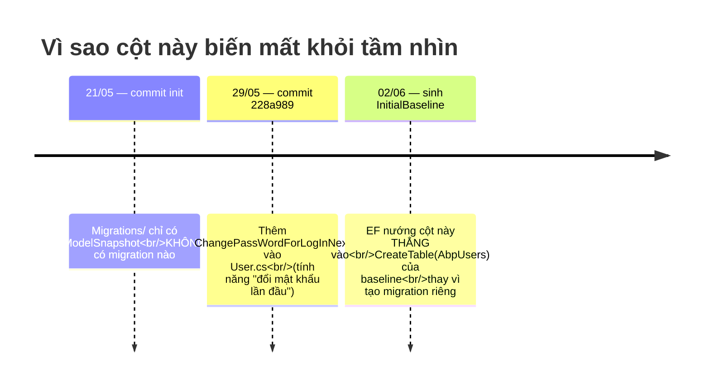

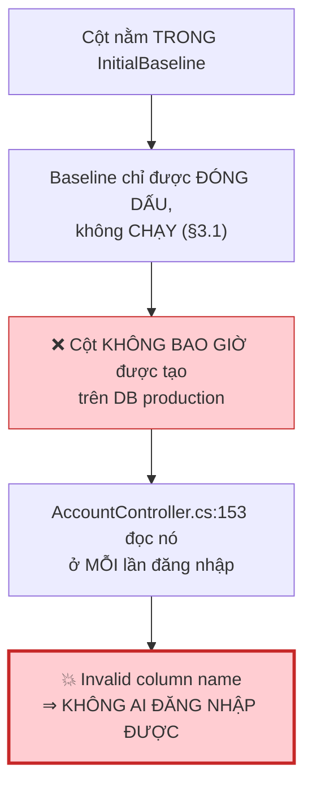

!!! danger "`dotnet ef database update` không cứu được"
    Theo sổ migration thì **mọi thứ "đã up to date"** — trong khi cột vẫn thiếu và đăng nhập vẫn chết.

    → Đây là lý do phải soát delta từ **CODE** (entity + `DbSet`), không chỉ từ danh sách migration.

---

## 4. `LastPasswordChangeTime` phải backfill {#backfill}

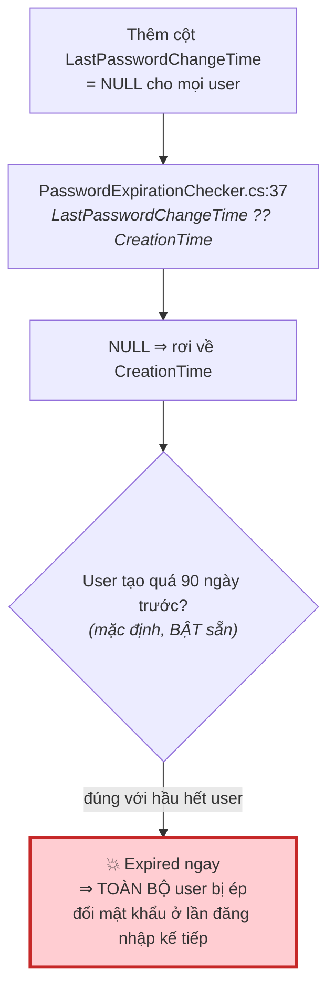

**Xử lý:** backfill `= GETDATE()` — coi như *"vừa đổi mật khẩu lúc nâng cấp"*, đồng hồ 90 ngày đếm lại từ thời điểm deploy.

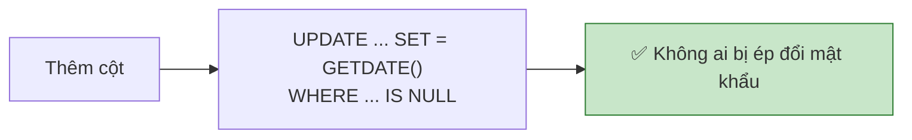

!!! bug "Phải `GETDATE()`, KHÔNG phải `GETUTCDATE()`"
    ```mermaid
    flowchart TD
        A["grep Clock.Provider trong repo<br/>= 0 kết quả"] --> B["⇒ ABP dùng mặc định<br/>ClockProviders.Unspecified"]
        B --> C["⇒ Clock.Now = DateTime.Now<br/>= giờ LOCAL của server"]
        C --> D["Backfill bằng UTC sẽ lệch 7 giờ<br/>so với mốc đem ra so sánh"]
        style D fill:#ffe0b2,stroke:#e65100
    ```

Backfill **chỉ chạy đúng lúc cột được tạo lần đầu** ⇒ chạy lại script không bao giờ đè lên mốc thật của user.

---

## 5. Cách chạy trên DB có sẵn

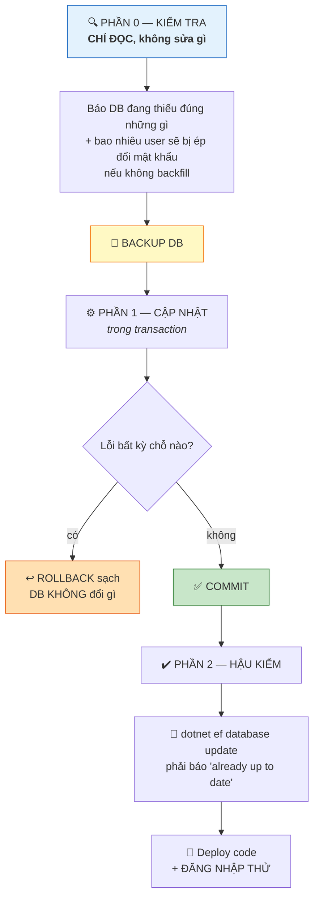

Script **idempotent** — mọi bước đều `IF NOT EXISTS`, chạy lại nhiều lần vẫn an toàn.

### Log của PHẦN 1

```
[1] Đã đóng dấu InitialBaseline.
[2] Đã thêm ChangePassWordForLogInNext (DEFAULT 0 — không ép ai đổi mật khẩu).
[3] Đã thêm LastPasswordChangeTime + BACKFILL GETDATE() cho toàn bộ user.
[4] Đã thêm LastFailedLoginAttemptTime.
[5] Đã tạo bảng tenantBranding (27 cột).
[6] Đã đóng dấu 8 migration.
=== HOÀN TẤT — ĐÃ COMMIT ===
```

### PHẦN 2 — bốn con số bắt buộc

| Kiểm tra | Bắt buộc |
|---|---|
| `__EFMigrationsHistory` | **9** row |
| `tenantBranding` số cột | **27** |
| User còn `NULL LastPasswordChangeTime` | **0** ⭐ |
| User có `ChangePassWordForLogInNext = 1` | **0** ⭐ |

> Hai dòng ⭐ phân biệt *"nâng cấp êm"* với *"sáng mai cả cơ quan không đăng nhập được"*.

!!! note "Mức độ khoá bảng — nói cho chính xác"
    ```mermaid
    flowchart TD
        A["CREATE TABLE (bảng mới)"] --> R1["✅ 0 rủi ro"]
        B["ADD COLUMN ... NULL<br/>(2 cột datetime2)"] --> R2["✅ metadata-only ở MỌI edition<br/>— tức thì"]
        C["ADD COLUMN ... NOT NULL DEFAULT<br/>(ChangePassWordForLogInNext)"] --> D{"SQL Server edition?"}
        D -->|"Enterprise / Developer"| R3["✅ metadata-only"]
        D -->|"Standard"| R4["⚠️ REBUILD bảng AbpUsers<br/>+ khoá Sch-M"]

        style R1 fill:#c8e6c9,stroke:#2e7d32
        style R2 fill:#c8e6c9,stroke:#2e7d32
        style R3 fill:#c8e6c9,stroke:#2e7d32
        style R4 fill:#ffe0b2,stroke:#e65100
    ```

    Bảng user vài nghìn dòng thì rebuild cũng xong tức thì. **PHẦN 0 in ra Edition + số dòng `AbpUsers`** để tự lượng sức — đừng đoán.

---

## 6. Để lần sau không lặp lại

### 6.1. Thứ tạo bảng là `DbSet`, KHÔNG phải kế thừa ABP

Hiểu nhầm phổ biến: *"chỉ class kế thừa ABP entity mới tạo bảng"* — **sai cả hai chiều**.

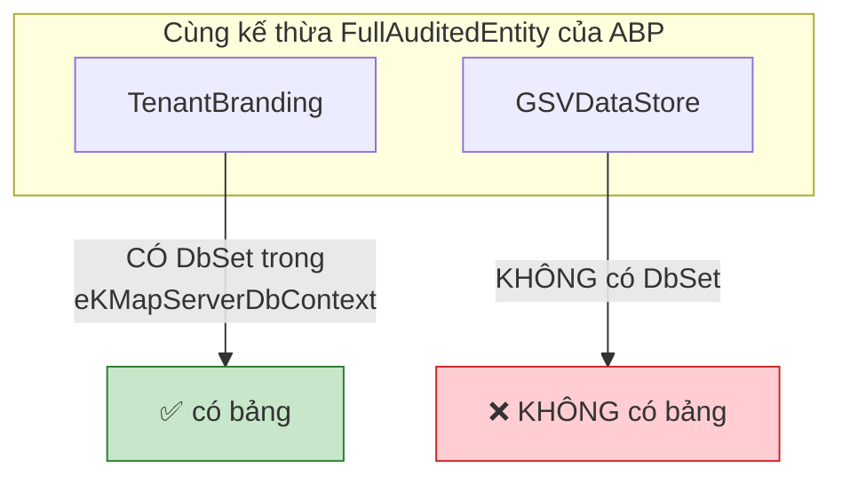

Bằng chứng trong repo: `GSVDataStore`, `GSVInvoices`, `GSVMapUser`, `GSVTokenKey`, `GSVItem` **đều kế thừa `FullAuditedEntity`/`Entity` nhưng không có bảng nào**.

**Thứ thực sự tạo bảng là được đưa vào EF model**, qua một trong ba đường:

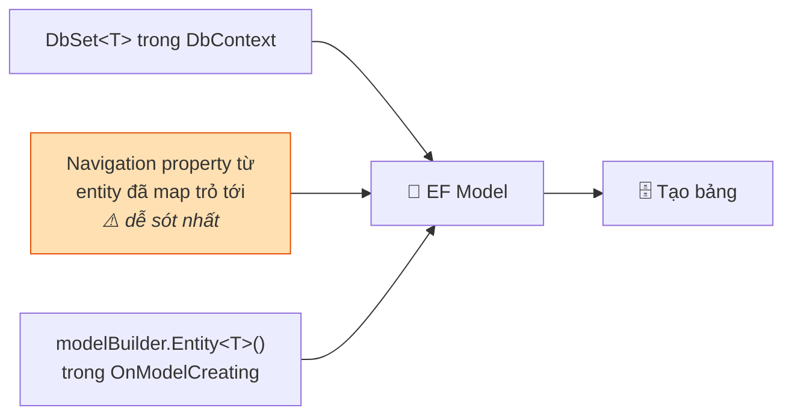

EF Core **không biết ABP là gì**. `Entity<T>`/`FullAuditedEntity` chỉ cho sẵn `Id` + cột audit. `[Table("...")]` chỉ *đặt tên* bảng nếu entity được map, **không** làm entity được map.

!!! warning "Chiều ngược lại mới nguy hiểm"
    Class POCO thuần, **không kế thừa gì của ABP, vẫn tạo bảng** nếu có `DbSet` hoặc bị navigation trỏ tới. *"Không kế thừa ABP"* **không phải tấm khiên**.

    Câu hỏi đúng để tự kiểm: **"class này có vào được EF model không?"** — không phải *"nó có kế thừa ABP không?"*.

    DTO thì an toàn: không nằm trong DbContext, không ai trỏ tới.

### 6.2. Bốn quy tắc cho migration tiếp theo {#quy-tac}

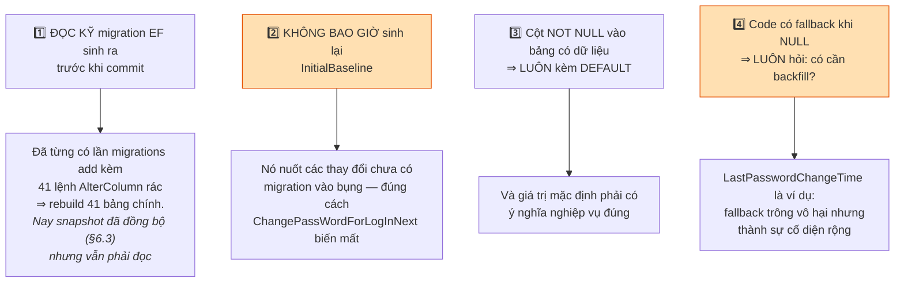

### 6.3. Tin tốt: lệch snapshot đã được sửa TẬN GỐC {#snapshot-da-sua}

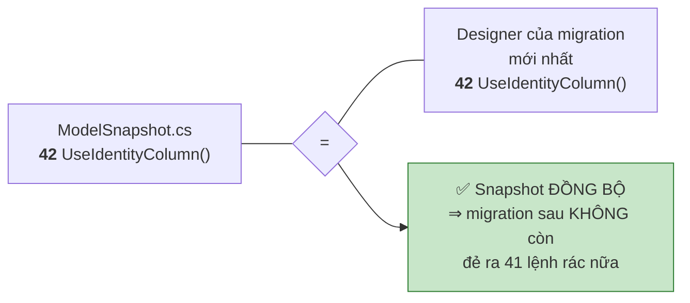

Đã kiểm chứng ở thời điểm viết: `ModelSnapshot.cs` và `20260715022326_Add_LastFailedLoginAttemptTime.Designer.cs` **giống hệt nhau** (591 dòng khai báo, diff rỗng). Sự cố 41 `AlterColumn` được xử lý tận gốc từ 14/07 — không phải chỉ vá phần ngọn ([chi tiết](migration-identity-columns-issue.md#cach-xu-ly)).

→ **Không còn nợ kỹ thuật ở đây.** Nhưng vẫn giữ nguyên quy tắc 1 ở [§6.2](#quy-tac): đọc kỹ migration trước khi commit. Cách phát hiện lệch tái diễn: so `ModelSnapshot.cs` với `.Designer.cs` của migration mới nhất — hai file phải mô tả cùng một model.
