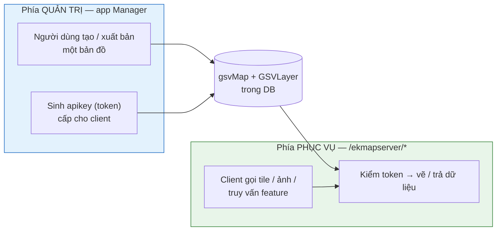
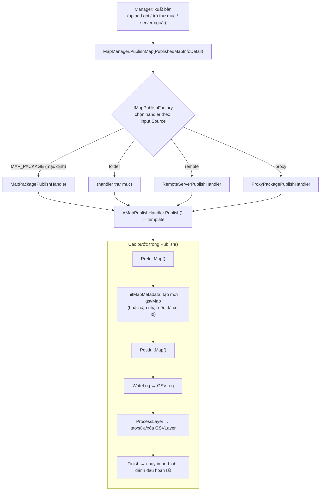
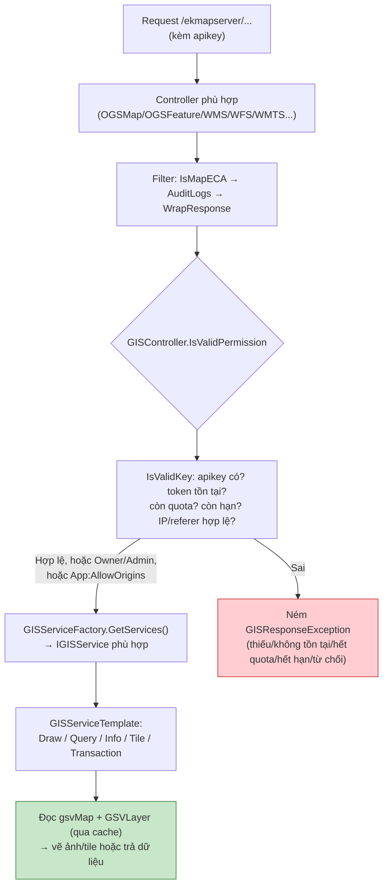

# Cung cấp dịch vụ GIS & Thêm bản đồ hoạt động thế nào

Tài liệu này giải thích **phần lõi nghiệp vụ** của eKMapServer: một "bản đồ" được tạo/xuất bản ra sao, và sau đó được phục vụ cho client thế nào. Mục tiêu là để đọc hiểu, không phải đặc tả từng dòng.

---

## 1. Mô hình tư duy {#mental-model}

Trong eKMapServer, **"bản đồ" (map) chính là một "dịch vụ" (service)**. Cùng một thứ, nhìn từ hai phía:

- **Phía quản trị** (app Manager) tạo ra bản ghi `gsvMap` + các `GSVLayer`, và cấp **apikey** cho client.
- **Phía phục vụ** (`/ekmapserver/*`, project `eKMapServer.Web.Services`) nhận request của client, kiểm apikey rồi vẽ bản đồ / trả dữ liệu.

Hai phía nối nhau qua **DB** và **cache**, không gọi trực tiếp.

---

## 2. Mô hình dữ liệu {#data-model}

| Bảng / Entity | Vai trò |
|---|---|
| **`gsvMap`** (`GSVMap`) | Bản ghi trung tâm — **một dịch vụ/bản đồ**. Giữ tiêu đề, `Config`, `Source`, `ServiceType`, phạm vi (`MaxExtent`, `MinLevel`/`MaxLevel`), `Enabled`, `StatusService`, và `Status` (mặc định `Private`). |
| **`GSVLayer`** | Các **lớp** thuộc một bản đồ (mỗi lớp một nguồn dữ liệu / kiểu hình học). |
| **`GSVMapToken` / `GSVToken`** | **apikey** truy cập: hạn mức (`RequestPerDay`), ngày hết hạn, allowlist **IP** (`IpAddress`) và/hoặc **tên miền** (`HttpReferer`). |
| **`GSVMapPermissionUser`** / `GSVMapPermission*` | Phân quyền trên bản đồ. Người tạo mặc định là `Owner`. |
| **`GSVCollectionMap`** | Gom bản đồ vào **bộ sưu tập** (collection) để tổ chức. |
| **`GSVLog`** | Nhật ký của tiến trình xuất bản (đang chạy / hoàn tất). |

`ServiceType` cho biết bản đồ được phục vụ theo chuẩn nào — xem [§5](#service-types).

---

## 3. Luồng 1 — Thêm / Xuất bản bản đồ {#publish}

Đây là phần "thêm bản đồ". Điểm vào là **`MapManager.PublishMap(...)`**.

Diễn giải:

1. **Chọn handler theo nguồn.** `input.Source` rỗng thì mặc định `MAP_PACKAGE`. Factory tìm đúng handler có `MapSource` khớp (gói upload, thư mục, server từ xa, proxy).
2. **Tạo metadata bản đồ** (`InitMapMetadata`):
      - Chưa có `Id` ⇒ **tạo mới**: `MapManager.CreateAsync` chèn `gsvMap`, gán người tạo là `Owner` (`GSVMapPermissionUser`), thêm vào collection. Có kiểm **license** (`CanAddMoreMap`).
      - Đã có `Id` ⇒ **tái công bố**: map cũ được cập nhật, đồng thời **xóa cache và gói cũ** để tránh phục vụ dữ liệu lỗi thời.
3. **Ghi log** tiến trình (`GSVLog`, trạng thái *đang chạy*).
4. **Xử lý lớp** (`ProcessLayer`): khi tái công bố thì so sánh theo `Code` để xóa lớp thừa, cập nhật lớp trùng, thêm lớp mới.
5. **Kết thúc** (`Finish`): chạy import job nếu cần, cập nhật `GSVLog` và `gsvMap` sang **hoàn tất**.

> Đây là **template method**: khung `Publish()` cố định ở lớp trừu tượng `AMapPublishHandler`, mỗi nguồn chỉ override phần khác nhau (`InitLayers`, `PreInitMap`…). Thêm nguồn mới = viết một handler, không đụng khung.

Sau bước này, đã có một `gsvMap` + `GSVLayer` sẵn sàng. Muốn client ngoài gọi được thì admin **cấp apikey** (`GSVMapToken`) với hạn mức / hạn dùng / allowlist IP hoặc tên miền.

---

## 4. Luồng 2 — Phục vụ dịch vụ cho client {#serving}

Khi client gọi `GET/POST /ekmapserver/...`, request đi vào project **`eKMapServer.Web.Services`**.

Kiểm token (`IsValidKey`) theo thứ tự:

1. **Có apikey không** → thiếu thì `TOKEN__REQUIRED`.
2. **Token tồn tại cho map này** (`GSVMapTokenCache.Get(mapId, apikey)`) → không thì `TOKEN__NOT_EXISTED`.
3. **Còn hạn mức** (`RequestInDay ≤ RequestPerDay`) → vượt thì `TOKEN__OVER_QUOTA`.
4. **Còn hạn dùng** (`ExpireDate`) → hết thì `TOKEN__EXPIRED`.
5. **Đúng địa chỉ nguồn** (`IsValidTokenAddress`): nếu token khai `HttpReferer` thì khớp **tên miền**; nếu khai `IpAddress` (danh sách ngăn bởi `;`) thì khớp **IP**. Không khớp ⇒ `TOKEN__ACCESS_DENIED`.

Có **đường vòng hợp lệ**: là `Owner`/`Admin` của bản đồ, hoặc request đến từ tên miền trong `App:AllowOrigins` (config) — thì vẫn qua dù không có token.

Xử lý thật nằm ở **`GISServiceTemplate`** (và các lớp `OGSMap`, `OGSFeature`, `OGCMap`…): vẽ ảnh, sinh tile, truy vấn/identify/find, sửa feature (transaction), trả legend/capabilities. Dữ liệu bản đồ đọc qua **cache** (`GSVMapCache`, `GSVMapTokenCache`) để không đập DB mỗi request.

---

## 5. Các loại dịch vụ {#service-types}

Cùng một `gsvMap` có thể phơi ra theo nhiều chuẩn; mỗi chuẩn một nhóm controller:

| Nhóm | Controller | Dùng cho |
|---|---|---|
| **OGS** (chuẩn riêng eKMap) | `OGSMapController`, `OGSFeatureController`, `OGSVectorTileController`, `OGSMetaController` | Ảnh bản đồ, tile, vector tile, truy vấn & sửa feature, attachment |
| **OGC** (chuẩn mở quốc tế) | `WMSController`, `WFSController`, `WMTSController` | Tương thích phần mềm GIS ngoài (QGIS, ArcGIS…) |
| **eKMap** | `EKMController` | API kiểu eKMap |

---

## 6. Kiểm soát truy cập — hai trục tách biệt {#access-control}

Rất dễ nhầm, nên tách rõ:

| Trục | Bảo vệ cái gì | Cơ chế |
|---|---|---|
| **Token dịch vụ GIS** | Traffic `/ekmapserver/*` (client gọi bản đồ) | apikey theo từng map + quota + hạn dùng + allowlist **IP/tên miền theo token** (`GSVMapToken`/`GSVToken`) |
| **Giới hạn IP quản trị** | Khu vực quản trị (`/Administrator`, API admin) | Middleware `AdminIpRestriction` — xem [tài liệu riêng](admin-ip-restriction-feature.md) |

Vì thế middleware quản trị **cố tình cho `/ekmapserver/*` đi qua** — hai trục không được trộn. Chi tiết ở [mục "hai lớp"](admin-ip-restriction-feature.md#hai-lop) của tài liệu giới hạn IP.

> ⚠️ Ghi chú kỹ thuật: hàm khớp IP của token (`IsValidTokenAddress`) hiện dùng `StartsWith`, nên `"10.0.0.1"` sẽ khớp nhầm cả `"10.0.0.10"`, `"10.0.0.100"`… Đây là điểm yếu đã biết ở lớp token (khác với lớp quản trị đã khớp theo CIDR chuẩn).

---

## 7. Bản đồ tra cứu code {#code-map}

| Việc | File / lớp |
|---|---|
| Điểm vào xuất bản | `Business/Administration/Map/MapManager.Publish.cs` → `PublishMap`, `CreateAsync` |
| Khung xuất bản (template) | `Business/Administration/Map/Package/MapPublishing/AMapPublishHandler.cs` |
| Chọn handler theo nguồn | `.../MapPublishing/IMapPublishFactory.cs` + các `*PublishHandler` |
| CRUD bản đồ (Manager gọi) | `Application/GSVMap/GSVMapAppService*.cs` |
| Entity bản đồ | `Objects/Entities/GSVMap.cs`, `GSVLayer`, `GSVMapToken` |
| Điểm vào phục vụ | `Web.Services/BaseController/GISController.cs` (+ `.Validation.cs`) |
| Kiểm token | `GISController.Validation.cs` → `IsValidKey`, `IsValidTokenAddress` |
| Controller theo chuẩn | `Web.Services/GIS/OGS/*`, `GIS/OGC/*`, `GIS/eKMap/*` |
| Xử lý nghiệp vụ (vẽ/truy vấn) | `Business/GISServices/Template/GISServiceTemplate*.cs`, `OGS/*`, `OGC/*` |
| Cache | `Business/Cache/MapCache/*`, `Business/Cache/TokenCache/*` |

---

## 8. Tóm tắt một câu {#tldr}

**Thêm bản đồ** = tạo `gsvMap` + `GSVLayer` qua pipeline `MapManager.PublishMap` (chọn handler theo nguồn, chạy template `Publish()`).
**Cung cấp dịch vụ** = request `/ekmapserver/*` → kiểm apikey (quota/hạn/IP/referer) → `GISServiceTemplate` vẽ hoặc trả dữ liệu.
Hai việc nối nhau qua **DB + cache**, và bảo mật dịch vụ (token) **tách hẳn** khỏi bảo mật quản trị (middleware IP).
