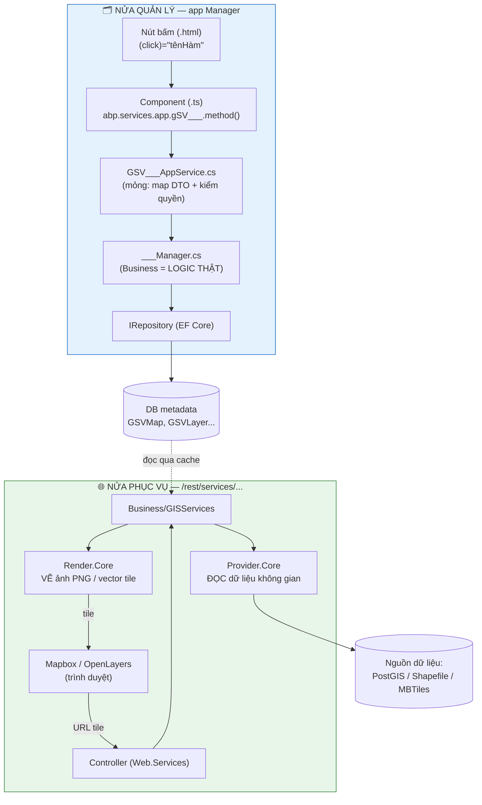
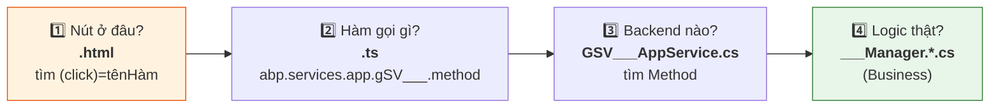
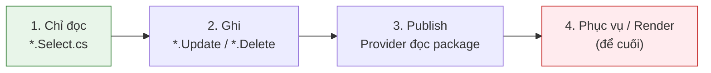
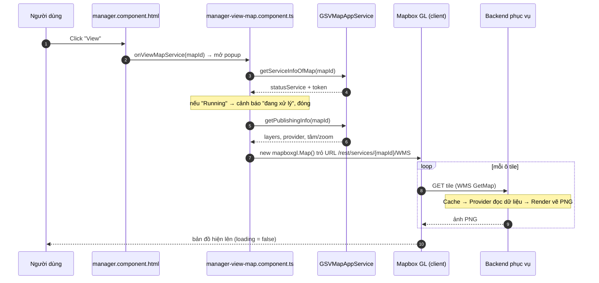

# Hướng dẫn đọc & xử lý code nghiệp vụ

Tài liệu này là **cẩm nang thực hành** để đọc hiểu và sửa code nghiệp vụ eKMapServer mà không bị ngợp. Không cần nhớ cả hệ thống — chỉ cần **một tấm bản đồ + một công thức lặp lại**.

!!! tip "Câu thần chú"
    **Hệ này chỉ có 2 nửa: QUẢN LÝ bản đồ và PHỤC VỤ bản đồ.**

    Gặp bất kỳ tính năng nào, hỏi đúng 1 câu: *"Cái này thuộc nửa nào?"* → biết ngay đi tìm ở đâu.

---

## 1. Sơ đồ 2 nửa {#hai-nua}

| Nửa | Là gì | Chạm vào |
|---|---|---|
| **QUẢN LÝ** (app Manager) | tạo / sửa / xóa / publish bản đồ | **DB (bảng)** qua EF Core |
| **PHỤC VỤ** (`/rest/services/...`) | trả ảnh/tile cho người xem | **Provider** (đọc) + **Render** (vẽ) + **đĩa** (cache) |

**Provider** = đọc dữ liệu không gian. **Render** = vẽ ảnh. **Business** đứng trên, điều phối cả hai.

---

## 2. Công thức 4 bước — trace MỌI tính năng {#cong-thuc}

Không cần nghĩ, cứ đi 4 bước này mỗi lần, y hệt nhau:

!!! success "Món quà lớn nhất của codebase: TÊN KHỚP XUYÊN SUỐT"
    `gSVMap` (JS) → `GSVMapAppService` (backend) → `MapManager` (business). Cứ theo chữ mà lần, **không cần đoán**.

    Mẹo: đọc **ngược từ bước 4 → 1**. Hiểu logic trước, rồi mới xem ai gọi nó.

---

## 3. Đọc TÊN FILE thay vì đọc hết file {#duoi-file}

File được tách sẵn theo **hành động** (`partial class`) — nhìn đuôi tên là biết vào đâu, khỏi đọc cả đống:

| Muốn sửa... | Mở file đuôi... |
|---|---|
| Danh sách / tìm kiếm | `*.Select.cs` |
| Sửa thông tin | `*.Update.cs` |
| Xóa | `*.Delete.cs` |
| Xuất bản | `*.Publish.cs` |
| Cache | `*.Cache.cs` |

> Sửa "xóa bản đồ"? → chỉ mở `MapManager.Delete.cs`. Khỏi đụng file khác.

---

## 4. Bản đồ domain {#domain}

Tiền tố **`GSV`** = GIS Service. Frontend và backend chia domain trùng khớp:

| Domain | Là gì | Frontend module |
|---|---|---|
| `GSVMap` | Bản đồ (CRUD, publish, share) | `modules/manager` |
| `GSVLayer` | Lớp dữ liệu trong bản đồ | (trong manager) |
| `GSVCollection` | Chuyên đề / thư mục nhóm | `modules/manager` |
| `GSVPackage` | Gói dữ liệu upload | `modules/manager/mapPackage` |
| `GSVProject` | Dự án (nhóm token/API key) | `modules/project` |
| `GSVToken` | API key để consumer dùng dịch vụ | `modules/apikey` |

---

## 5. Dịch vụ nào dùng Render, dịch vụ nào không {#render-hay-khong}

!!! note "Quy tắc"
    **Xuất ẢNH/TILE → có Render. Xuất DỮ LIỆU THÔ → không Render (chỉ Provider).**

| Dịch vụ | Render? | Ai vẽ |
|---|:---:|---|
| WMS, WMTS, MapServer (tile ảnh) | ✅ | Server (PNG) |
| VectorTileServer (MVT) | ✅ | Client (Mapbox) |
| WFS, FeatureServer (GeoJSON/GML) | ❌ | — (chỉ data) |

Cả **OGC** (chuẩn mở: WMS/WFS/WMTS) và **OGS** (định dạng riêng eKMap: MapServer/FeatureServer/VectorTileServer) đều dùng chung lõi Render khi cần xuất ảnh.

---

## 6. Quy tắc vàng để KHÔNG bị ngợp khi sửa {#quy-tac-vang}

1. **Đọc theo 1 sợi dây, không đọc ngang.** Trace tính năng A thì kệ B. Bỏ qua 90% còn lại.
2. **Sửa ở tầng thấp nhất.** Đổi logic → sửa trong `Manager` (Business), đừng đụng frontend nếu không cần.
3. **Đổi giao diện/nút → chỉ frontend. Đổi cách tính/lọc → chỉ Business.** Hiếm khi phải sửa cả hai.
4. **Copy tính năng có sẵn thay vì tự nghĩ.** Hệ này rất đều tay — cái mới gần như luôn giống cái cũ.

---

## 7. Thứ tự học đề nghị (dễ → khó) {#thu-tu-hoc}

!!! warning "Đừng học Render/Provider trước"
    Đó là bẫy gây nản. **80% việc thực tế nằm ở nửa QUẢN LÝ đơn giản.**

---

## 8. Ví dụ mẫu đã trace sẵn: nút "Xem bản đồ" (View) {#vi-du-view}

!!! info "Điểm chốt"
    Nút View **không tự vẽ** — nó chỉ **đấu Mapbox vào URL dịch vụ**. Backend mới vẽ từng tile khi Mapbox gọi tới.

---

## 9. Ví dụ mẫu: nút "Xóa Cache" {#vi-du-xoa-cache}

**Vì sao có nút này:** mỗi ô tile PNG được vẽ 1 lần rồi **lưu vào đĩa** (cache) để lần sau khỏi vẽ lại. Khi bạn sửa style/dữ liệu, tile cũ vẫn còn → người xem thấy bản đồ **CŨ**. Nút "Xóa Cache" dọn tile cũ, buộc server vẽ lại theo dữ liệu mới.

**Bấm vào ảnh hưởng gì:**

| Câu hỏi | Trả lời |
|---|---|
| Xóa bảng nào trong DB? | **Không.** Chỉ `Directory.Delete` / `File.Delete` trên đĩa. |
| Mất dữ liệu bản đồ / layer / feature? | **Không.** Dữ liệu gốc ở DB/PostGIS/file — không đụng. |
| Sau khi xóa? | Lần đầu xem lại **chậm hơn chút** vì server vẽ lại tile, rồi tự cache lại. |
| An toàn không? | **Có.** Cache tự sinh lại khi có người xem. |

> Đường đi: `edit.component.html` → `onDeleteCache()` → `gSVMap.deleteCache(mapId)` → `MapManager.DeleteCache(map)` (`MapManager.Delete.cs`).
>
> **Xóa Cache = "làm mới" hình ảnh bản đồ, KHÔNG phải xóa bản đồ.** Đây là chức năng thuộc nửa **PHỤC VỤ** (chạm đĩa), dù nút nằm trong màn hình sửa.
