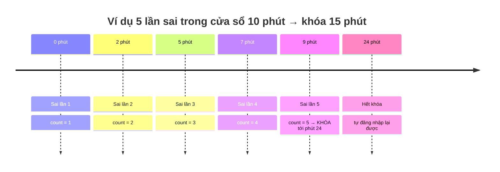
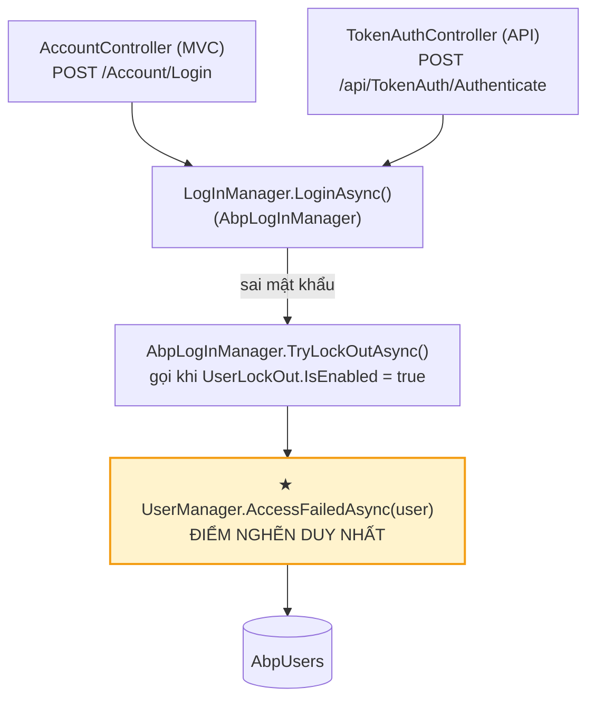
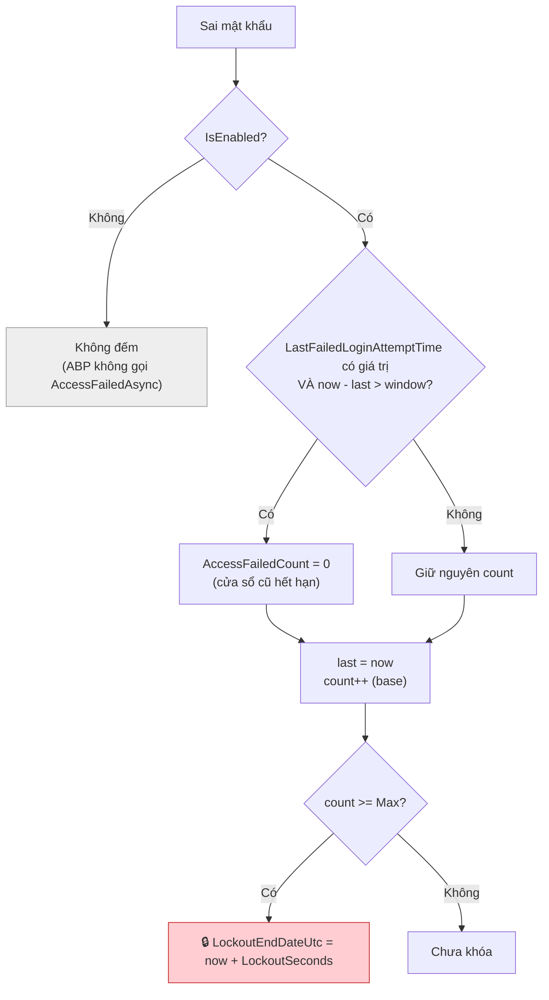

# Phương án: Khóa tài khoản tạm thời khi đăng nhập sai

**Ngày:** 2026-07-15

**Phạm vi:** eKMapServer Portal (ASP.NET Core MVC + ABP) và eKMapServer App (Angular Administrator)

**Trạng thái:** Code hoàn thành, build sạch. Migration còn ở trạng thái `Pending` (chưa apply vào DB).

---

## 1. Yêu cầu

Có giao diện cho phép thiết lập chính sách giới hạn số lần đăng nhập sai:

> Nếu một tài khoản nhập sai mật khẩu liên tiếp **quá số lần quy định** trong **một khoảng thời gian quy định** (ví dụ: 5 lần sai trong 10 phút) thì bị **khóa quyền truy cập tạm thời**.

Chính sách gồm bốn tham số, cấu hình được ở cả cấp Host và Tenant:

| Tham số | Ý nghĩa | Mặc định |
|---|---|---|
| `IsEnabled` | Bật/tắt chính sách | `true` |
| `MaxFailedAccessAttemptsBeforeLockout` | Số lần sai tối đa | `5` |
| `FailedAttemptWindowSeconds` | **Cửa sổ thời gian đếm số lần sai** | `600` (10 phút) |
| `DefaultAccountLockoutSeconds` | Thời gian khóa | `900` (15 phút) |

Hết thời gian khóa, tài khoản **tự** mở lại — không cần admin can thiệp.



---

## 2. Bối cảnh kiến trúc — dữ kiện chi phối thiết kế

Nền tảng là **ABP.Zero 6.0.0**, vốn **đã có sẵn 3/4 tham số** trên: `IsEnabled`, `MaxFailedAccessAttemptsBeforeLockout`, `DefaultAccountLockoutSeconds` — kèm DTO (`UserLockOutSettingsEditDto`), service đọc/ghi (Host + Tenant), và ô nhập trên form Security Settings của app Administrator.

Cơ chế đếm/khóa của ABP nằm trong các cột có sẵn của bảng `AbpUsers` (`AccessFailedCount`, `LockoutEndDateUtc`, `IsLockoutEnabled`), do `AbpUserManager` và `AbpLogInManager` quản lý:

- Sai mật khẩu → `AccessFailedCount++`; đạt `Max` → đặt `LockoutEndDateUtc = now + DefaultAccountLockoutSeconds`.
- Đăng nhập **thành công** → `AccessFailedCount` reset về 0.

**Khoảng trống duy nhất:** ABP đếm số lần sai **liên tiếp** nhưng **không có khái niệm cửa sổ thời gian**. Bộ đếm chỉ reset khi login đúng hoặc khi bị khóa — không tự reset sau T phút. Nghĩa là "5 lần sai" của ABP là 5 lần sai bất kể cách nhau bao lâu, còn yêu cầu là 5 lần sai **trong 10 phút**.

→ Toàn bộ tính năng này thu gọn về **một việc mới**: thêm cửa sổ thời gian. Mọi thứ khác chỉ là nối dây cấu hình vào cơ chế ABP đã có.

### Hai cửa đăng nhập, một điểm nghẽn

Hệ thống có **hai** đường xác thực bằng mật khẩu:



Cả hai controller đều gọi `LogInManager.LoginAsync`, và khi sai mật khẩu, ABP dồn về đúng **một** hàm: `UserManager.AccessFailedAsync`. Đây là lý do logic cửa sổ được đặt tại đó (mục 3.2) chứ không phải trong controller — đặt ở controller thì đường API lọt lưới, thành lỗ hổng bảo mật.

---

## 3. Các quyết định thiết kế

### 3.1. Thêm trường `LastFailedLoginAttemptTime` vào `User`

Để biết lần sai gần nhất cách bây giờ bao lâu (có vượt cửa sổ chưa), cần một mốc thời gian. ABP đã có `AccessFailedCount` nhưng **không kèm timestamp** — chỉ có con số, không có "lần cuối là khi nào".

```csharp
// eKMapServer.Core/Authorization/Users/User.cs
public DateTime? LastFailedLoginAttemptTime { get; set; }
```

**Vì sao nullable:** toàn bộ user hiện có mang `NULL` = "chưa từng có lần sai nào trong cửa sổ". Lần sai đầu tiên chỉ set mốc rồi đếm bình thường, không cần backfill dữ liệu cũ — khác hẳn `LastPasswordChangeTime` (tính năng hết hạn mật khẩu) vốn buộc phải cân nhắc backfill vì `NULL` ở đó ảnh hưởng tới việc chặn đăng nhập.

**Cố ý KHÔNG suy mốc từ bảng `AbpUserLoginAttempts`.** ABP đã ghi mọi lần đăng nhập (kèm thời gian + kết quả) vào bảng đó, nên về lý thuyết có thể truy vấn ra "lần sai gần nhất". Nhưng đó là bảng **log/audit** — sẽ phình rất to, và ghép logic điều khiển bảo mật vào một bảng log là coupling dễ vỡ, tốn một query mỗi lần sai. Một cột chuyên dụng trên `AbpUsers` là O(1) và độc lập với chính sách lưu log.

### 3.2. Đặt logic cửa sổ tại chokepoint `UserManager.AccessFailedAsync`

`AccessFailedAsync` và `ResetAccessFailedCountAsync` là method `virtual` kế thừa từ Identity `UserManager<TUser>`. Override ngay trong class `UserManager` **vốn đã tồn tại** của dự án:

```csharp
// eKMapServer.Core/Authorization/Users/UserManager.cs
public override async Task<IdentityResult> AccessFailedAsync(User user)
{
    var windowSeconds = await SettingManager.GetSettingValueForUserAsync<int>(
        AppSettings.UserManagement.UserLockOut.FailedAttemptWindowSeconds,
        user.TenantId, user.Id);

    // Cửa sổ cũ đã hết hạn → đếm lại từ đầu (giữ nguyên hành vi ABP: reset về 0)
    if (windowSeconds > 0 && user.LastFailedLoginAttemptTime.HasValue &&
        Clock.Now.Subtract(user.LastFailedLoginAttemptTime.Value).TotalSeconds > windowSeconds)
    {
        user.AccessFailedCount = 0;   // set in-memory, để base tăng 0->1, tránh 2 lần ghi DB
    }

    user.LastFailedLoginAttemptTime = Clock.Now;
    return await base.AccessFailedAsync(user);   // ABP tăng count, khóa nếu đạt Max, persist cả 2 field
}

public override async Task<IdentityResult> ResetAccessFailedCountAsync(User user)
{
    user.LastFailedLoginAttemptTime = null;      // login đúng → xóa mốc
    return await base.ResetAccessFailedCountAsync(user);
}
```

Bốn chi tiết có chủ đích:

**Không đụng `LogInManager`.** Override ở `UserManager` phủ được cả hai đường login (MVC + API) chỉ với một chỗ sửa, vì cả hai đều dồn về đây (xem sơ đồ mục 2). Override luồng nội bộ của `AbpLogInManager` vừa nặng vừa dễ hụt.

**Set `user.AccessFailedCount = 0` trong bộ nhớ thay vì gọi `base.ResetAccessFailedCountAsync`.** `base.AccessFailedAsync` dùng `Store.IncrementAccessFailedCountAsync`, tức đọc giá trị trên chính entity rồi `++`. Đặt về 0 trong bộ nhớ trước, để base tăng `0 → 1` và **persist một lần**. Gọi reset của base sẽ sinh thêm một lệnh ghi DB thừa.

**Dùng `GetSettingValueForUserAsync(name, user.TenantId, user.Id)`, không dùng `GetSettingValueAsync()`.** Tại thời điểm sai mật khẩu, người dùng **chưa** đăng nhập nên `AbpSession` còn rỗng. `GetSettingValueAsync()` sẽ đọc theo session không có tenant/user → luôn lấy mặc định cấp application, bỏ qua cấu hình riêng của tenant. Truyền thẳng `user.TenantId`/`user.Id` thì chạy đúng ở cả ngữ cảnh chưa login. (Cùng lý do với `PasswordExpirationChecker` ở tính năng hết hạn mật khẩu.)

**Reset xóa cả mốc thời gian.** Login đúng → `ResetAccessFailedCountAsync` được ABP gọi; ta nhân đó đặt `LastFailedLoginAttemptTime = null` để lần sai kế tiếp bắt đầu cửa sổ mới sạch sẽ.

### 3.3. Ngữ nghĩa cửa sổ: reset theo khoảng cách giữa hai lần sai {#semantics}

Cần nói rõ vì đây là điểm dễ hiểu nhầm. Logic **không** phải "đếm số lần sai rơi vào một cửa sổ 10 phút trượt", mà là: **mỗi lần sai, nếu cách lần sai trước quá `FailedAttemptWindowSeconds` thì bộ đếm về 0 rồi đếm lại.**



Hệ quả cần nắm: một chuỗi sai **rải đều** cách nhau đúng dưới ngưỡng cửa sổ (ví dụ sai mỗi 9 phút với cửa sổ 10 phút) sẽ **không** bao giờ reset và cuối cùng vẫn bị khóa, dù không lúc nào có "5 lần trong 10 phút" theo nghĩa cửa sổ trượt tuyệt đối.

Đây là hành vi khóa-theo-cửa-sổ tiêu chuẩn và **đúng tinh thần yêu cầu** ("sai **liên tiếp** quá số lần"): còn sai liên tiếp (chưa có lần login đúng xen giữa) thì vẫn tính. Muốn cửa sổ trượt tuyệt đối thì phải lưu timestamp từng lần thử (bảng `AbpUserLoginAttempts`) — đã cố ý loại ở mục 3.1 vì không đáng đánh đổi.

### 3.4. Ràng buộc giá trị khi lưu setting {#validation}

Form Angular có thể chặn giá trị bậy ở client, nhưng người dùng vẫn gọi **thẳng API** được (Postman/curl), bỏ qua mọi kiểm tra phía client. Server **không được tin client**. Các giá trị vô lý cần chặn khi `IsEnabled = true`:

| Giá trị bậy | Hậu quả |
|---|---|
| `MaxFailedAccessAttemptsBeforeLockout = 0` | Không bao giờ khóa được → chính sách vô hiệu |
| `FailedAttemptWindowSeconds <= 0` | Cửa sổ sai logic |
| `DefaultAccountLockoutSeconds < 60` | "Khóa" vài giây, vô nghĩa |

Cần thêm hàm kiểm tra, gọi ở **đầu** `UpdateUserLockOutSettingsAsync` (trước mọi lệnh ghi setting), ở **cả** `HostSettingsAppService` và `TenantSettingsAppService`:

```csharp
if (settings.IsEnabled)
{
    if (settings.MaxFailedAccessAttemptsBeforeLockout < 1)
        throw new UserFriendlyException(L("MaxFailedAccessAttemptsMustBeAtLeastOne"));

    if (settings.FailedAttemptWindowSeconds < 60)
        throw new UserFriendlyException(L("FailedAttemptWindowMustBeAtLeast60Seconds"));

    if (settings.DefaultAccountLockoutSeconds < 60)
        throw new UserFriendlyException(L("LockoutDurationMustBeAtLeast60Seconds"));
}
```

`UserFriendlyException` (namespace `Abp.UI`) là exception được ABP trả nguyên văn message ra client — form hiện đúng dòng lỗi thay vì "Internal Server Error". Ba key `L(...)` cần thêm vào `eKMapServer.xml` + `eKMapServer-vi.xml` (hoặc viết thẳng chuỗi tiếng Việt nếu chưa cần đa ngữ).

Đặt validation **trước** mọi lệnh ghi để cấu hình sai thì không setting nào được lưu, thay vì lưu một nửa. Đây là cùng nguyên tắc với `ValidatePasswordExpirationSettings` ở tính năng hết hạn mật khẩu.

### 3.5. Đường external/OpenID không bị ảnh hưởng — đúng như mong muốn

Đăng nhập qua OpenID Connect (`AccountController.ExternalLoginCallback`) không dùng mật khẩu nội bộ nên **không** kích hoạt `AccessFailedAsync`. Chính sách khóa chỉ áp cho đăng nhập bằng mật khẩu — hợp lý, vì không có "mật khẩu sai" để mà đếm.

---

## 4. Luồng hoạt động

### 4.1. Đếm và khóa (khi sai mật khẩu)

Xem sơ đồ ở [mục 3.3](#semantics). Điểm mấu chốt: `AbpLogInManager` chỉ gọi `TryLockOutAsync` → `AccessFailedAsync` **khi `UserLockOut.IsEnabled = true`**. Tắt chính sách thì hàm override không bao giờ chạy, không tốn gì.

### 4.2. Khi tài khoản đang bị khóa

`AbpLogInManager` kiểm tra `LockoutEndDateUtc` **trước** khi verify mật khẩu. Tài khoản đang khóa thì bị từ chối **kể cả khi nhập đúng mật khẩu**, trả `AbpLoginResultType.LockedOut`. `AbpLoginResultTypeHelper.CreateExceptionForFailedLoginAttempt` sinh thông báo tương ứng cho người dùng.

### 4.3. Khi đăng nhập thành công

`AbpLogInManager` gọi `ResetAccessFailedCountAsync` → bộ đếm về 0 và `LastFailedLoginAttemptTime` về `null`. Cửa sổ đếm bắt đầu lại sạch từ lần sai kế tiếp.

### 4.4. Hết thời gian khóa

`LockoutEndDateUtc` là mốc trong quá khứ → ABP tự cho đăng nhập lại. Không cần thao tác admin, không cần job dọn dẹp.

---

## 5. Danh sách file

### eKMapServer.Core

| File | Nội dung | Trạng thái |
|---|---|---|
| `Authorization/Users/User.cs` | Thêm `LastFailedLoginAttemptTime` (nullable) | ✅ |
| `Authorization/Users/UserManager.cs` | Override `AccessFailedAsync` + `ResetAccessFailedCountAsync` (logic cửa sổ) | ✅ |
| `Configuration/AppSettings.cs` | `UserLockOut.FailedAttemptWindowSeconds` | ✅ |
| `Configuration/AppSettingProvider.cs` | Mặc định `600`, scope Application + Tenant, `isVisibleToClients: true` | ✅ |
| `Localization/SourceFiles/eKMapServer.xml` + `-vi.xml` | Key `FailedLoginWindow` + 3 key lỗi validation (`MaxFailedAccessAttemptsMustBeAtLeastOne`, `FailedAttemptWindowMustBeAtLeast60Seconds`, `LockoutDurationMustBeAtLeast60Seconds`) | ✅ |

### eKMapServer.Application

| File | Nội dung | Trạng thái |
|---|---|---|
| `Configuration/Tenants/Dto/UserLockOutSettingsEditDto.cs` | Thêm `FailedAttemptWindowSeconds` | ✅ |
| `Configuration/Tenants/TenantSettingsAppService.cs` | Đọc/ghi setting mới | ✅ |
| `Configuration/Host/HostSettingsAppService.cs` | Đọc/ghi setting mới | ✅ |
| *(cả hai AppService)* | Validation `Max ≥ 1`, `Window ≥ 60`, `Lockout ≥ 60` guard bằng `IsEnabled` ([3.4](#validation)); cần `using Abp.UI;` | ✅ |

### eKMapServer.EntityFrameworkCore

| File | Nội dung | Trạng thái |
|---|---|---|
| `Migrations/20260715022326_Add_LastFailedLoginAttemptTime.cs` | Cột `datetime2 NULL` trên `AbpUsers` | ✅ (chưa chắc đã apply) |

### Angular (Administrator)

| File | Nội dung | Trạng thái |
|---|---|---|
| `src/app/pages/settings/settings.component.html` | Ô nhập `FailedAttemptWindowSeconds`, binding `settingSystem.security.userLockOut.failedAttemptWindowSeconds`, ẩn/hiện theo `isEnabled` | ✅ |
| Service proxy | **Không cần regenerate.** `settingSystem` là `any`, gửi qua ABP dynamic proxy (`abp.services.app.hostSettings.updateAllSettings`) → field mới tự round-trip dưới dạng JSON | ✅ không cần |

---

## 6. Triển khai

### Bước 1 — Apply migration

```bash
cd eKMapServer_Portal/Services/src/eKMapServer.EntityFrameworkCore
dotnet ef database update
```

**Phải chạy trước khi khởi động code mới.** Code mới đọc `user.LastFailedLoginAttemptTime`; cột chưa có thì EF ném `Invalid column name` ở mọi query load user — hỏng luôn đăng nhập.

SQL sinh ra phải là **đúng một** lệnh (nếu ra nhiều `AlterColumn` thừa, xem `migration-identity-columns-issue.md`):

```sql
ALTER TABLE [AbpUsers] ADD [LastFailedLoginAttemptTime] datetime2 NULL;
```

**Không cần backfill.** `NULL` = chưa có lần sai nào, hoàn toàn đúng cho user cũ.

### Bước 2 — Build Angular

```bash
cd eKMapServer_App/Administrator && npm run publish
```
Copy `dist/*` vào `eKMapServer.Web.Mvc/wwwroot/Administrator/`. (Ô cấu hình nằm ở app Administrator; app Manager không có form này.)

### Bước 3 — Kiểm tra cấu hình

Xác nhận `App.UserManagement.UserLockOut.FailedAttemptWindowSeconds` trong `AbpSettings`; không có row thì dùng mặc định **600**. Ba tham số của ABP (`IsEnabled`, `Max`, `DefaultAccountLockoutSeconds`) vốn đã có mặc định riêng của ABP.Zero.

---

## 7. Kiểm thử

Cấu hình test: `Max = 3`, `Window = 60s`, `Lockout = 120s` cho nhanh.

| Kịch bản | Thao tác | Kết quả mong đợi |
|---|---|---|
| Khóa trong cửa sổ | Sai 3 lần trong vòng 60s | Lần thử thứ 4 bị từ chối kể cả khi mật khẩu đúng |
| Cửa sổ hết hạn → không khóa | Sai 2 lần, chờ > 60s, sai tiếp 1 lần | **Không** khóa (bộ đếm đã reset về 0) |
| Login đúng reset bộ đếm | Sai 2 lần rồi đăng nhập đúng | `AccessFailedCount = 0`, `LastFailedLoginAttemptTime = NULL` |
| Tự mở khóa | Bị khóa, chờ > 120s | Đăng nhập lại bình thường, không cần admin |
| Phủ cả hai đường | Lặp kịch bản khóa qua **cả** form MVC và `api/TokenAuth` | Cùng hành vi — xác nhận chokepoint phủ cả hai |
| Tắt chính sách | `IsEnabled = false`, sai nhiều lần | Không bao giờ khóa |

**Test validation ([3.4](#validation), sau khi làm):**

- POST thẳng API lưu setting với `Max = 0` / `Window = 10` / `Lockout = 5` (bỏ qua form) → phải bị `UserFriendlyException` từ chối, không setting nào được lưu.

**Kiểm tra trực tiếp DB khi test:**

```sql
SELECT UserName, AccessFailedCount, LockoutEndDateUtc, LastFailedLoginAttemptTime
FROM AbpUsers WHERE UserName = 'admin';

-- Ép hết hạn khóa để test tự mở khóa:
UPDATE AbpUsers SET LockoutEndDateUtc = DATEADD(MINUTE, -1, GETUTCDATE()) WHERE UserName = 'admin';
```

Lưu ý `LockoutEndDateUtc` là giờ **UTC** (ABP quản lý cột này theo UTC), khác với `LastFailedLoginAttemptTime` ghi bằng `Clock.Now` (giờ local server, do `Clock.Provider` mặc định `Unspecified`).

---
