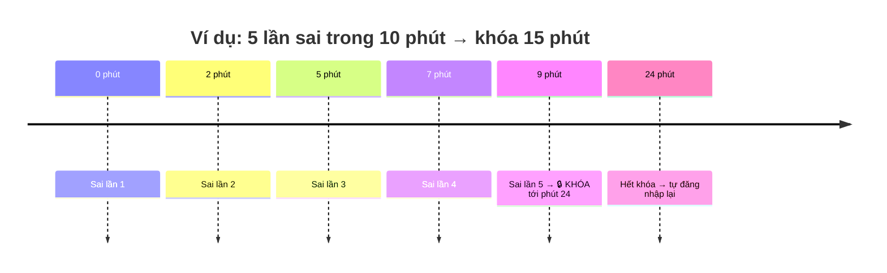
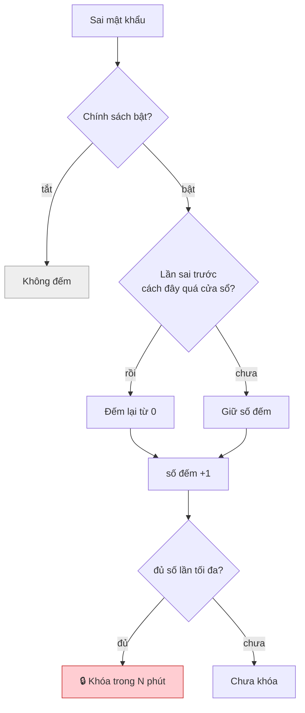
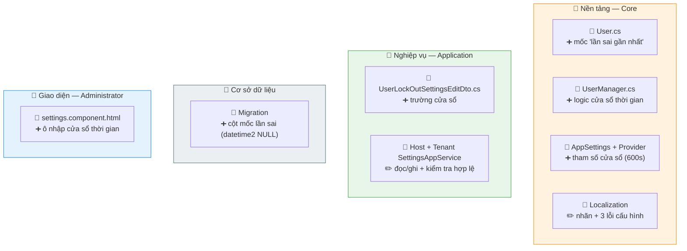

# Khóa tài khoản tạm thời khi đăng nhập sai

> Sai mật khẩu **quá số lần** trong **một khoảng thời gian** → khóa tạm thời, hết giờ **tự** mở lại.

## 1. Cách hoạt động

## 2. Cấu hình (Host + Tenant)

| Tham số | Ý nghĩa | Mặc định |
|---|---|---|
| Bật/tắt | Có áp dụng chính sách không | Bật |
| Số lần sai tối đa | Sai bao nhiêu lần thì khóa | 5 |
| Cửa sổ thời gian | Khoảng đếm số lần sai | 600 giây (10 phút) |
| Thời gian khóa | Khóa bao lâu | 900 giây (15 phút) |

## 3. File nào — sửa gì

> ✏️ sửa · ➕ thêm mới

## 4. Cần nhớ

!!! warning "Chặn ở đúng một điểm để phủ cả 2 đường đăng nhập"
    Cả form web (MVC) lẫn API (`/api/TokenAuth`) đều dồn về **một** hàm đếm sai. Logic đặt ở đó nên **không đường nào lọt lưới**. Đặt ở controller thì đường API thành lỗ hổng.

!!! note "Ý nghĩa cửa sổ"
    Mỗi lần sai, nếu **cách lần sai trước** quá cửa sổ thì số đếm về 0. Đăng nhập **đúng** cũng reset về 0. Đăng nhập bằng OpenID (không mật khẩu) **không** bị tính.

!!! danger "Phải chạy migration trước khi bật code mới"
    Code đọc cột mốc lần sai; chưa có cột → **hỏng cả đăng nhập** (`Invalid column name`). Chạy `dotnet ef database update` (đúng 1 lệnh `ADD COLUMN`). **Không cần** backfill (user cũ = chưa có lần sai nào).
