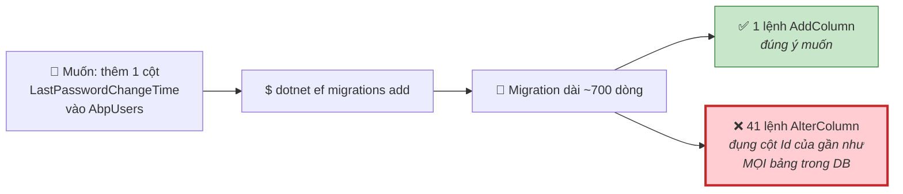
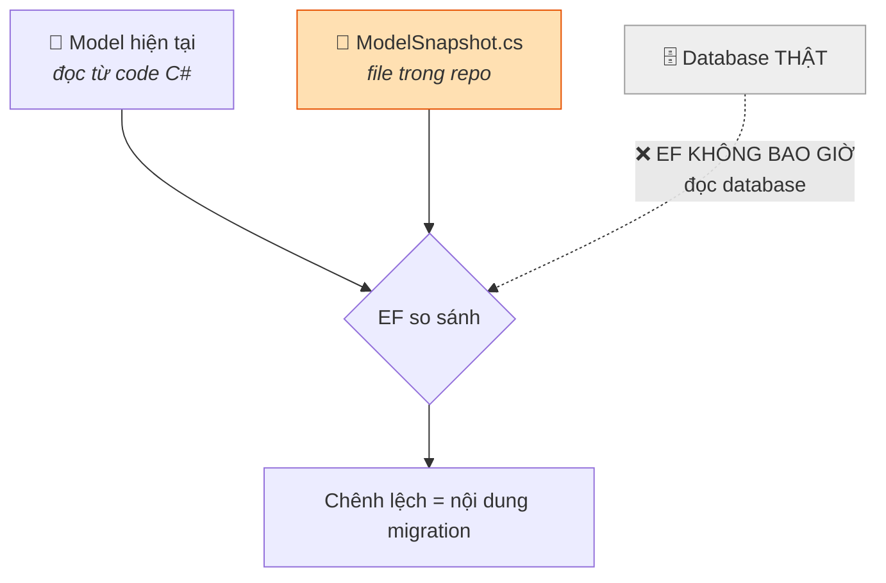
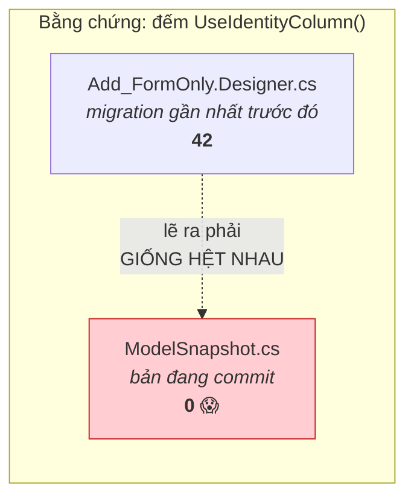
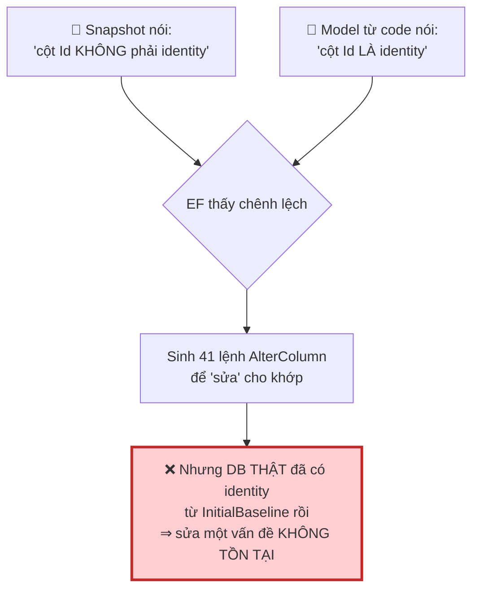
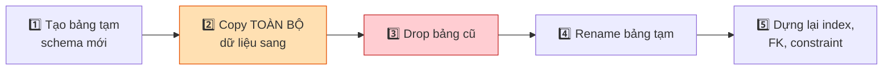
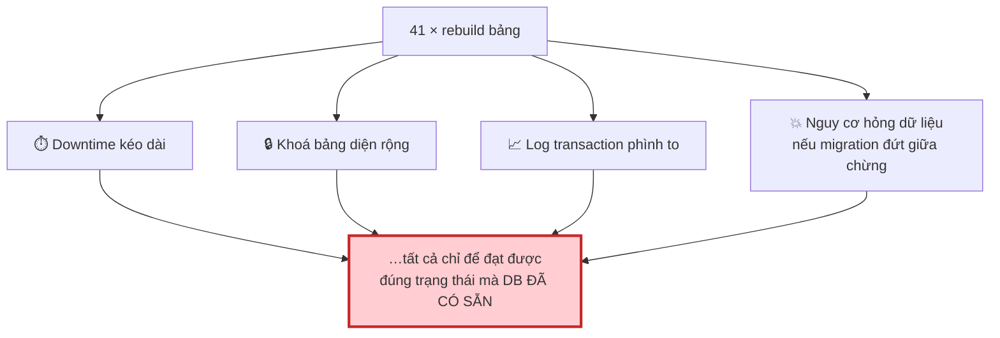
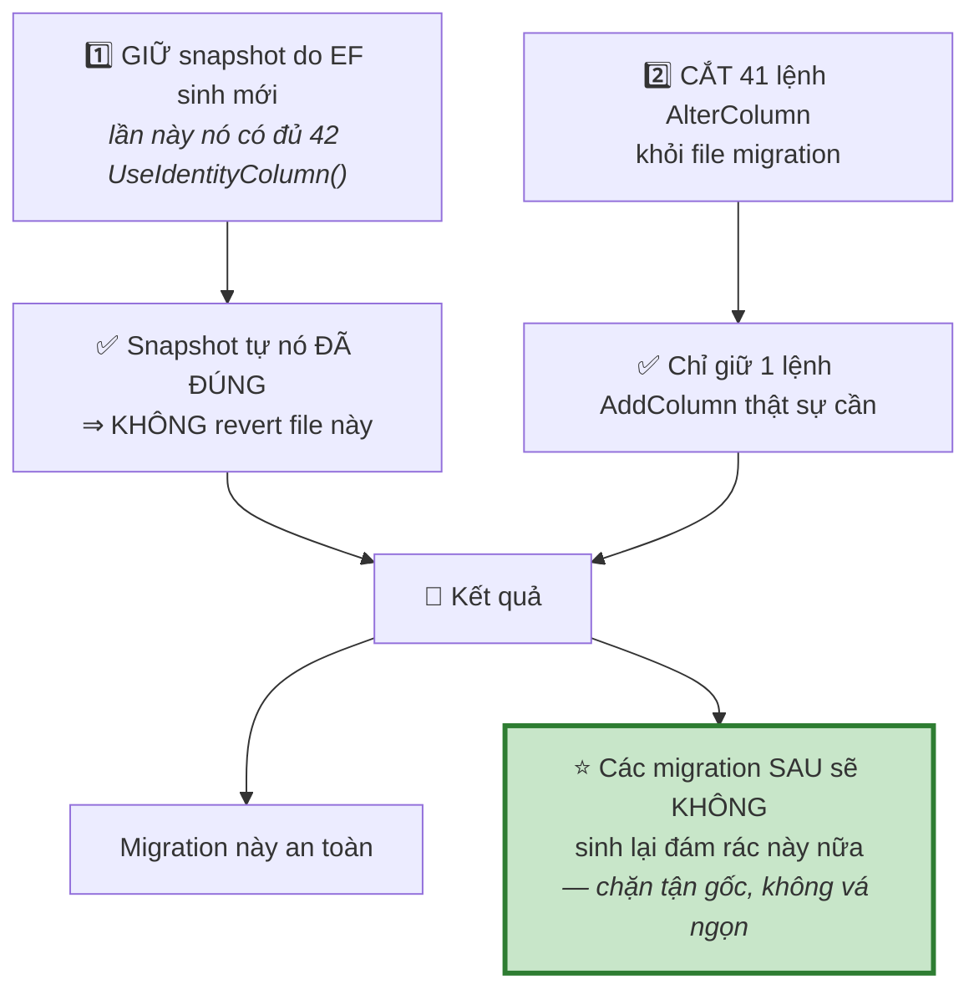
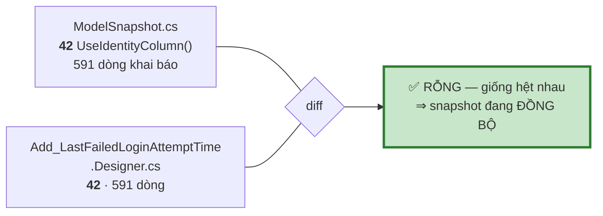
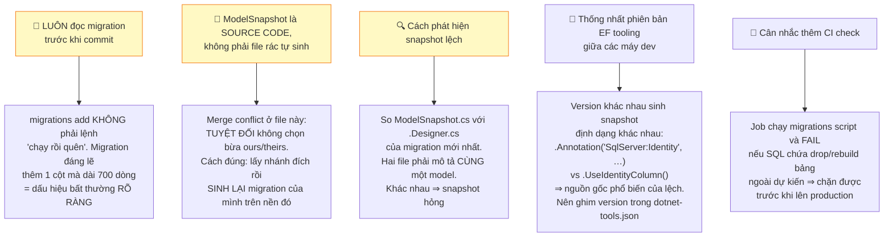

# Sự cố: migration thêm 1 cột nhưng EF sinh thêm 41 lệnh `AlterColumn` thừa

**Ngày:** 2026-07-14 · **Migration:** `20260714025730_Add_LastPasswordChangeTime` · **Mức độ:** 🔴 Cao · **Trạng thái:** ✅ Đã xử lý tận gốc

---

## 1. Chuyện gì đã xảy ra



41 bảng bị đụng tới, gồm cả bảng lớn: `AbpUsers`, `AbpTenants`, `AbpAuditLogs`, `AbpSettings`, `gsvMap`, `gsvLayer`, `gsvLog`, `tenantBranding`, `AbpRoles`, `AbpPermissions`…

Nguyên nhân **không phải** do khai báo entity sai.

---

## 2. Vì sao EF làm vậy



!!! danger "EF tin tuyệt đối vào ModelSnapshot. Snapshot sai ⇒ migration sai."

### Snapshot đã bị lệch như thế nào



Designer của migration cuối **chính là** snapshot tại thời điểm đó. Snapshot mất sạch 42 khai báo identity trong khi Designer vẫn giữ đủ ⇒ file snapshot **đã bị ghi đè bằng bản cũ/sai** (nhiều khả năng: merge conflict giải quyết sai, hoặc một máy dev dùng phiên bản EF tooling khác sinh lại rồi commit đè).

### Hệ quả dây chuyền



---

## 3. Vì sao nguy hiểm

SQL Server **không cho phép** thêm/bỏ `IDENTITY` bằng `ALTER COLUMN`. Để thực thi, EF/SQL Server buộc phải rebuild cả bảng:



**Nhân quy trình đó với 41 bảng** — gồm cả `AbpAuditLogs`, `gsvLog` (những bảng lớn nhất hệ thống):



!!! danger "Cái bẫy độc nhất: nó chạy êm trên máy dev"
    ```mermaid
    flowchart LR
        A["💻 Máy dev<br/>DB nhỏ, không tải"] -->|"chạy êm ru ✅"| B["Yên tâm commit"]
        B --> C["🖥️ Production<br/>DB lớn, đang phục vụ"]
        C -->|"💥"| D["Mới bộc lộ"]

        style D fill:#ffcdd2,stroke:#c62828
    ```

---

## 4. Cách đã xử lý {#cach-xu-ly}



Migration sau khi cắt gọn:

```csharp
public partial class Add_LastPasswordChangeTime : Migration
{
    protected override void Up(MigrationBuilder migrationBuilder)
    {
        migrationBuilder.AddColumn<DateTime>(
            name: "LastPasswordChangeTime",
            table: "AbpUsers",
            type: "datetime2",
            nullable: true);
    }

    protected override void Down(MigrationBuilder migrationBuilder)
    {
        migrationBuilder.DropColumn(
            name: "LastPasswordChangeTime",
            table: "AbpUsers");
    }
}
```

!!! question "Cắt bỏ 41 lệnh có làm schema lệch không?"
    **Không.** Database thật **vốn đã** có các cột identity đó — do `InitialBaseline` tạo ra. Bỏ qua 41 lệnh `AlterColumn` không làm schema lệch đi đâu cả; chúng vốn là lệnh "sửa" một thứ đã đúng sẵn.

---

## 5. Kiểm chứng

### Lúc xử lý sự cố

```bash
dotnet ef migrations script Add_FormOnly Add_LastPasswordChangeTime
```

Kết quả — **đúng một lệnh**, không có thao tác rebuild nào:

```sql
BEGIN TRANSACTION;
ALTER TABLE [AbpUsers] ADD [LastPasswordChangeTime] datetime2 NULL;
COMMIT;
```

### Trạng thái hiện tại (kiểm lại 17/07/2026)



Và **không commit nào** trong lịch sử repo còn chứa `migrationBuilder.AlterColumn` — đã kiểm tra toàn bộ 4 commit từng đụng vào thư mục `Migrations/`.

→ **Sự cố đã đóng.** Migration mới sẽ không tái sinh đám rác này.

---

## 6. Bài học



!!! tip "Quy trình an toàn cho mọi migration về sau"
    ```mermaid
    flowchart LR
        A["dotnet ef<br/>migrations add"] --> B["📖 ĐỌC file migration"]
        B --> C{"Có lệnh nào<br/>ngoài dự kiến?"}
        C -->|"có"| D["🛑 DỪNG<br/>snapshot đang lệch"]
        C -->|"không"| E["dotnet ef<br/>migrations script"]
        E --> F{"SQL có DROP CONSTRAINT<br/>hay tạo bảng tạm?"}
        F -->|"có"| D
        F -->|"không"| G["✅ Commit"]

        style D fill:#ffcdd2,stroke:#c62828
        style G fill:#c8e6c9,stroke:#2e7d32
    ```

*Xem thêm: [Cập nhật DB đang chạy lên schema hiện tại](db-update-existing-database.md) — quy trình đưa delta vào DB production mà không đụng dữ liệu.*
