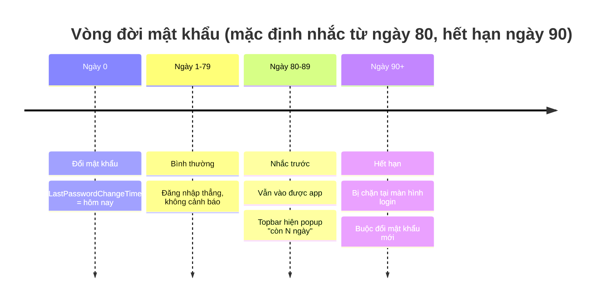
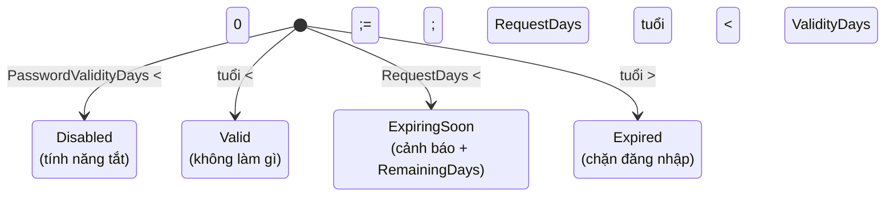
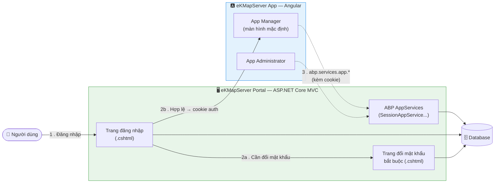
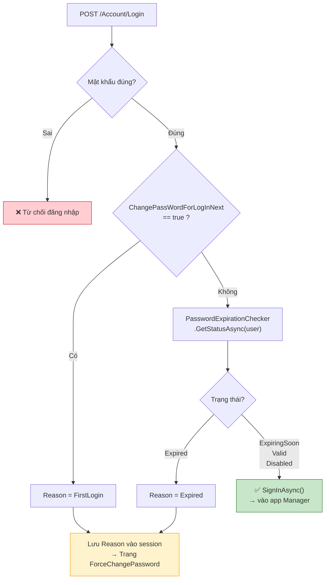
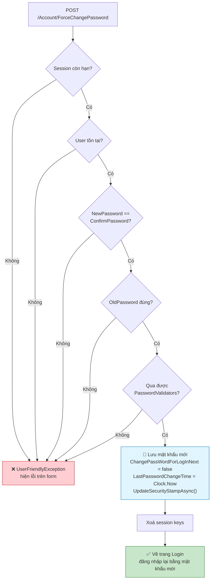
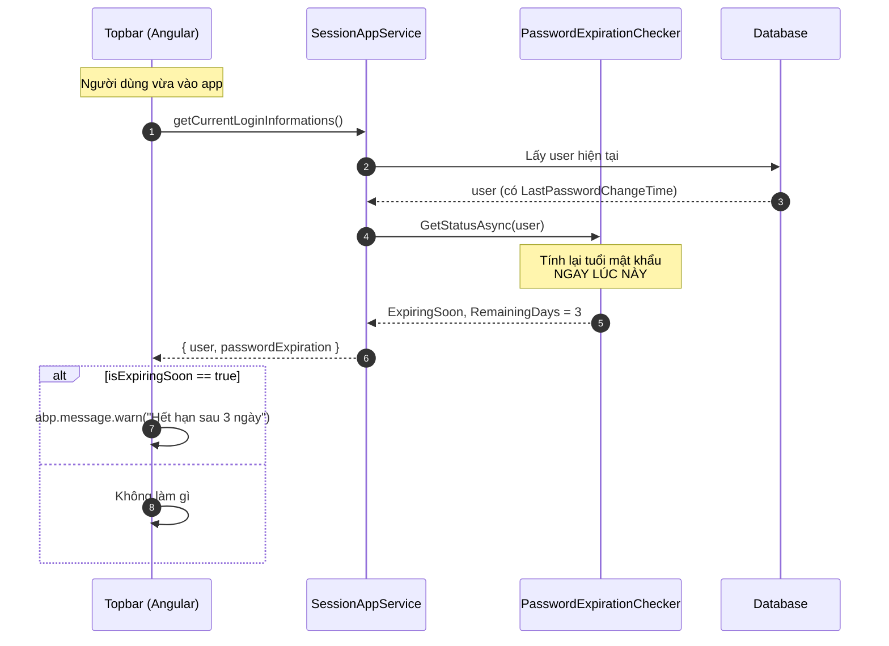

# Phương án: Hết hạn mật khẩu & Đổi mật khẩu bắt buộc

**Ngày:** 2026-07-14

**Phạm vi:** eKMapServer Portal (ASP.NET Core MVC + ABP) và eKMapServer App (Angular)

**Trạng thái:** Code hoàn thành.

---

## 1. Yêu cầu

Hệ thống cần hai hành vi liên quan tới vòng đời mật khẩu:

**Ép đổi mật khẩu ở lần đăng nhập đầu.** Admin tạo tài khoản với mật khẩu mặc định (`123qwe`) và bật cờ `ChangePassWordForLogInNext`. Người dùng không được vào hệ thống cho tới khi tự đặt mật khẩu riêng.

**Ép đổi mật khẩu khi quá hạn.** Mật khẩu có tuổi thọ tối đa, cấu hình qua setting `App.PasswordValidityDays` (mặc định 90 ngày). Quá mốc đó là bị chặn tại màn hình đăng nhập, buộc đổi mật khẩu mới vào được. Trước mốc đó một khoảng, người dùng vẫn đăng nhập bình thường nhưng được nhắc trước — mốc bắt đầu nhắc cấu hình qua `App.PasswordChangeRequestDays` (mặc định 80 ngày).

Hai setting đều tính theo **tuổi của mật khẩu**, không phải "số ngày trước khi hết hạn". Với cấu hình mặc định (80 / 90), người dùng có 10 ngày được nhắc trước khi bị chặn.



Trạng thái mà `PasswordExpirationChecker` trả về:



---

## 2. Bối cảnh kiến trúc — dữ kiện chi phối toàn bộ thiết kế

Hệ thống chia làm hai phần chạy trên **cùng một origin**:



| Thành phần | Công nghệ | Vai trò |
|---|---|---|
| eKMapServer Portal | ASP.NET Core MVC + Razor (`.cshtml`) | Đăng nhập, đăng ký, đổi mật khẩu |
| eKMapServer App | Angular (**hai** app: `Manager` và `Administrator`) | Giao diện các module nghiệp vụ |

**Angular không có hệ thống đăng nhập riêng.** Module `auth/` trong app Angular (với `localStorage`, `Bearer token`) là code mẫu KeenThemes còn sót lại — `environment.ts` vẫn để `isMockEnabled: true`, và không file nào trong app gọi API thật qua `HttpClient`.

Angular xác thực bằng **cookie của MVC**, và gọi backend qua ABP dynamic proxy:

```typescript
abp.services.app.session.getCurrentLoginInformations().then(...)
```

Hai hệ quả trực tiếp lên thiết kế:

**Việc chặn đăng nhập bắt buộc phải nằm ở MVC**, vì đó là nơi duy nhất kiểm soát được quá trình xác thực.

**Việc cảnh báo bắt buộc phải tới được Angular**, vì đó là nơi người dùng thật sự làm việc sau khi đăng nhập.

---

## 3. Các quyết định thiết kế

### 3.1. Thêm trường `LastPasswordChangeTime` vào `User`

Để biết mật khẩu đã bao nhiêu tuổi, cần một mốc thời gian. Entity `AbpUser` của ABP có sẵn `CreationTime` và `LastModificationTime`, nhưng **không cái nào dùng được**:

`LastModificationTime` được ABP cập nhật khi **bất kỳ** thay đổi nào trên bản ghi user — sửa profile, gán role, đổi email, khoá/mở tài khoản. Dùng nó làm mốc thì admin gán thêm một role cho user là đồng hồ hết hạn mật khẩu của người đó **reset về 0**. Tính năng sẽ vô hiệu trong thực tế, vì user hoạt động thường xuyên liên tục được "gia hạn" mà không hề đổi mật khẩu.

`CreationTime` chỉ đúng cho tới lần đổi mật khẩu đầu tiên.

Hai câu hỏi khác nhau — *"bản ghi sửa lần cuối khi nào"* và *"mật khẩu đổi lần cuối khi nào"* — thì cần hai trường khác nhau:

```csharp
// eKMapServer.Core/Authorization/Users/User.cs
public DateTime? LastPasswordChangeTime { get; set; }
```

**Vì sao nullable:** user chưa từng đổi mật khẩu (và toàn bộ dữ liệu đang có) sẽ mang giá trị `NULL`, và mọi nơi đọc đều fallback về `CreationTime`. Nhờ vậy không phải đụng vào các chỗ tạo user (seed host admin, seed tenant admin, `UserRegistrationManager`, `UserAppService.CreateAsync`) — mốc tính tuổi mật khẩu của user mới chính là lúc tạo, hoàn toàn hợp lý.

**Phải set ở cả ba đường đổi mật khẩu.** Sót một chỗ là tính năng sai:

| Nơi | Tình huống |
|---|---|
| `UserAppService.ChangePassword` | User tự đổi trong app |
| `UserAppService.ResetPassword` | Admin reset cho user |
| `AccountController.ForceChangePassword` | Bị ép đổi (lần đầu / hết hạn) |

Dùng `Clock.Now` của ABP chứ không phải `DateTime.Now`, để nhất quán với cách ABP ghi `CreationTime` — nếu sau này dự án đổi `Clock.Provider` sang UTC thì cả hai cùng đổi theo.

### 3.2. Gom logic hết hạn vào một class dùng chung

Có **hai** nơi cần trả lời cùng một câu hỏi *"mật khẩu này già chưa"*:

- `AccountController` — để quyết định có **chặn đăng nhập** không
- `SessionAppService` — để quyết định có **cảnh báo** không

Nếu mỗi bên tự tính, sớm muộn chúng sẽ bất đồng về thế nào là "hết hạn". Bug kiểu đó cực khó phát hiện vì nhìn riêng từng bên đều thấy có vẻ đúng — chỉ khi đặt cạnh nhau mới lộ ra là MVC bảo "hết hạn" còn Angular bảo "còn 3 ngày".

```csharp
// eKMapServer.Core/Authorization/Users/PasswordExpirationChecker.cs
public async Task<PasswordExpirationStatus> GetStatusAsync(User user)
{
    var expirationDays = await _settingManager.GetSettingValueForUserAsync<int>(
        AppSettings.PasswordValidityDays, user.TenantId, user.Id);

    var changeReminderDays = await _settingManager.GetSettingValueForUserAsync<int>(
        AppSettings.PasswordChangeRequestDays, user.TenantId, user.Id);

    if (expirationDays <= 0)
    {
        return PasswordExpirationStatus.Disabled();
    }

    var ageDays = (Clock.Now - (user.LastPasswordChangeTime ?? user.CreationTime)).TotalDays;

    if (ageDays >= expirationDays)
    {
        return PasswordExpirationStatus.Expired();
    }

    // Settings can be written straight to AbpSettings (SQL, seed data) without going through
    // HostSettingsAppService, so a reminder outside the valid range just means "no warning".
    if (changeReminderDays > 0 && changeReminderDays < expirationDays && ageDays >= changeReminderDays)
    {
        return PasswordExpirationStatus.ExpiringSoon(
            Math.Max(1, (int)Math.Ceiling(expirationDays - ageDays)));
    }

    return PasswordExpirationStatus.Valid();
}
```

Bốn chi tiết có chủ đích:

**Nhánh `expirationDays <= 0` → `Disabled()` phải đứng riêng, không được `&&` với điều kiện của reminder.** Đây từng là bug: điều kiện `expirationDays <= 0 && changeReminderDays <= 0` khiến việc đặt `PasswordValidityDays = 0` (ý định: **tắt** tính năng) trong khi reminder vẫn để mặc định 80 sẽ **không** tắt được gì cả — luồng chạy tiếp xuống `ageDays >= 0`, luôn đúng, nên **mọi user đều Expired**. Tệ hơn: đổi mật khẩu xong thì tuổi mật khẩu về 0, mà `0 >= 0` vẫn là Expired → người dùng kẹt vĩnh viễn trong vòng lặp ép đổi mật khẩu, không cách nào vào được hệ thống. Chỉ `PasswordValidityDays` mới quyết định tính năng bật hay tắt.

**Nhánh `Expired` đứng trước nhánh `ExpiringSoon`**, nên khi hai setting bị cấu hình sai (reminder ≥ expiration), người dùng sẽ bị chặn thẳng chứ không bao giờ nhận được cảnh báo.

**Điều kiện `changeReminderDays > 0 && changeReminderDays < expirationDays` là lớp phòng thủ thứ hai.** Ràng buộc chính nằm ở `HostSettingsAppService` (xem 3.3), nhưng bảng `AbpSettings` có thể bị sửa thẳng bằng SQL hoặc nạp từ seed data — những đường không đi qua AppService. Checker không tin dữ liệu đầu vào: reminder nằm ngoài khoảng hợp lệ thì đơn giản là không cảnh báo, chứ không sinh ra hành vi lạ.

**Dùng `GetSettingValueForUserAsync(name, user.TenantId, user.Id)`, không dùng `GetSettingValueAsync()`.** Lý do: tại thời điểm `Login` POST chạy, người dùng **chưa** đăng nhập nên `AbpSession` còn rỗng. `GetSettingValueAsync()` sẽ đọc theo session không có tenant/user, tức luôn lấy giá trị mặc định cấp application và bỏ qua cấu hình riêng của tenant. Truyền thẳng `user.TenantId`/`user.Id` thì hàm này chạy đúng ở cả hai ngữ cảnh (đã login và chưa login).

### 3.3. Ràng buộc `RequestDays < ValidityDays` khi lưu setting {#validation}

Hai setting được nhập độc lập trên form Security Settings, và trước đây `HostSettingsAppService` lưu thẳng xuống DB không kiểm tra gì. Admin gõ nhầm `reminder = 90, expiration = 80` là rơi vào cấu hình vô nghĩa: nhánh `ExpiringSoon` không bao giờ chạy được (vì `Expired` đứng trước và luôn thắng), nên tính năng nhắc trước bị **tắt âm thầm** — không ai báo lỗi, chỉ là người dùng đùng một cái bị chặn đăng nhập mà chưa từng được cảnh báo.

Nên chặn ngay từ lúc lưu:

```csharp
// eKMapServer.Application/Configuration/Host/HostSettingsAppService.cs
private void ValidatePasswordExpirationSettings(int passwordValidityDays, int passwordChangeRequestDays)
{
    if (passwordValidityDays < 0 || passwordChangeRequestDays < 0)
    {
        throw new UserFriendlyException(L("PasswordExpirationDaysCannotBeNegative"));
    }

    // Validity = 0 turns the whole feature off, so the request-day value is irrelevant then.
    if (passwordValidityDays > 0 && passwordChangeRequestDays >= passwordValidityDays)
    {
        throw new UserFriendlyException(L("PasswordChangeReminderDaysMustBeLessThanExpirationDays"));
    }
}
```

Được gọi ở đầu `UpdateSecuritySettingsAsync`, **trước** mọi lệnh ghi setting — cấu hình sai thì không có setting nào được lưu, thay vì lưu một nửa.

Không đặt khoảng cách tối thiểu (kiểu "phải nhắc trước ít nhất 7 ngày"). Chỉ cần `request < validity` là cấu hình đã có ý nghĩa. Nếu sau này chính sách bảo mật yêu cầu một khoảng nhắc tối thiểu, sửa điều kiện thành `passwordValidityDays - passwordChangeRequestDays >= N` và đặt `N` thành hằng số trong `AppSettings` để cả server lẫn form Angular dùng chung một nguồn.

Ba cấu hình hợp lệ:

| Expiration | Reminder | Ý nghĩa |
|---|---|---|
| `90` | `80` | Mặc định — nhắc từ ngày 80, chặn từ ngày 90 |
| `90` | `0` | Có hết hạn nhưng **không** nhắc trước |
| `0` | (bỏ qua) | **Tắt** hoàn toàn tính năng hết hạn |

### 3.4. Cảnh báo: tính khi được hỏi, không lưu trạng thái

Đây là quyết định quan trọng nhất. Có ba cách đưa cảnh báo tới Angular:

| Phương án | Vấn đề |
|---|---|
| Lưu vào `HttpContext.Session` lúc login | Session là state **phía server** — JavaScript không đọc thẳng được. Phải viết thêm endpoint. Và vẫn dính các bệnh dưới. |
| Lưu vào cookie (bỏ `HttpOnly` để JS đọc) | Nhét dữ liệu dẫn xuất vào chỗ dành cho state xác thực. Client sửa được. Phải tự lo vòng đời: set khi nào, xoá khi nào. |
| **Tính từ dữ liệu mỗi khi được hỏi** | **Không có nhược điểm nào ở trên.** |

Điểm mấu chốt: từ khi có `LastPasswordChangeTime`, câu *"còn mấy ngày nữa hết hạn"* là một **hàm** của `(LastPasswordChangeTime, PasswordValidityDays, hôm nay)`. Nó không phải một **sự kiện** xảy ra lúc login để phải ghi lại — nó là thứ tính ra được bất cứ lúc nào.

Lưu nó xuống là lưu trùng một sự thật đã có, và kéo theo ba bệnh:

**Reload là mất cảnh báo.** Session/cookie chỉ được ghi đúng một lần ngay sau POST login. Angular là SPA — người dùng bấm F5 là banner biến mất, vì không có ai ghi lại.

**Phải nhớ xoá, và sẽ quên.** Ghi vào session thì phải có chỗ xoá sau khi hiển thị, nếu không banner hiện lại suốt phiên. Không lưu thì không phải dọn.

**Số ngày bị đóng băng.** User mở tab qua đêm, hôm sau vẫn thấy con số của hôm qua.

Nên cảnh báo được trả qua API mà Angular **vốn đã gọi sẵn** để lấy tên người dùng:

```csharp
// SessionAppService.GetCurrentLoginInformations()
if (AbpSession.UserId.HasValue)
{
    var user = await GetCurrentUserAsync();
    output.User = ObjectMapper.Map<UserLoginInfoDto>(user);

    var status = await _passwordExpirationChecker.GetStatusAsync(user);
    output.PasswordExpiration = new PasswordExpirationInfoDto
    {
        IsExpiringSoon = status.IsExpiringSoon,
        RemainingDays = status.RemainingDays
    };
}
```

Không cần proxy mới, không cần cookie mới, không cần endpoint mới. Việc thêm field vào output DTO cũng không đụng gì tới ABP dynamic proxy — proxy chỉ mô tả **method**, còn DTO chỉ là JSON.

### 3.5. Một trang đổi mật khẩu cho cả hai luồng

Hai luồng (đăng nhập lần đầu / hết hạn) giống nhau ở mọi điểm quan trọng: người dùng **đã** xác thực thành công bằng mật khẩu hiện tại, cùng một form 3 ô, cùng điều kiện thoát, cùng session state. Khác nhau đúng một thứ: **câu chữ hiển thị**.

Tách thành hai trang đồng nghĩa phải nhân bản action `ForceChangePassword [HttpPost]` — nơi chứa toàn bộ validation. Hai bản sao của cùng một khối bảo mật sẽ lệch nhau theo thời gian.

Nhưng "dùng chung" **không** có nghĩa là truyền câu chữ qua querystring:

```csharp
// KHÔNG làm thế này
Url.Action("ForceChangePassword", "Account",
    new { returnUrl, successMessage = L("PasswordExpiredWarning") })
```

Đó là nhét **chuỗi hiển thị** vào URL. Bất kỳ ai cũng gõ được `/Account/ForceChangePassword?successMessage=Tài khoản bị khoá, gọi ngay 0900...` và trang đổi mật khẩu mang thương hiệu công ty sẽ hiện nguyên văn dòng đó — một trang phishing miễn phí trên chính domain của mình. Nếu view render bằng `@Html.Raw` thì thành XSS.

Cách đúng là truyền **lý do** (một enum, không phải text tự do) qua session:

```csharp
public enum ForceChangePasswordReason
{
    FirstLogin = 0,
    Expired = 1
}
```

View tự chọn key localization từ lý do đó:

```cshtml
@(Model.Reason == ForceChangePasswordReason.Expired
    ? L("PasswordExpiredWarning")
    : L("ForceChangePasswordWarning"))
```

Lợi thêm: có enum rồi thì hai luồng muốn khác nhau về **luật** cũng làm được trong cùng một action, không cần tách file.

### 3.6. Validation phải nằm ở server, kể cả khi client đã kiểm tra

Trang đổi mật khẩu có endpoint `ValidatePasswordHelper` để JS gọi khi người dùng đang gõ, hiện hộp đỏ ngay lập tức. Nhưng validation trong action POST **không phải là dư thừa**.

`ValidatePasswordHelper` là endpoint mà **client tự nguyện gọi**. Không có gì bắt client phải gọi, cũng không có gì bắt client phải nghe theo kết quả. Nó chạy trong trình duyệt — môi trường mà người dùng toàn quyền kiểm soát. Ai cũng POST thẳng được:

```bash
curl -X POST https://server/Account/ForceChangePassword \
  -d "OldPassword=123qwe&NewPassword=1&ConfirmPassword=1&__RequestVerificationToken=..."
```

Trong luồng này `ForceChangePassword.js` không tồn tại và `ValidatePasswordHelper` không bao giờ được gọi. Chỉ có action POST đứng giữa kẻ tấn công và database.

Nguyên tắc: **mọi thứ chạy trên client là gợi ý, chỉ server mới là luật.** Validation phía client tồn tại để trải nghiệm tốt hơn, không phải để bảo vệ hệ thống. Cùng lý do đó, ràng buộc `reminder < expiration` ở mục 3.3 nằm trong AppService chứ không chỉ nằm ở form Angular.

Phần logic thật sự không bị lặp — cả hai nơi đều gọi chung `IsCurrentPassword()` và `ValidateNewPasswordAsync()`; chỗ POST chỉ là vài dòng gọi hàm.

### 3.7. Giữ mật khẩu ra khỏi audit log {#audit}

Dự án bật audit log toàn cục (`eKMapServerWebCoreModule.cs`):

```csharp
Configuration.Auditing.IsEnabled = true;
Configuration.Auditing.IsEnabledForAnonymousUsers = true;   // eKMapServerCoreModule
```

Nghĩa là **mọi** lời gọi AppService và **mọi** action MVC đều sinh một dòng trong bảng `AbpAuditLogs`, trong đó cột `Parameters` chứa toàn bộ tham số đầu vào đã serialize thành JSON. Đây là tin tốt cho câu hỏi *"admin nào đã sửa cấu hình bảo mật, lúc nào"* — không cần viết thêm cơ chế log nào, `HostSettingsAppService.UpdateAllSettings` đã được ghi lại kèm nguyên bộ DTO, có `UserId`, `ClientIpAddress`, `ExecutionTime`.

Nhưng nó cũng có nghĩa là **mật khẩu thô sẽ bị ghi thẳng vào bảng log** nếu không chặn. Bao nhiêu công sức hash mật khẩu trong `AbpUsers` trở thành vô nghĩa khi bản rõ nằm sẵn ở bảng bên cạnh — bảng mà thường được cấp quyền đọc rộng rãi hơn nhiều: DBA, đội vận hành, công cụ báo cáo, và mọi bản backup.

Cách chặn là gắn `[DisableAuditing]` (namespace `Abp.Auditing`) lên **từng property mật khẩu**, không phải lên cả method — vẫn giữ được dòng log *"admin X đã reset mật khẩu cho user Y lúc Z"*, chỉ bỏ đi giá trị mật khẩu:

| Nơi | Field được che |
|---|---|
| `Users/Dto/ChangePasswordDto.cs` | `CurrentPassword`, `NewPassword` |
| `Users/Dto/ResetPasswordDto.cs` | `AdminPassword`, `NewPassword` (giữ audit `UserId` — cần biết reset cho ai) |
| `Models/Account/ForceChangePasswordViewModel.cs` | `OldPassword`, `NewPassword`, `ConfirmPassword` |
| `AccountController.ValidatePasswordHelper` | Attribute đặt trên **method**, vì mật khẩu là tham số rời chứ không nằm trong DTO nào |

`ValidatePasswordHelper` là chỗ nguy hiểm nhất trong nhóm: nó được JS gọi **mỗi lần người dùng gõ một phím**, nên một lần đổi mật khẩu sinh ra hàng chục dòng log chứa cả mật khẩu dở dang lẫn mật khẩu hoàn chỉnh.

Các model do template ABP sinh ra (`LoginViewModel`, `RegisterViewModel`, `CreateUserDto`, `AuthenticateModel`) **đã có sẵn** `[DisableAuditing]`. Chỉ những model do dự án tự viết là hở — nên khi thêm bất kỳ DTO nào có trường mật khẩu, phải nhớ gắn attribute này.

!!! danger "Audit log chỉ ghi giá trị mới, không ghi giá trị cũ"
    `AbpAuditLogs` lưu request gửi lên, nên nó trả lời được *"admin đặt `PasswordValidityDays` = 0"* nhưng không trả lời được *"trước đó nó là 90"* — muốn biết phải tự dò ngược bản ghi trước đó.

    Nếu yêu cầu nghiệp vụ là audit cấu hình bảo mật kiểu before/after thì phải viết log riêng trong `UpdateSecuritySettingsAsync`. Còn nếu chỉ cần *"ai sửa gì, lúc nào"* thì cái có sẵn là đủ.

---

## 4. Luồng hoạt động

### 4.1. Đăng nhập (MVC)



Thứ tự có chủ đích: **xác thực trước, mọi thứ khác sau**. Không có đường nào chạm được vào trang đổi mật khẩu bắt buộc mà chưa chứng minh biết mật khẩu hiện tại.

User dùng cho các bước sau lấy thẳng từ `loginResult.User` — chính là user vừa được `LogInManager` xác thực:

```csharp
var loginResult = await GetLoginResultAsync(...);   // ném exception nếu sai mật khẩu
var checkUser = loginResult.User;
```

Không gọi lại `UserManager.FindByNameOrEmailAsync(...)`: bản một tham số của hàm đó tra user theo `AbpSession.TenantId`, không phải theo tenancy name người dùng gõ ở form. Hai giá trị lệch nhau thì nó trả `null` và dòng ngay sau ném `NullReferenceException` dù đăng nhập hoàn toàn hợp lệ. Dùng `loginResult.User` vừa đúng tenant, vừa bớt một query.

Nhánh `FirstLogin` được kiểm tra **trước** nhánh `Expired`. Điều này quan trọng khi test: nếu cờ `ChangePassWordForLogInNext` còn bật thì luôn thấy màn hình FirstLogin, không bao giờ chạm tới nhánh Expired.

!!! warning "`TokenAuthController` không kiểm tra hết hạn"
    Việc chặn đăng nhập chỉ nằm ở `AccountController` (MVC). Endpoint `/api/TokenAuth/Authenticate` cấp JWT mà **không** kiểm tra `ChangePassWordForLogInNext` lẫn hạn mật khẩu.

    Hiện chưa phải lỗ hổng thực tế: hai app Angular xác thực bằng cookie của MVC, không có chỗ nào trong `eKMapServer_App` gọi `api/TokenAuth`. Nhưng nếu sau này public API này ra ngoài thì phải cắm thêm cùng một `PasswordExpirationChecker` vào đó — nếu không, hết hạn mật khẩu sẽ bị bypass hoàn toàn qua đường token.

### 4.2. Đổi mật khẩu bắt buộc (MVC)

`GET /Account/ForceChangePassword` — không có `ForcePwdUserId` hợp lệ trong session thì **redirect về Login**. Trang này không được phép mở tự do. Session state có hạn 10 phút (`ForceChangePasswordSessionMinutes`).

`POST /Account/ForceChangePassword` — chuỗi kiểm tra **phía server**:



`UpdateSecurityStampAsync()` cần thiết vì đổi mật khẩu mà không đổi security stamp thì các cookie/session cũ của user vẫn còn hiệu lực.

!!! note "Luật 'mật khẩu mới khác mật khẩu cũ' đang tạm tắt"
    Luật này được để **comment** ở cả hai nơi (`ForceChangePassword [HttpPost]` và `ValidatePasswordHelper`), theo quyết định là chưa cần tới.

    Hệ quả cần nắm: người dùng có thể "đổi mật khẩu" bằng cách gõ lại đúng mật khẩu hiện tại. Với luồng đăng nhập lần đầu, mật khẩu hiện tại **chính là** `123qwe` — nên tính năng ép đổi mật khẩu lần đầu hiện **không** ngăn được việc giữ nguyên mật khẩu mặc định. Với luồng hết hạn, người dùng cũng có thể "gia hạn" mật khẩu cũ thêm một chu kỳ.

    Khi muốn bật lại, phải bỏ comment ở **cả hai** nơi. Bật một bên thì client báo lỗi mà server vẫn cho qua.

### 4.3. Cảnh báo trong app (Angular)

Topbar **đã sẵn** gọi `getCurrentLoginInformations()` để lấy tên người dùng, nên chỉ cần đọc thêm một field từ chính response đó — không tốn thêm round-trip. Đây là lý do chọn `topbar.component.ts` thay vì `app.component.ts` (nơi sẽ phải gọi lại cùng endpoint lần thứ hai).



Vì số ngày được **tính lại mỗi lần gọi**, người dùng F5 bao nhiêu lần cũng ra con số đúng — không như cách lưu sẵn vào session/cookie.

```typescript
getUser() {
    abp.services.app.session.getCurrentLoginInformations().then((data: any) => {
        this.user$ = data.user;
        // ...
        this.warnIfPasswordExpiringSoon(data.passwordExpiration);
    })
}

// getUser() also runs on every 'app.saveUser' event, so keep the warning to once per app load.
private warnIfPasswordExpiringSoon(passwordExpiration: any) {
    if (this.passwordWarningShown || !passwordExpiration || !passwordExpiration.isExpiringSoon) {
        return;
    }

    this.passwordWarningShown = true;
    abp.message.warn(
        abp.localization.localize('PasswordExpiresInDays', 'eKMapServer')
            .replace('{0}', passwordExpiration.remainingDays)
    );
}
```

Cờ `passwordWarningShown` **không thừa**: `getUser()` được gắn vào event `app.saveUser`, nên nó chạy lại mỗi lần có ai đó lưu user. Không chặn thì popup bung ra lặp đi lặp lại giữa lúc đang làm việc.

!!! note "Cả hai app `Manager` và `Administrator` đều đã cắm cảnh báo"
    Có **hai** app Angular, mỗi app một `topbar.component.ts` riêng, và cả hai đều gọi sẵn `getCurrentLoginInformations()`:

    | App | Đã cắm cảnh báo? |
    |---|---|
    | `Administrator` | Có |
    | `Manager` | Có |

    Sau khi đăng nhập, `AccountController.GetAppHomeUrl()` trả về `Url.Action("Index", "Manager")` — người dùng đáp xuống app **Manager**, nên đây mới là chỗ quan trọng nhất phải có cảnh báo. Cả hai topbar dùng chung một logic `warnIfPasswordExpiringSoon`, chặn bằng cờ `passwordWarningShown` để chỉ hiện một lần mỗi phiên.

---

## 5. Danh sách file

### eKMapServer.Core

| File | Nội dung |
|---|---|
| `Authorization/Users/User.cs` | Thêm `LastPasswordChangeTime` (nullable) |
| `Authorization/Users/PasswordExpirationChecker.cs` | **Mới** — logic hết hạn dùng chung |
| `Authorization/Users/PasswordExpirationStatus.cs` | **Mới** — Disabled / Valid / ExpiringSoon / Expired |
| `Configuration/AppSettings.cs` | `App.PasswordValidityDays`, `App.PasswordChangeRequestDays` |
| `Configuration/AppSettingProvider.cs` | Mặc định `90` và `80`, scope Application + Tenant, `isVisibleToClients: true` |
| `Localization/SourceFiles/eKMapServer.xml` | `ForceChangePasswordWarning`, `PasswordExpiredWarning`, `PasswordExpiresInDays`, `PasswordChangeReminderDaysMustBeLessThanExpirationDays`, `PasswordExpirationDaysCannotBeNegative` |
| `Localization/SourceFiles/eKMapServer-vi.xml` | Như trên, bản tiếng Việt |

### eKMapServer.Application

| File | Nội dung |
|---|---|
| `Users/UserAppService.cs` | Set `LastPasswordChangeTime` trong `ChangePassword` và `ResetPassword` |
| `Users/Dto/ChangePasswordDto.cs` | `[DisableAuditing]` cho hai trường mật khẩu (xem [3.7](#audit)) |
| `Users/Dto/ResetPasswordDto.cs` | `[DisableAuditing]` cho `AdminPassword`, `NewPassword` |
| `Sessions/SessionAppService.cs` | Trả thêm `PasswordExpiration` |
| `Sessions/Dto/PasswordExpirationInfoDto.cs` | **Mới** |
| `Sessions/Dto/GetCurrentLoginInformationsOutput.cs` | Thêm field `PasswordExpiration` |
| `Configuration/Host/HostSettingsAppService.cs` | Đọc/ghi hai setting; `ValidatePasswordExpirationSettings` (xem [3.3](#validation)) |
| `Configuration/Tenants/Dto/SecuritySettingsEditDto.cs` | `PasswordValidityDays`, `PasswordChangeRequestDays` |

### eKMapServer.Web.Mvc

| File | Nội dung |
|---|---|
| `Controllers/AccountController.cs` | Nhánh chặn đăng nhập; validation server-side ở POST; chốt chặn session ở GET; `[DisableAuditing]` trên `ValidatePasswordHelper` |
| `Models/Account/ForceChangePasswordReason.cs` | **Mới** — enum FirstLogin / Expired |
| `Models/Account/ForceChangePasswordViewModel.cs` | Field `Reason`; `[DisableAuditing]` cho ba trường mật khẩu |
| `Views/Account/ForceChangePassword.cshtml` | Hiển thị message theo `Reason` |

### eKMapServer.EntityFrameworkCore

| File | Nội dung |
|---|---|
| `Migrations/20260714025730_Add_LastPasswordChangeTime.cs` | **Mới** — cột `datetime2 NULL` trên `AbpUsers` |

> Migration này ban đầu sinh ra 41 lệnh `AlterColumn` thừa do `ModelSnapshot` trong repo bị lệch. Chi tiết: **[`migration-identity-columns-issue.md`](./migration-identity-columns-issue.md)**.

### Angular

| File | Nội dung |
|---|---|
| `Administrator/.../topbar/topbar.component.ts` | Đọc `passwordExpiration`, hiện cảnh báo một lần mỗi phiên |
| `Administrator/.../settings/settings.component.html` | Hai ô nhập số ngày trên form Security Settings |
| `Manager/.../topbar/topbar.component.ts` | Đọc `passwordExpiration`, hiện cảnh báo một lần mỗi phiên (giống Administrator) |

---

## 6. Triển khai

### Bước 1 — Apply migration

```bash
cd eKMapServer_Portal/Services/src/eKMapServer.EntityFrameworkCore
dotnet ef database update
```

**Phải chạy trước khi khởi động code mới.** Code mới đọc `user.LastPasswordChangeTime`; nếu cột chưa có, EF ném `Invalid column name` ở mọi query load user — hỏng luôn cả đăng nhập, không riêng tính năng này.

SQL sinh ra phải là **đúng một** lệnh:

```sql
ALTER TABLE [AbpUsers] ADD [LastPasswordChangeTime] datetime2 NULL;
```

### Bước 2 — Backfill dữ liệu cũ ⚠️ **CHƯA QUYẾT ĐỊNH** {#backfill}

Sau migration, toàn bộ user hiện có sẽ có `LastPasswordChangeTime = NULL` → fallback về `CreationTime`. Nghĩa là **mọi user được tạo cách đây hơn `PasswordValidityDays` ngày sẽ bị ép đổi mật khẩu ngay ở lần đăng nhập kế tiếp** — kể cả người vừa đổi mật khẩu tuần trước.

Với hệ thống đã chạy lâu, đây là ép đổi mật khẩu diện rộng cho gần như toàn bộ người dùng.

```sql
-- (A) Suy ra từ lần sửa bản ghi gần nhất
UPDATE AbpUsers
SET LastPasswordChangeTime = COALESCE(LastModificationTime, CreationTime);

-- (B) Cho mọi người một mốc mới, đồng hồ đếm lại từ hôm nay
UPDATE AbpUsers SET LastPasswordChangeTime = GETDATE();

-- (C) Không backfill — chấp nhận ép đổi hàng loạt
```

Phương án (A) ít gây xáo trộn nhất nhưng kế thừa dữ liệu không chính xác (`LastModificationTime` không phản ánh việc đổi mật khẩu). Phương án (B) sạch sẽ và công bằng, đổi lại mọi người được "gia hạn" thêm một chu kỳ.

**Lưu ý múi giờ:** `Clock.Provider` không được cấu hình trong dự án nên ABP dùng mặc định `Unspecified` → `Clock.Now` trả về **giờ local của server**. SQL phải dùng `GETDATE()`, **không** phải `GETUTCDATE()` — nhầm sẽ lệch đúng bằng offset múi giờ (VN: 7 tiếng).

### Bước 3 — Dọn mật khẩu thô còn sót trong `AbpAuditLogs` ⚠️ {#audit-cleanup}

Việc gắn `[DisableAuditing]` (xem [3.7](#audit)) chỉ chặn từ lúc deploy trở đi. **Những dòng log ghi trước đó vẫn đang chứa mật khẩu thô** và code mới không dọn ngược được.

Xem có bao nhiêu:

```sql
SELECT Id, UserId, ServiceName, MethodName, ExecutionTime, Parameters
FROM AbpAuditLogs
WHERE MethodName IN ('ChangePassword', 'ResetPassword', 'ForceChangePassword', 'ValidatePasswordHelper')
ORDER BY ExecutionTime DESC;
```

Xoá riêng cột `Parameters`, giữ lại dòng log để không mất dấu vết ai làm gì lúc nào:

```sql
UPDATE AbpAuditLogs
SET Parameters = '{}'
WHERE MethodName IN ('ChangePassword', 'ResetPassword', 'ForceChangePassword', 'ValidatePasswordHelper');
```

Hai điều không được bỏ qua:

**Backup cũ vẫn còn mật khẩu.** Xoá trên DB đang chạy không chạm được tới các bản backup đã tạo.

**Mật khẩu đã vào log thì coi như đã lộ.** Với hệ thống đã chạy production, những tài khoản xuất hiện trong đám log đó nên được đổi mật khẩu — đặc biệt là tài khoản admin từng bấm Reset, vì mật khẩu đăng nhập của **chính admin** nằm trong trường `AdminPassword` của `ResetPasswordDto`.

### Bước 4 — Build Angular

Trên Production, MVC nạp bundle tĩnh từ `wwwroot/`, không phải từ `ng serve`:

```cshtml
<environment names="Development">
    <script src="http://localhost:4200/main.js"></script>
</environment>
<environment names="Staging,Production">
    <script asp-src-include="~/Manager/main-es2015.*.js" type="module"></script>
</environment>
```

Build **cả hai** app rồi copy vào đúng thư mục:

```bash
cd eKMapServer_App/Manager       && npm run publish   # = ng build --prod → dist/
cd eKMapServer_App/Administrator && npm run publish
```

```
eKMapServer_App/Manager/dist/*        →  eKMapServer.Web.Mvc/wwwroot/Manager/
eKMapServer_App/Administrator/dist/*  →  eKMapServer.Web.Mvc/wwwroot/Administrator/
```

Tên thư mục phải khớp chính xác vì view trỏ tới `~/Manager/...` và `~/Administrator/...`, và `Views/Administrator/_Layout.cshtml` còn có `<base href="/Administrator/">`.

### Bước 5 — Kiểm tra cấu hình

Xác nhận `App.PasswordValidityDays` và `App.PasswordChangeRequestDays` trong `AbpSettings` có giá trị hợp lý. Không có row nào thì hệ thống dùng mặc định **90** và **80** (khai báo trong `AppSettingProvider`).

Nếu database đang mang cấu hình sai từ trước (`reminder >= expiration`), sửa lại qua form Security Settings — form giờ sẽ chặn giá trị sai. Cấu hình sai vẫn còn trong DB thì không gây lỗi, chỉ là người dùng không nhận được cảnh báo nào trước khi bị chặn.

---

## 7. Kiểm thử

Cả bốn trạng thái đều test được bằng cách lùi `LastPasswordChangeTime`. Script nằm ở `Test by SQL/test-password-expiration.sql`.

Giả sử cấu hình mặc định (`expiration = 90`, `reminder = 80`):

| Kịch bản | SQL | Kết quả mong đợi |
|---|---|---|
| Bình thường | `LastPasswordChangeTime = GETDATE()` | Đăng nhập thẳng, không cảnh báo |
| Cảnh báo | `DATEADD(DAY, -(@Reminder + 2), GETDATE())` | Vào được app, topbar hiện popup "hết hạn sau 8 ngày" |
| Hết hạn | `DATEADD(DAY, -(@Days + 1), GETDATE())` | Bị chặn tại login, sang ForceChangePassword — *"Mật khẩu của bạn đã hết hạn"* |
| Đăng nhập lần đầu | `ChangePassWordForLogInNext = 1` | Sang ForceChangePassword — *"Bạn cần đặt mật khẩu mới trước khi tiếp tục"* |

Mọi câu `UPDATE` test hai kịch bản hết hạn/cảnh báo đều phải kèm `ChangePassWordForLogInNext = 0`, vì nhánh `FirstLogin` được kiểm tra trước và sẽ che mất nhánh `Expired`.

**Test riêng phần cấu hình:**

- Đặt `PasswordValidityDays = 0`, giữ `PasswordChangeRequestDays = 80` → tính năng phải **tắt hoàn toàn**, không ai bị ép đổi. (Đây chính là kịch bản từng gây lockout toàn hệ thống — xem 3.2.)
- Đặt `PasswordChangeRequestDays = 90` với `PasswordValidityDays = 90` → form phải **báo lỗi**, không lưu setting nào.
- Sửa thẳng `AbpSettings` bằng SQL cho `reminder = 95, expiration = 90` → hệ thống không được crash, chỉ đơn giản là không cảnh báo.
- Đặt `PasswordChangeRequestDays = 0` với `PasswordValidityDays = 90` → vẫn hết hạn ở ngày 90, nhưng không có cảnh báo nào trước đó.

**Test riêng phần bảo mật:**

- POST thẳng tới `/Account/ForceChangePassword` với `NewPassword=1`, bỏ qua JS → phải bị `PasswordValidators` từ chối.
- POST với `OldPassword` rỗng → phải bị từ chối.
- Mở `/Account/ForceChangePassword` khi chưa đăng nhập → phải redirect về Login.
- Để trang ForceChangePassword mở quá 10 phút rồi mới submit → phải báo `SessionExpired`.
- Đổi mật khẩu qua cả ba đường (tự đổi, admin reset, bị ép đổi), rồi soi `SELECT Parameters FROM AbpAuditLogs ORDER BY ExecutionTime DESC` → **không được** thấy mật khẩu nào ở dạng thô. Dòng log vẫn phải còn (biết ai làm, lúc nào), chỉ giá trị mật khẩu là rỗng.

---
