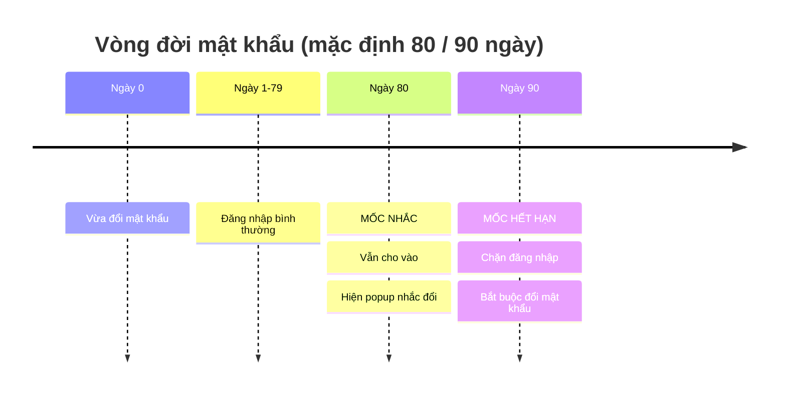
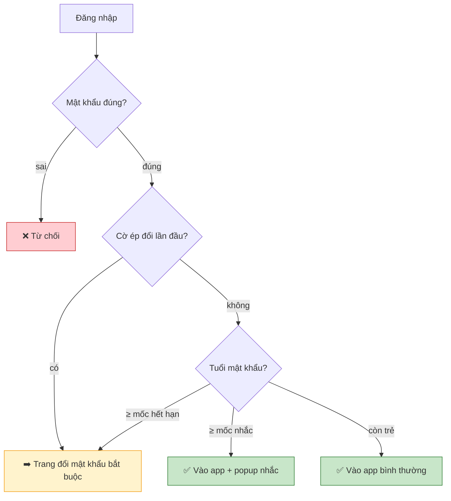
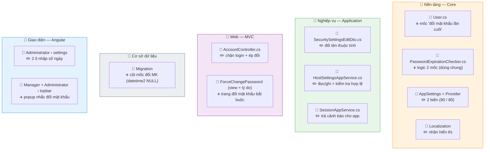

# Hết hạn mật khẩu & Đổi mật khẩu bắt buộc

> Mật khẩu có tuổi thọ: tới **mốc nhắc** thì nhắc (vẫn cho vào), tới **mốc hết hạn** thì chặn, bắt buộc đổi. Kèm ép đổi mật khẩu ở lần đăng nhập đầu.

## 1. Cách hoạt động

Luồng khi đăng nhập:

## 2. Cấu hình (Host + Tenant)

| Mốc | Số ngày mặc định | Khi tới mốc |
|---|---|---|
| 🔔 Nhắc đổi (`PasswordChangeRequestDays`) | 80 | Popup nhắc — **vẫn cho vào** |
| 🔒 Hết hạn (`PasswordValidityDays`) | 90 | **Chặn** — bắt buộc đổi mới vào được |

Ràng buộc: `nhắc < hết hạn`. Đặt **hết hạn = 0** để **tắt** cả tính năng.

## 3. File nào — sửa gì

> ➕ thêm mới · ✏️ sửa

## 4. Cần nhớ

!!! danger "Đặt 'hết hạn = 0' để tắt — không gộp điều kiện"
    Chỉ `PasswordValidityDays` quyết định bật/tắt. Nếu gộp nhầm điều kiện tắt, đặt hết hạn = 0 mà mốc nhắc vẫn 80 sẽ khiến **mọi user bị chặn và kẹt vĩnh viễn** (đổi xong tuổi = 0 vẫn bị coi là hết hạn). Đây là bug từng gặp — nhánh "tắt" phải đứng riêng.

!!! danger "Phải chạy migration + cân nhắc backfill trước khi bật"
    Code đọc cột mốc đổi MK → chưa có cột thì **hỏng cả đăng nhập**. Sau khi thêm cột, user cũ = `NULL` → tính theo ngày tạo → **có thể ép đổi hàng loạt**. Backfill `= GETDATE()` (coi như vừa đổi lúc nâng cấp). Dùng `GETDATE()` **không** phải `GETUTCDATE()` (server dùng giờ local).

!!! warning "Đường token chưa kiểm hết hạn"
    Việc chặn nằm ở đăng nhập web (MVC). `/api/TokenAuth` cấp JWT **không** kiểm hết hạn mật khẩu. Hiện vô hại (app dùng cookie), nhưng nếu mở API này ra ngoài thì phải cắm thêm cùng bộ kiểm tra.

!!! note "Luật 'MK mới khác MK cũ' đang tắt"
    Đang để tạm tắt → user có thể 'đổi' bằng cách gõ lại mật khẩu cũ; ép đổi lần đầu hiện **không** ngăn được giữ nguyên mật khẩu mặc định. Bật lại phải bật ở **cả hai** nơi (server + client).

!!! check "Mật khẩu không lọt vào nhật ký"
    Các trường mật khẩu gắn `[DisableAuditing]` để không bị ghi thô vào bảng log — vẫn giữ dòng log "ai đổi, lúc nào", chỉ bỏ giá trị.
