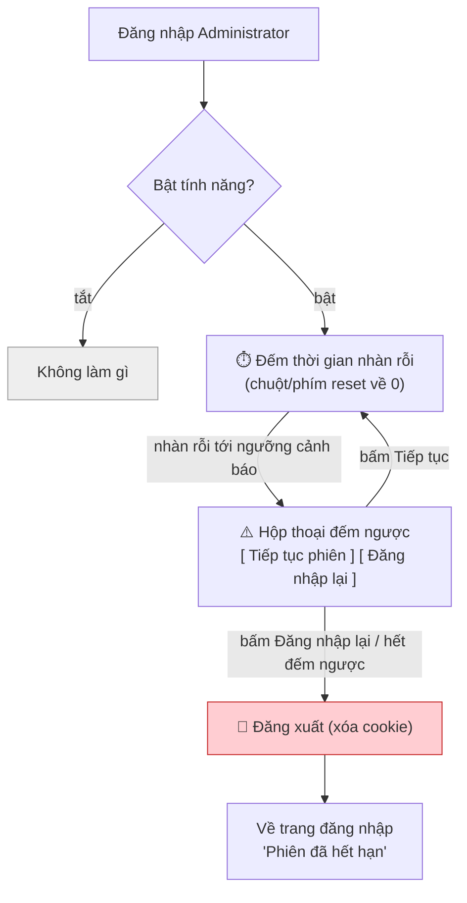
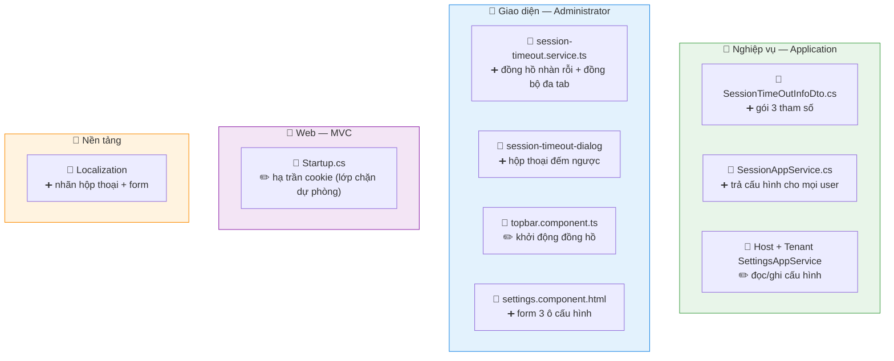

# Tự động đóng phiên khi không hoạt động

> Bỏ máy quá lâu → **hiện cảnh báo đếm ngược** → không thao tác thì **đóng phiên, bắt đăng nhập lại**. Chỉ áp dụng app **Administrator**.

## 1. Cách hoạt động

## 2. Cấu hình (Host + Tenant)

| Tham số | Ý nghĩa | Mặc định |
|---|---|---|
| Bật/tắt | Có áp dụng không | Tắt |
| Tổng thời gian chờ | Nhàn rỗi tối đa trước khi đóng | 30 giây |
| Cảnh báo trước khi đóng | Hiện hộp thoại trước bao nhiêu giây | 30 giây |

→ Hộp thoại hiện tại mốc **(tổng − cảnh báo)** rồi đếm ngược.

## 3. File nào — sửa gì

> ✏️ sửa · ➕ thêm mới

## 4. Cần nhớ

!!! warning "Phiên thật là COOKIE của server"
    Đóng phiên = điều hướng tới **`/Account/Logout`** để server xóa cookie — **không** phải xóa localStorage (xóa localStorage thì cookie vẫn sống). Vì cookie dùng chung nên đăng xuất là **toàn hệ** (cả MVC + Administrator + Manager).

!!! note "Ba tầng thời gian, không xung đột"
    Đồng hồ client (phát hiện nhàn rỗi + cảnh báo) chỉ **kích hoạt** luồng đăng xuất có sẵn; không đụng hạn cookie (~14 ngày, giữ làm chốt chặn cuối). `Startup.cs` hạ trần cookie xuống vài giờ làm lớp dự phòng khi client (JS) chết.

!!! tip "Đổi cấu hình phải reload"
    Cấu hình đọc lúc vào app, nên user đang mở phải **F5** mới nhận giá trị mới. Mặc định **tắt** → build xong chưa đổi gì cho tới khi admin bật.
