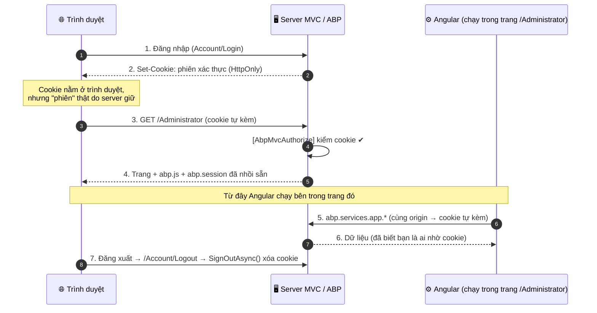
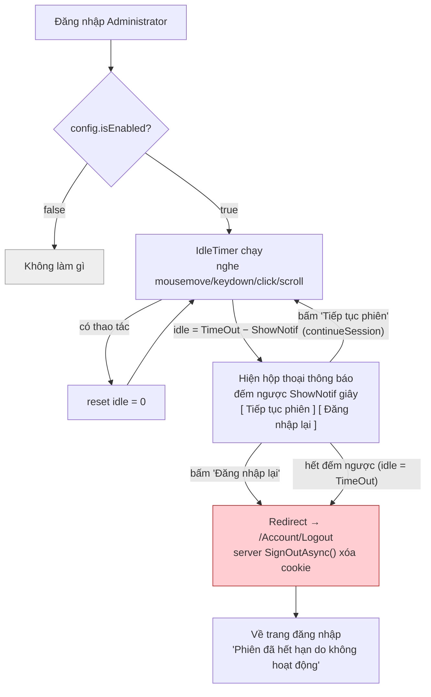
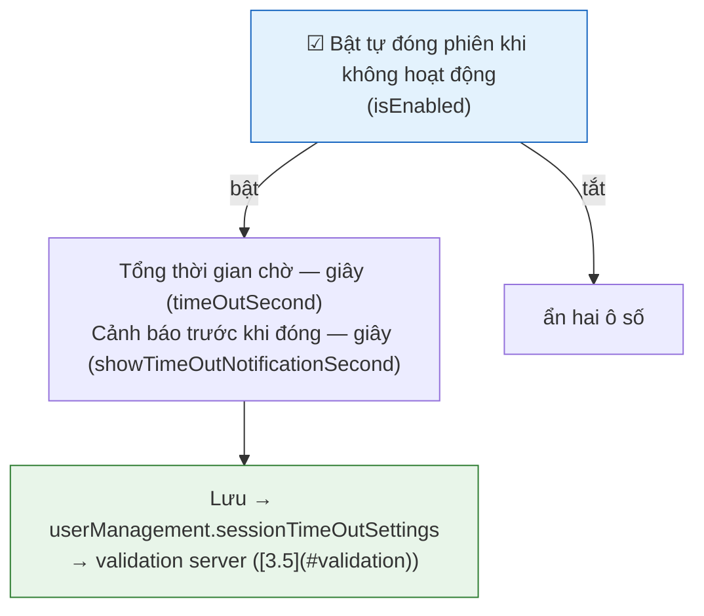
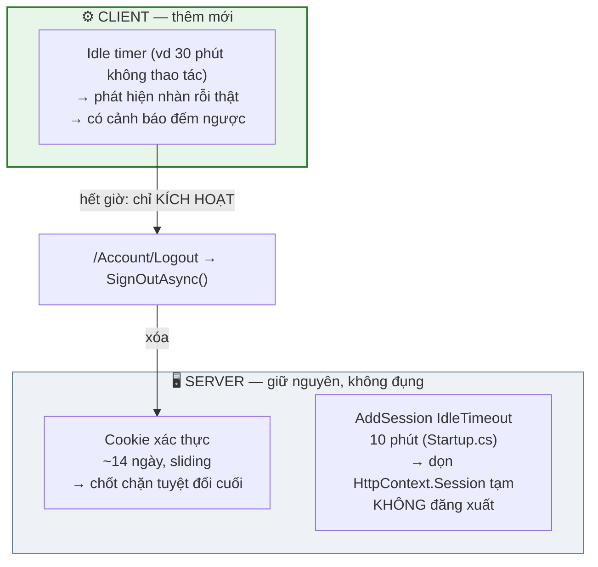
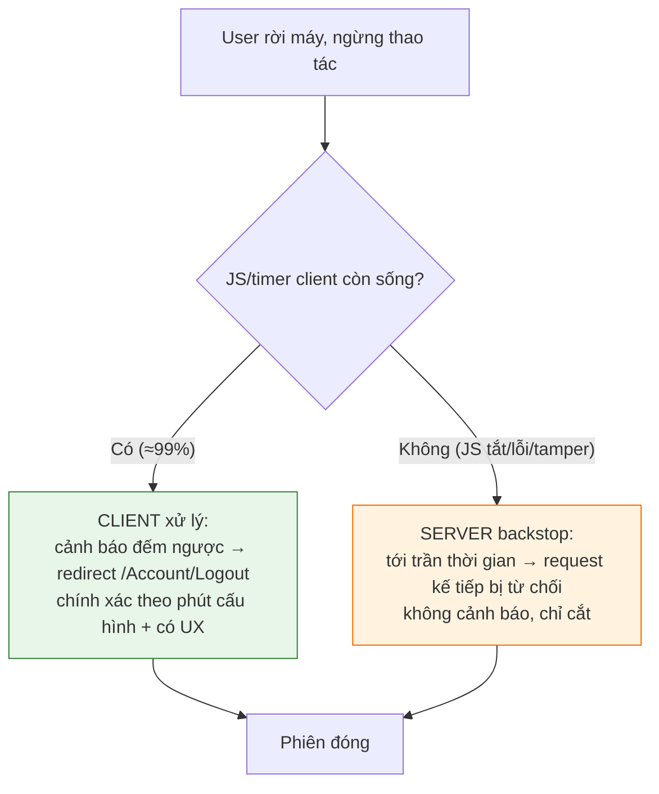

# Phương án: Tự động đóng phiên khi không hoạt động (Session Timeout)

**Ngày:** 2026-07-15

**Phạm vi:** eKMapServer App — Angular **Administrator** (idle-timer chạy ở đây; phiên thật là **cookie server**, không phải JWT — xem [2.1](#session-model)). Portal MVC **nằm ngoài phạm vi** (xem [3.1](#scope)).

**Trạng thái:** ✅ **Đã triển khai** (backend + client + ô cấu hình + lớp backstop server). Tài liệu mô tả thiết kế và ánh xạ tới code thật đã có. Còn lại: build `Web.Host` + `npm run publish` bên Administrator để phát hành.

---

## 1. Yêu cầu

a) Có chức năng cho phép **thiết lập giới hạn thời gian chờ (timeout)** để đóng phiên kết nối khi phần mềm không nhận được yêu cầu từ người dùng.

b) **Hiển thị thông báo**, đóng phiên kết nối đã hết hạn timeout và **yêu cầu đăng nhập lại**.

Ba tham số điều khiển, cấu hình được ở cả cấp Host và Tenant:

| Tham số | Ý nghĩa | Mặc định |
|---|---|---|
| `IsEnabled` | Bật/tắt tính năng | `false` |
| `TimeOutSecond` | **Tổng thời gian không hoạt động** tối đa trước khi đóng phiên | `30` |
| `ShowTimeOutNotificationSecond` | Hiện thông báo cảnh báo **trước thời điểm đóng** bao nhiêu giây | `30` |

!!! note "Phân vai người dùng"
    **Admin** cấu hình *bao lâu thì hết phiên* (trang Settings). **User thường** không quản lý gì, không thấy cấu hình — chỉ **trải nghiệm**: bỏ máy lâu thì được thông báo và bị đưa về đăng nhập. Chữ `isVisibleToClients: true` chỉ nghĩa là mã JS **đọc được** con số để chạy đồng hồ, **không** phải cho user sửa.

---

## 2. Bối cảnh kiến trúc — dữ kiện chi phối thiết kế

### 2.1. Chỉ có MỘT phiên: cookie của server, Angular ăn theo {#session-model}

Đây là điểm dễ hiểu nhầm nhất — cần chốt trước khi thiết kế.

Mở thư mục `src/app/modules/auth/` sẽ thấy một `AuthService` dùng **JWT + localStorage**, login bằng `admin@demo.com`. **Đó là code mẫu chết của template Metronic — luồng thật KHÔNG bao giờ chạy qua nó.** Đừng để nó đánh lừa. Xác thực thật của cả hệ thống nằm ở **cookie** do server ASP.NET/ABP cấp.

App Angular Administrator **không tự quản phiên**. Nó được **nhúng trong một trang MVC** (`AdministratorController` + `Views/Administrator/Index.cshtml`) và ăn theo cookie đó. Bằng chứng ngay trong code:

| Chứng cứ | Ở đâu | Nói lên điều gì |
|---|---|---|
| `[AbpMvcAuthorize]` trên `AdministratorController` | `Web.Mvc/Controllers` | Không có cookie hợp lệ ⇒ **không vào được** `/Administrator` |
| Nhúng `abp.js` + `AbpServiceProxies/GetAll` + `AbpScripts/GetScripts` | `Views/Administrator/_Scripts.cshtml` | Server **nhồi sẵn** phiên vào biến `abp.session` (userId, tenant…) khi tải trang |
| `abp.services.app.*` là AJAX **cùng origin** | mọi component Angular | Trình duyệt **tự đính kèm cookie**, không gắn token nào vào header |
| Đăng xuất → `/Account/Logout` → `SignInManager.SignOutAsync()` | `user-offcanvas.component.ts` + `AccountController` | "Đóng phiên" = server **xóa cookie**, không phải client xóa gì |



→ **Kết luận chi phối thiết kế:** phiên = **cookie, do server giữ**. Trình duyệt chỉ cầm cookie và tự nộp lại ở mỗi request. Vì vậy module timeout này:

- **Đọc** cấu hình và **đo nhàn rỗi** ở phía client (chỉ trình duyệt biết user có di chuột/gõ phím).
- Nhưng **"đóng phiên" phải nhờ server**: điều hướng tới **`/Account/Logout`** để `SignOutAsync()` hủy cookie. Xóa localStorage **không** làm cookie mất → phiên vẫn sống. Đây là điểm khác hẳn so với kiểu JWT stateless.

### 2.2. Cấu hình đã có sẵn — nhưng chưa "nối dây"

Ba tham số đã được khai báo, đăng ký và đọc/ghi đầy đủ ở backend:

- **Hằng số:** `AppSettings.cs` → `UserManagement.SessionTimeOut.{IsEnabled, TimeOutSecond, ShowTimeOutNotificationSecond}`.
- **Định nghĩa:** `AppSettingProvider.cs` → mặc định `false / 30 / 30`, scope `Application | Tenant`, `isVisibleToClients: true`.
- **DTO:** `SessionTimeOutSettingsEditDto` (kèm `[Range(10, int.MaxValue)]` trên hai trường số).
- **Đọc/ghi:** `HostSettingsAppService` và `TenantSettingsAppService` đã round-trip đủ ba tham số.

!!! success "Đã nối dây (cập nhật khi triển khai)"
    Ban đầu ba con số chỉ đi một vòng khép kín *trang admin → DB → trang admin*, không nơi nào tiêu thụ ("cái núm vặn đã lắp nhưng chưa nối dây vào động cơ"). Bản triển khai đã nối đủ:

    - **Nơi tiêu thụ:** `SessionAppService` nhả 3 tham số qua `GetCurrentLoginInformations`; client Angular đọc và chạy idle-timer ([4](#file-list)).
    - **Ô nhập:** `settings.component.html` đã có form 3 ô (tab *Usersetting*) bind vào `userManagement.sessionTimeOutSettings` ([3.6](#edit-form)).

### 2.3. "Hết hạn" sẵn có — thô, không thay thế được idle timeout

Phiên hiện **không** vô thời hạn, nhưng cơ chế sẵn có là **hết hạn theo tuổi cookie**, không theo hoạt động thực của người dùng trong app:

| Cơ chế | Kiểu | Giá trị | Cấu hình được? |
|---|---|---|---|
| Cookie xác thực (ASP.NET Identity) | Tuyệt đối / trượt (sliding) | ~14 ngày (mặc định ABP) | Có, nhưng ở tầng khác |

Đây là **hàng rào chốt chặn thô, câm lặng**: không cảnh báo, không biết user còn ngồi trước máy hay đã bỏ đi; sliding expiration còn **tự gia hạn** mỗi lần có request, nên user mở tab để đó vài tiếng vẫn không hề bị đẩy ra. Nó **không** đáp ứng yêu cầu "đóng khi ngừng thao tác X giây + có thông báo". Module này bổ sung lớp idle timeout ở **phía client** ở trên, **không** đụng tới hạn cookie (giữ nó làm chốt chặn tuyệt đối cuối cùng).

---

## 3. Các quyết định thiết kế

### 3.1. Phạm vi: idle-timer chạy ở Administrator; đóng phiên qua `/Account/Logout` {#scope}

Idle timeout chỉ có ý nghĩa ở nơi người dùng **ngồi làm việc lâu** — tức app Angular Administrator. Portal MVC chỉ để đăng nhập / đổi mật khẩu, không ai ngồi rảnh ở đó. App **Manager** để lại giai đoạn sau. Vậy **đồng hồ đếm nhàn rỗi (idle timer) đặt ở Administrator**.

Nhưng nhớ kỹ ([2.1](#session-model)): dù timer chạy ở client, **phiên vẫn là cookie ở server**. Nên khi hết giờ, "đóng phiên" **không** phải xóa gì đó trong trình duyệt, mà là **điều hướng tới `/Account/Logout`** để server gọi `SignInManager.SignOutAsync()` hủy cookie — đúng y cơ chế nút Đăng xuất hiện có. Điểm mạnh: cookie là **server-side nên thu hồi được thật**, chỉ một cú redirect là phiên chết hẳn, không để lại "token mồ côi" nào còn hiệu lực.

### 3.2. Đọc cấu hình qua `SessionAppService.GetCurrentLoginInformations` {#read-path}

Angular hiện đọc setting qua `abp.services.app.hostSettings.getAllSettings()` — nhưng đó là API **cấp host-admin**; user thường (role thấp) có thể bị **403**. Idle timeout phải chạy cho **mọi** user, nên không thể phụ thuộc API admin.

**Quyết định:** thêm một block `sessionTimeOut` vào `GetCurrentLoginInformations()` — API mọi user đăng nhập đều gọi được. Đây đúng theo **tiền lệ đã có** trong chính file đó: block `PasswordExpiration` cũng được nhét vào đây theo cùng lý do.

```csharp
// Dto/GetCurrentLoginInformationsOutput.cs — thêm 1 property
public SessionTimeOutInfoDto SessionTimeOut { get; set; }

// SessionAppService.GetCurrentLoginInformations() — đọc theo user hiện tại
output.SessionTimeOut = new SessionTimeOutInfoDto
{
    IsEnabled = await SettingManager.GetSettingValueAsync<bool>(
        AppSettings.UserManagement.SessionTimeOut.IsEnabled),
    TimeOutSecond = await SettingManager.GetSettingValueAsync<int>(
        AppSettings.UserManagement.SessionTimeOut.TimeOutSecond),
    ShowTimeOutNotificationSecond = await SettingManager.GetSettingValueAsync<int>(
        AppSettings.UserManagement.SessionTimeOut.ShowTimeOutNotificationSecond)
};
```

Ở đây dùng `GetSettingValueAsync()` (không cần bản `ForUser`) là **đúng**: khác với lúc đăng nhập sai của tính năng khóa tài khoản, tại thời điểm gọi API này user **đã đăng nhập** nên `AbpSession` đã có tenant/user — `SettingManager` tự lấy đúng giá trị effective theo tenant.

### 3.3. Ngữ nghĩa timeout & cảnh báo {#semantics}

Cần nói rõ để không hiểu nhầm mốc thời gian:

- `TimeOutSecond` = **tổng** thời gian không hoạt động tối đa. Chạm mốc này ⇒ phiên bị đóng.
- `ShowTimeOutNotificationSecond` = hiện hộp thoại **trước** thời điểm đóng bấy nhiêu giây.
- ⇒ Hộp thoại xuất hiện tại mốc idle `= TimeOutSecond − ShowTimeOutNotificationSecond`, và **đếm ngược** `ShowTimeOutNotificationSecond` giây.

Hộp thoại có **hai nút**: **"Tiếp tục phiên"** (gia hạn tại chỗ) và **"Đăng nhập lại"** (đăng xuất ngay). Phiên đóng khi user bấm "Đăng nhập lại" **hoặc** khi hết đếm ngược mà không bấm gì (user bỏ đi thật). Bấm "Tiếp tục phiên" ⇒ quay lại pha nhàn rỗi, đếm lại từ đầu:



!!! note "Gia hạn bằng NÚT bấm, không tự reset theo chuột"
    Trong pha **cảnh báo** (dialog đang hiện), hoạt động chuột/phím **không** tự reset — chỉ nút **"Tiếp tục phiên"** (`continueSession()`) mới gia hạn. Lý do: dialog là modal che màn hình, user vừa thấy là theo phản xạ di chuột tới đọc → nếu auto-reset theo chuột thì dialog **biến mất ngay**, gần như không bao giờ đóng được phiên (kể cả người đã bỏ đi vô tình chạm chuột). Auto-reset chỉ áp dụng ở **pha nhàn rỗi** trước đó ([3.4](#client-detect)). Bấm "Tiếp tục" thì `continueSession()` hủy đếm ngược, ẩn dialog, đăng ký lại listener hoạt động và đếm nhàn rỗi lại từ đầu. Đây là chuẩn ngành (*"Phiên sắp hết hạn. [Tiếp tục] [Đăng xuất]"*).

### 3.4. Phát hiện "không hoạt động" ở client + đồng bộ đa tab {#client-detect}

Chỉ trình duyệt mới biết user có di chuột/gõ phím hay không — nên **idle timer bắt buộc chạy ở client** (server chỉ biết "có request tới" hay không). Dùng RxJS `fromEvent` gộp các sự kiện `mousemove / keydown / click / scroll`, `debounce`/throttle để đỡ tốn, mỗi lần có sự kiện thì reset mốc.

**Đa tab:** ghi **mốc thời gian hoạt động cuối** vào `localStorage` và nghe sự kiện `storage`. (Lưu ý: `localStorage` ở đây chỉ chứa **một con số timestamp** để các tab đồng bộ đồng hồ nhàn rỗi — **không** liên quan gì tới phiên; phiên vẫn là cookie ở server theo [2.1](#session-model).) Một tab có thao tác ⇒ các tab khác cũng reset; khi một tab đăng xuất thì mọi tab cùng về login (tránh cảnh một tab đã logout, tab kia vẫn "sống").

!!! bug "Bẫy thực tế: phải ép change-detection thủ công"
    App Administrator này **zone không tự chạy change-detection cho tác vụ async** (bằng chứng: `topbar.component.ts` phải gọi `this.cdRef.detectChanges()` sau `getCurrentLoginInformations().then(...)` mới cập nhật được giao diện). Hệ quả: nếu service đổi `showDialog = true` / `remaining--` bên trong `setTimeout`/`setInterval`, biến **đổi thật nhưng giao diện không vẽ lại** — dialog không hiện, đến khi hết đếm ngược thì `doLogout()` chạy ⇒ trải nghiệm "**tự đăng xuất mà không thấy cảnh báo**", hoặc dialog chỉ "bùng ra" khi user bấm nút khác (click là sự kiện Angular bắt được nên mới chạy CD).

    **Cách xử lý (đã thử và chốt):** ban đầu thử `ApplicationRef.tick()` trong service — **không ăn** (timer vẫn chạy, logout đúng giờ, nhưng dialog vẫn không vẽ; có vẻ `tick()` từ gốc không tới được view dialog trong app này). Giải pháp chạy được là dùng đúng cơ chế topbar đã chứng minh: service phát một `Subject` `change$.next()` **sau** khi đổi `showDialog`/`remaining`; dialog component **subscribe `change$` và gọi `this.cdr.detectChanges()` của chính nó**. `detectChanges()` trên CDR của đúng component cần vẽ luôn hiệu quả, không phụ thuộc việc zone có tự CD hay không.

### 3.5. Ràng buộc giá trị khi lưu setting {#validation}

Form Angular chặn được giá trị bậy ở client, nhưng vẫn có thể POST thẳng API (Postman/curl) bỏ qua mọi kiểm tra client. Server **không tin client**. Khi `IsEnabled = true`, cần chặn:

| Giá trị bậy | Hậu quả |
|---|---|
| `TimeOutSecond <= 0` | Đóng phiên ngay lập tức / vô nghĩa |
| `ShowTimeOutNotificationSecond <= 0` | Không có cửa sổ cảnh báo |
| `TimeOutSecond <= ShowTimeOutNotificationSecond` | Cảnh báo hiện ngay khi vừa đăng nhập (mốc `TimeOut − Show ≤ 0`) |

Thêm guard ở **đầu** `UpdateUserManagementSessionTimeOutSettingsAsync` (trước mọi lệnh ghi), ở **cả** `HostSettingsAppService` và `TenantSettingsAppService`:

```csharp
if (settings.IsEnabled)
{
    if (settings.TimeOutSecond < 10)
        throw new UserFriendlyException(L("SessionTimeOutMustBeAtLeast10Seconds"));
    if (settings.ShowTimeOutNotificationSecond < 5)
        throw new UserFriendlyException(L("SessionTimeOutNotificationMustBeAtLeast5Seconds"));
    if (settings.TimeOutSecond <= settings.ShowTimeOutNotificationSecond)
        throw new UserFriendlyException(L("SessionTimeOutMustBeGreaterThanNotification"));
}
```

`UserFriendlyException` (`Abp.UI`) được ABP trả nguyên văn ra client — form hiện đúng dòng lỗi. Đặt validation **trước** mọi lệnh ghi để cấu hình sai thì không lưu một nửa. (Cùng nguyên tắc với validation ở tính năng khóa tài khoản.)

!!! warning "Trạng thái thực tế: guard cross-field ở server CHƯA làm"
    Hiện server mới chỉ chặn **min-10** cho từng trường qua `[Range(10, int.MaxValue)]` trên `SessionTimeOutSettingsEditDto` (ABP tự validate DataAnnotation → trả "request is not valid"). Đoạn guard cross-field `TimeOut <= ShowNotif` ở trên **chưa được thêm** vào `Host/TenantSettingsAppService`. Client đã chặn cross-field ([settings.component.ts](#file-list)) nên form không lọt giá trị bậy; nhưng nếu muốn chặt ở cả server (POST thẳng qua Postman), thêm đoạn này là việc còn lại. Đây là chốt "nên có", không chặn tính năng chạy.

### 3.6. Ô nhập cấu hình trên trang Settings — bám đúng cây DTO {#edit-form}

Gọi thử `getAllSettings()` cho thấy ba tham số **đã round-trip** và nằm dưới nhánh `userManagement`, **không** phải `security`:

```jsonc
{
  "result": {
    "userManagement": {
      "sessionTimeOutSettings": {        // ← nơi form phải bind vào
        "isEnabled": false,
        "timeOutSecond": 30,
        "showTimeOutNotificationSecond": 30
      }
    },
    "security": {
      "passwordExpirationDays": 100,
      "passwordChangeReminderDays": 90,
      "sessionTimeOutSettingsEditDto": null   // ⚠ property thừa, luôn null — bỏ qua
    }
  }
}
```

Rút ra hai điều chốt cho phần code:

1. **Đường bind là `userManagement.sessionTimeOutSettings`.** Ô nhập trên `settings.component.html` (và model gửi lên khi lưu) phải nằm trong nhánh `userManagement`, đúng chỗ backend đọc/ghi ở [2.2](#read-path). Bind nhầm sang `security` sẽ ghi vào một field chết.

2. **`security.sessionTimeOutSettingsEditDto` là rác — luôn `null`.** Field này lọt vào DTO `security` nhưng không được `HostSettingsAppService`/`TenantSettingsAppService` đổ giá trị, nên mãi `null`. Đừng để nó gây hiểu nhầm "cấu hình chưa có" — cấu hình thật nằm ở `userManagement.sessionTimeOutSettings`. Nên **xóa property thừa này** khi dọn code để tránh người sau bind nhầm.

Bố cục ô nhập (ẩn/hiện theo `isEnabled`):



!!! tip "Kiểm nhanh sau khi nối dây"
    Đổi `timeOutSecond` trên form rồi gọi lại `getAllSettings()` — giá trị mới phải hiện ở `userManagement.sessionTimeOutSettings.timeOutSecond`, còn `security.sessionTimeOutSettingsEditDto` vẫn `null` (đúng như trên). Nếu giá trị không đổi ⇒ form đang bind sai nhánh.

### 3.7. Ba tầng thời gian song song — vì sao không xung đột {#three-layers}

Module này **thêm** một lớp idle timeout ở client, **không sửa** cấu hình phiên sẵn có ở server. Ba tầng chạy độc lập, mỗi tầng một việc:



| Tầng | Ai giữ | Nhiệm vụ | Hết hạn thì | Module này sửa? |
|---|---|---|---|---|
| Cookie xác thực (~14 ngày, sliding) | Server | Chốt chặn tuyệt đối cuối cùng | Đăng xuất thật | ❌ để nguyên |
| `AddSession` IdleTimeout (10 phút) — `Startup.cs` | Server | Dọn `HttpContext.Session` (kho tạm) | Xóa dữ liệu tạm, **KHÔNG** đăng xuất | ❌ để nguyên |
| **Idle timer (vd 30 phút không thao tác)** | **Client** | Phát hiện nhàn rỗi thật → gọi `/Account/Logout` | Đăng xuất thật + cảnh báo trước | ➕ thêm mới |

Không va chạm vì lớp client **chỉ kích hoạt** luồng logout có sẵn (`/Account/Logout` → `SignOutAsync`), **không** tự đóng cookie, **không** đụng config server. Vài hệ quả cần biết:

- Client timer là **lớp UX, không phải rào bảo mật**: tắt JS thì cookie vẫn sống tới hạn ~14 ngày. Đủ cho yêu cầu "cảnh báo + đăng xuất khi nhàn rỗi".
- `/Account/Logout` xóa **cả cookie** ⇒ đăng xuất **toàn hệ** (MVC + Administrator + Manager, cùng origin), không phải chỉ Administrator.
- Cookie sliding tự gia hạn mỗi request; client timer đo **thao tác thật** (chặt hơn) ⇒ client luôn "nổ" **trước** ⇒ đúng mục đích (đăng xuất sớm khi thật sự rời máy).

!!! note "Nếu KHÔNG muốn dùng JS thì cấu hình động session kiểu gì? (và vì sao ở đây vẫn chọn client)"
    Idle timeout **thuần server-side là làm được**, không cần JS:

    - **Sliding expiration** trên cookie: `ExpireTimeSpan = 30 phút` + `SlidingExpiration = true`. Không có request trong 30 phút ⇒ cookie coi như hết, request kế tiếp buộc đăng nhập lại.
    - Chuẩn hơn: hook **`CookieAuthenticationEvents.OnValidatePrincipal`** — mỗi request đọc mốc hoạt động cuối, so với ngưỡng, quá hạn thì `RejectPrincipal()` + sign-out.

    Muốn **cấu hình động** (đổi là ăn, không restart) thì trong hook/đường validate đó đọc ngưỡng qua `SettingManager` (hoặc `IOptionsMonitor`), **đừng** nhét vào `Startup` vì nó baked 1 lần lúc khởi động (xem [3.2](#read-path) — cùng nguyên tắc "đọc lúc request, không đóng băng lúc startup"). Các nền tảng khác cũng theo lối này: Java `session.setMaxInactiveInterval()`, PHP `session.gc_maxlifetime`, hay IdP như **Keycloak** có "SSO Session Idle" chỉnh trong admin console, áp lúc refresh token.

    **Nhưng** cách server-only vướng đúng 2 điểm mà yêu cầu (b) đòi: (1) **không hiện được hộp cảnh báo đếm ngược** — server không vẽ được lên màn hình đang mở; (2) server chỉ biết "**không có request tới**", không phân biệt "user đang đọc màn hình" với "user đã bỏ đi". Vì yêu cầu **bắt buộc có thông báo trước khi đóng**, nên phải có mặt client. Ta chọn client cho phần **phát hiện + cảnh báo**, và vẫn để **server đóng phiên**.

### 3.8. Lớp backstop ở server (nâng lên phương án C) — tùy chọn {#server-backstop}

Bản thiết kế mặc định (mục 3.1–3.7) là **phương án A: chỉ client**. Nó phụ thuộc JavaScript — tắt JS thì idle-logout không chạy. Với app SPA điều này gần như vô hại (tắt JS = mất luôn app, xem phân tích cuối mục), nhưng nếu có **yêu cầu tuân thủ (compliance)** buộc phiên nhàn rỗi phải bị cưỡng chế chấm dứt bất kể JS, thì nâng lên **phương án C = A + một lớp chặn độc lập ở server**.

**Ranh giới vai trò — không được lẫn:**



Lớp server **chỉ bung ra khi lớp client chết**. Nên nó không cần cảnh báo, không cần chính xác — chỉ cần **hạ trần phơi nhiễm** từ ~14 ngày (hạn cookie mặc định) xuống một mức hợp lý. Có 2 cách hiện thực:

#### Cách 1 — Sliding cookie hạn cố định *(khuyên dùng: 3 dòng, đủ tốt)*

Bật idle-timeout có sẵn của ASP.NET. Thêm vào `Startup.cs`, **sau** `IdentityRegistrar.Register(services)`:

```csharp
services.ConfigureApplicationCookie(o =>
{
    o.ExpireTimeSpan    = TimeSpan.FromHours(8);  // hạ trần từ ~14 NGÀY xuống 8 GIỜ
    o.SlidingExpiration = true;                     // còn request thì tự gia hạn
});
```

Không cố khớp con số phút của admin — chỉ **hạ trần**: nếu JS chết, phiên bỏ quên không sống quá 8 giờ (thay vì 14 ngày). Client vẫn là anh cắt chính xác ở 30 phút.

| Ưu | Nhược |
|---|---|
| 3 dòng, không đụng logic, không theo dõi gì | **Tĩnh** — đổi trần phải restart |
| Dùng cơ chế chuẩn của framework | Không khớp đúng số phút cấu hình (nhưng backstop không cần khớp) |

!!! warning "Cookie dùng chung"
    Cookie xác thực chung cho **cả** MVC + Administrator + Manager. Trần 8 giờ này áp cho tất cả. Chọn giá trị **đủ dài** để không phiền người đang làm việc thật (1 ca làm ≈ 8 giờ là an toàn), nhưng **ngắn hơn hẳn** 14 ngày.

#### Cách 2 — `OnValidatePrincipal` động *(chỉ khi compliance đòi khớp đúng số phút)*

Nếu server **bắt buộc** cưỡng chế đúng ngưỡng admin cấu hình (và audit được): hook đọc `SettingManager` mỗi request, so `LastActivity`, quá hạn thì `RejectPrincipal()` + `SignOutAsync()`. Phức tạp hơn nhiều và có **2 cái bẫy**:

1. **Đừng ghi đè** event `OnValidatePrincipal` sẵn có — ASP.NET Identity đã gắn `SecurityStampValidator` vào đó (vô hiệu phiên khi đổi mật khẩu / security stamp). Ghi đè = **hỏng tính năng bảo mật khác**. Phải **gọi handler cũ rồi mới thêm logic mình**.
2. Phải tự lưu + cập nhật `LastActivity` (claim trong ticket + `ctx.ShouldRenew = true`).

→ Chỉ đáng làm khi có yêu cầu văn bản. Còn lại, Cách 1 cho ROI tốt hơn hẳn.

#### 3 quy tắc đúng dù chọn cách nào

1. **Ngưỡng server > ngưỡng client** (client 30' → server ≥ 8h, hoặc ít nhất dài hơn hẳn). Để cảnh báo đẹp của client **luôn nổ trước**; server chỉ đỡ khi client đã chết. Đặt bằng nhau ⇒ có lúc server "cắt phựt" trước khi client kịp cảnh báo (server đo *không request*, client đo *không thao tác* — hai mốc lệch nhau), user bị đá ra mà không thấy hộp cảnh báo → xấu UX.
2. **Không đụng `AddSession(10 phút)`** — đó là session-state (`HttpContext.Session`), không liên quan phiên đăng nhập ([2.1](#session-model)).
3. **Không đổi code client** — A giữ nguyên; C chỉ **thêm** ở server.

!!! note "Phân tích mối đe dọa — vì sao dự án này chọn A, chưa cần C"
    "Tắt JS để né idle-logout" **không phải hướng tấn công thật** ở đây:

    - App Administrator **toàn bộ là JS (Angular)** ⇒ tắt JS thì **không vào được app**, lấy đâu phiên nhàn rỗi bên trong để lo → lỗ hổng tự triệt tiêu.
    - Idle-logout bảo vệ **người ĐÃ rời đi** khỏi việc người khác ngồi vào máy còn đăng nhập. Kẻ duy nhất "tắt JS" là **chính chủ tài khoản** — mà giữ phiên của chính mình sống lâu hơn thì **không tấn công ai**, không có động cơ.
    - Lưới an toàn cuối (**hạn cookie do server cưỡng chế**) vẫn còn: kể cả JS chết, phiên không sống mãi.

    Vì vậy: **A đủ cho yêu cầu UX/vệ sinh phiên.** Chỉ nâng **C** khi có compliance bắt buộc cưỡng chế + kiểm toán — và khi đó C là *cộng thêm* Cách 1/2 vào server, **không** phải làm lại A.

---

## 4. Danh sách file (đã triển khai) {#file-list}

Trạng thái: ✅ đã làm · ⬜ chưa làm (không chặn tính năng) · — không cần đụng.

### eKMapServer.Application

| File | Nội dung | Trạng thái |
|---|---|---|
| `Sessions/Dto/SessionTimeOutInfoDto.cs` | DTO mới: `IsEnabled`, `TimeOutSecond`, `ShowTimeOutNotificationSecond` | ✅ |
| `Sessions/Dto/GetCurrentLoginInformationsOutput.cs` | Thêm property `SessionTimeOut` | ✅ |
| `Sessions/SessionAppService.cs` | Đọc 3 setting đổ vào block `SessionTimeOut` ([3.2](#read-path)). **Cần 2 using:** `Abp.Configuration` (cho `GetSettingValueAsync<T>`) + `eKMapServer.Configuration` (cho `AppSettings`) | ✅ |
| `Configuration/Host/HostSettingsAppService.cs` + `Tenants/TenantSettingsAppService.cs` | Round-trip đủ 3 tham số (đọc `getAllSettings` + ghi `update`) | ✅ |
| *guard cross-field ở server* ([3.5](#validation)) | Chặn `TimeOut <= ShowNotif` bằng `UserFriendlyException` | ⬜ chưa — hiện chỉ có `[Range(10,…)]` của DTO chặn min-10; client đã chặn cross-field |
| `Configuration/Tenants/Dto/SecuritySettingsEditDto.cs` | Xóa property thừa `SessionTimeOutSettingsEditDto` (luôn `null`, [3.6](#edit-form)) | ⬜ chưa — vẫn còn, vô hại nhưng nên dọn |

### eKMapServer.Core

| File | Nội dung | Trạng thái |
|---|---|---|
| Hằng số `AppSettings.UserManagement.SessionTimeOut.*` + `SettingDefinition` | **đã có sẵn từ trước** — không đụng | — |
| `Localization/SourceFiles/eKMapServer.xml` + `-vi.xml` | 8 key: dialog (`SessionTimeoutTitle`, `SessionTimeoutMessage` có `{0}`, `SessionTimeoutContinue`, `SessionTimeoutLoginAgain`) + form Settings (`SessionTimeOutSettings`, `SessionTimeOutEnable`, `SessionTimeOutTotalSeconds`, `SessionTimeOutWarnSeconds`) | ✅ |

### Angular (Administrator)

| File | Nội dung | Trạng thái |
|---|---|---|
| `pages/_layout/components/session-timeout/session-timeout.service.ts` | Idle timer (RxJS), đọc config từ `GetCurrentLoginInformations`, đồng bộ đa tab, hết giờ **điều hướng `/Account/Logout`**. Phát `change$` (Subject) mỗi lần đổi trạng thái để dialog vẽ lại ([bẫy CD](#client-detect)); có `continueSession()` cho nút gia hạn | ✅ |
| `pages/_layout/components/session-timeout/session-timeout-dialog.component.ts` + `.html` | Hộp thoại đếm ngược (modal Bootstrap 4.5); **nghe `change$` → tự `detectChanges()`**; 2 nút "Tiếp tục phiên" (`continueSession`) + "Đăng nhập lại" (`logoutNow`); dùng pipe `localize` (kể cả `{{ 'SessionTimeoutMessage' \| localize : sto.remaining }}` cho `{0}`) | ✅ |
| `pages/layout.module.ts` | Khai báo `SessionTimeoutDialogComponent` trong `declarations` | ✅ |
| `pages/_layout/layout.component.html` | Đặt thẻ `<session-timeout-dialog>` một lần (trong layout non-blank) | ✅ |
| `pages/_layout/components/topbar/topbar.component.ts` | Inject service + gọi `sessionTimeout.start(data.sessionTimeOut)` trong `getUser()` | ✅ |
| `pages/settings/settings.component.html` | Form 3 ô (tab *Usersetting*), bind `userManagement.sessionTimeOutSettings` ([3.6](#edit-form)) | ✅ |
| `pages/settings/settings.component.ts` | Helper `sessionTimeOutError()` khớp `[Range(10,…)]` + guard cross-field; chặn `saveAll()` | ✅ |
| Service proxy | **Không regenerate** — `settingSystem` là `any`, field mới tự round-trip qua ABP dynamic proxy | — |

### eKMapServer.Web.Mvc — lớp backstop server, phương án C ([3.8](#server-backstop))

| File | Nội dung | Trạng thái |
|---|---|---|
| `Startup/Startup.cs` | **Cách 1** đã cắm: `ConfigureApplicationCookie` (`ExpireTimeSpan = 10h` + `SlidingExpiration`) sau `IdentityRegistrar.Register` | ✅ |
| *(hoặc)* Cách 2 `OnValidatePrincipal` | Chỉ khi compliance đòi khớp đúng số phút — **chưa làm**, chain handler cũ | ⬜ không cần |

!!! info "Không có migration"
    Toàn bộ dữ liệu nằm trong bảng `AbpSettings` sẵn có (mỗi setting là một row key–value). Không thêm cột, **không cần `dotnet ef`**. Phương án C cũng **không** thêm bảng — chỉ chỉnh config cookie.

---

## 5. Triển khai

Code đã xong (mục 4). Việc còn lại là build + phát hành.

### Bước 1 — Backend

Đảm bảo `SessionAppService.cs` có 2 using `Abp.Configuration` + `eKMapServer.Configuration` (thiếu sẽ lỗi `CS0103`/`CS0308`). Build lại `eKMapServer.Web.Host`. Block `sessionTimeOut` xuất hiện trong response `GetCurrentLoginInformations`; API sẵn cho mọi user đăng nhập. Lớp backstop `ConfigureApplicationCookie` (10h) trong `Startup.cs` cũng có hiệu lực sau build này.

### Bước 2 — Angular Administrator

```bash
cd eKMapServer_App/Administrator && npm run publish
```
Copy `dist/*` vào `eKMapServer.Web.Mvc/wwwroot/Administrator/`. (Ô cấu hình và idle timer đều nằm ở app Administrator; app Manager chưa áp dụng.)

### Bước 3 — Kiểm tra cấu hình

Mặc định `IsEnabled = false` ⇒ bật xong build vẫn **không có gì thay đổi** cho tới khi admin bật. Vào Settings (tab *Usersetting*), bật tính năng, đặt ví dụ `TimeOutSecond = 60`, `ShowTimeOutNotificationSecond = 15`. Đổi setting xong, user đang mở phải **reload** mới nhận giá trị mới (config đọc lúc `GetCurrentLoginInformations`).

---

## 6. Kiểm thử

Cấu hình test cho nhanh: `TimeOutSecond = 30`, `ShowTimeOutNotificationSecond = 10`.

| Kịch bản | Thao tác | Kết quả mong đợi |
|---|---|---|
| Tắt tính năng | `IsEnabled = false` | Không có đồng hồ, không hộp thoại |
| Cảnh báo đúng mốc | Không thao tác 20s (= 30 − 10) | Hộp thoại đếm ngược hiện ra, đếm từ 10 |
| Thao tác reset | Di chuột trước mốc 20s | Đồng hồ về 0, không hiện hộp thoại |
| Xác nhận → đăng xuất | Bấm "Đăng nhập lại" khi hộp thoại hiện | Redirect `/Account/Logout` → server xóa cookie → về trang đăng nhập |
| Tự đăng xuất | Để yên hết đếm ngược | Tự redirect `/Account/Logout`, thông báo hết phiên |
| Chặn sau khi đóng | Sau khi đăng xuất, quay lại `/Administrator` | Bị `[AbpMvcAuthorize]` chặn, đá về đăng nhập (cookie đã hủy) |
| Đa tab | Mở 2 tab, thao tác ở tab A | Tab B cũng reset; đăng xuất thì cả hai về login |
| Validation server — Range | POST thẳng API lưu `TimeOut = 5` (bỏ qua form) | Bị `[Range(10,…)]` từ chối ("request is not valid"), không lưu |
| Validation server — cross-field | POST `TimeOut = 20, Show = 25` (cả hai ≥10 nhưng Show ≥ Timeout) | Bị guard cross-field từ chối ([3.5](#validation)), không lưu |
| Phân quyền đọc | Đăng nhập bằng user role thấp | `GetCurrentLoginInformations` vẫn trả `sessionTimeOut` (không 403) |
| *(C)* Backstop khi JS chết | Tắt JS trình duyệt (hoặc chặn timer), để phiên nhàn rỗi quá trần server | Request kế tiếp bị đá về đăng nhập (cookie hết hạn), dù client không cắt |

**Kiểm tra cấu hình trong DB:**

```sql
SELECT Name, Value FROM AbpSettings
WHERE Name LIKE 'App.UserManagement.SessionTimeOut.%';
```
Không có row ⇒ đang dùng mặc định `false / 30 / 30` từ `AppSettingProvider`.

---

## 7. Ngoài phạm vi (ghi để khỏi hiểu nhầm)

- **Không** áp dụng cho Portal MVC (không ai ngồi rảnh ở trang đăng nhập / đổi mật khẩu).
- **Không** áp dụng cho app Manager (giai đoạn sau).
- **Không** đổi hạn cookie xác thực (~14 ngày) — giữ làm chốt chặn tuyệt đối cuối.
- **Không** viết cơ chế đăng xuất mới — tái dùng `/Account/Logout` sẵn có (server `SignOutAsync()` đã hủy cookie đúng cách).
