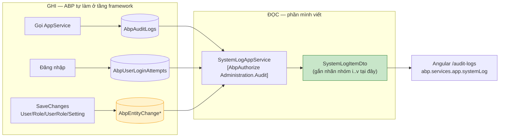
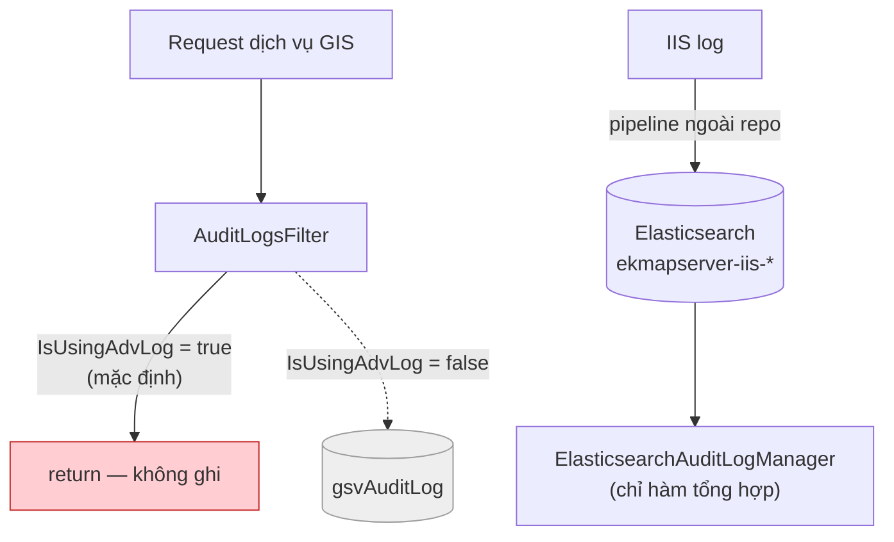
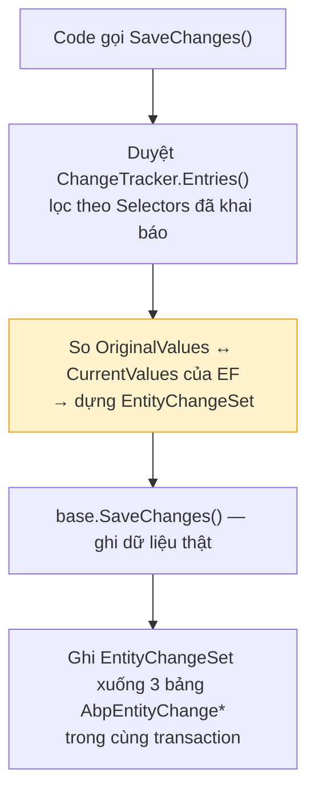
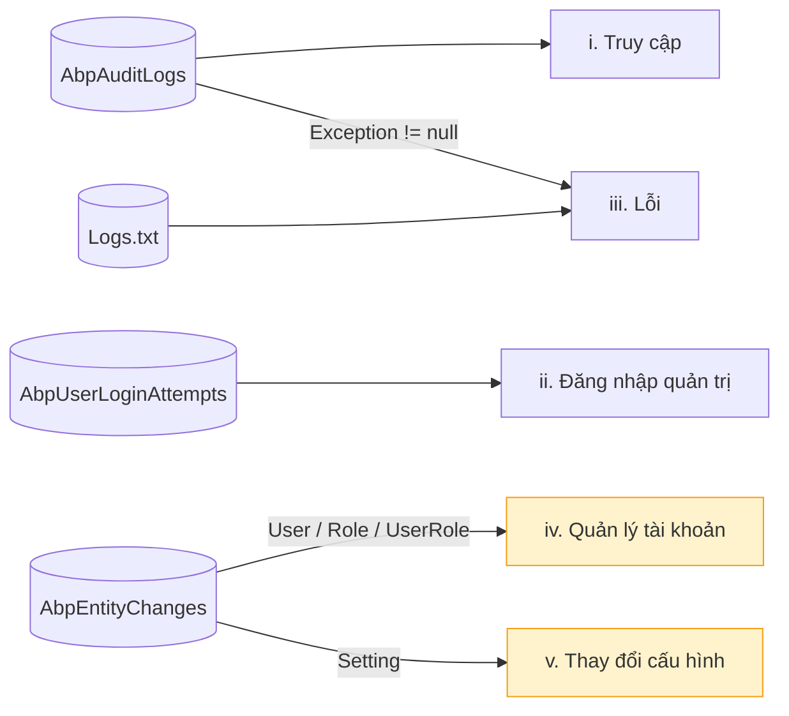

# Phương án: Phân loại nhật ký hệ thống theo 05 nhóm

**Ngày:** 2026-07-17 — cập nhật 2026-07-20 sau khi hiện thực

**Phạm vi:** eKMapServer Portal (ASP.NET Core MVC + ABP) và eKMapServer App (Angular Administrator)

**Trạng thái:** Đã hiện thực bước 1–3 ([mục 10](#order)). Backend và màn hình 5 tab build sạch,
**chưa chạy kiểm thử thời gian chạy** — xem [mục 11](#unverified) để biết còn phải xác nhận gì.

> Ba quyết định đã đổi so với bản đề xuất đầu, đều ghi tại chỗ:
> [4.1](#entityhistory) (`User` không phải entity tần suất thấp),
> [4.2](#no-unified-table) (DTO thêm `TargetType`/`TargetId`),
> [6](#ui) (giữ cả 3 mục menu thay vì gộp).

---

## 1. Yêu cầu

Nhật ký hệ thống phải được phân loại theo **ít nhất 05 nhóm**:

| # | Nhóm | Trả lời câu hỏi |
|---|---|---|
| i | Nhật ký truy cập Phần mềm | Ai gọi dịch vụ/trang nào, lúc nào, từ đâu |
| ii | Nhật ký đăng nhập khi quản trị Phần mềm | Ai đăng nhập quản trị, thành công hay thất bại |
| iii | Nhật ký các lỗi phát sinh trong quá trình hoạt động | Lỗi gì, ở đâu, lúc nào |
| iv | Nhật ký quản lý tài khoản | Tài khoản/quyền nào bị tạo/sửa/xóa, đổi từ gì sang gì |
| v | Nhật ký thay đổi cấu hình Phần mềm | Tham số cấu hình nào bị đổi, đổi từ gì sang gì |

### 1.1. Cơ chế hoạt động — tóm tắt đầu cuối {#co-che}

> Mục này trả lời gọn câu "hệ thống ghi và đọc nhật ký bằng cách nào". Chi tiết và lý do nằm ở các mục sau.



**Bốn điều cần nói đúng khi trình bày:**

**1. Không viết dòng code ghi log nào.** ABP ghi sẵn ở tầng framework bằng interceptor. Ba trong bốn nguồn **đã chạy từ trước** khi làm tính năng này:

| Nguồn | Nhóm | Phải làm gì |
|---|---|---|
| `AbpAuditLogs` | i, iii | **Không gì** — đã ghi sẵn |
| `AbpUserLoginAttempts` | ii | **Không gì** — đã ghi sẵn, chỉ là chưa ai đọc |
| `AbpEntityChange*` | iv, v | **Bật `Selectors`** — 2 dòng cấu hình ([4.1](#entityhistory)) |
| `Logs.txt` | phụ trợ iii | màn hình cũ đọc riêng ([4.5](#error)) |

Việc **duy nhất** chạm vào đường ghi là khai báo entity cho EntityHistory. Đây cũng là thay đổi duy nhất có rủi ro với hệ thống đang chạy.

**2. Phân nhóm xảy ra lúc ĐỌC, không phải lúc ghi.** Trong CSDL **không có** bảng log hợp nhất và **không có** cột `Category` nào. Mỗi nhóm là một truy vấn trên nguồn tương ứng, cùng quy về `SystemLogItemDto`. Lý do ở [4.2](#no-unified-table).

> Nếu người nghiệm thu hỏi *"bảng lưu 5 nhóm ở đâu"* — câu trả lời là **không có bảng nào cả**, và đó là quyết định có chủ đích, không phải thiếu sót.

**3. Quyền: dùng lại `Administration.Audit` sẵn có**, không tạo permission mới ([4.6](#permission)) — nên không phải cập nhật seeder lẫn màn hình phân quyền vai trò.

**4. Angular đọc qua ABP dynamic proxy** (`abp.services.app.systemLog`). Proxy do server sinh lúc chạy qua script `AbpServiceProxies/GetAll`, **không** phải generate service proxy thủ công.

**Giới hạn phải nêu kèm:** EntityHistory hook ở `SaveChanges` ⇒ đây là audit **tầng ứng dụng**, không phải tầng database. Sửa thẳng CSDL bằng SSMS/`psql` **không để lại vết** ([2.3](#entityhistory-limit)).

---

## 2. Hiện trạng — dữ kiện chi phối thiết kế

Hệ thống **đã ghi rất nhiều log**, nhưng rải ở 6 nguồn khác nhau và không nguồn nào mang khái niệm "nhóm". Bản kiểm kê thực tế:

| Nguồn | Cơ chế ghi | Nội dung | Trạng thái |
|---|---|---|---|
| `AbpAuditLogs` | ABP interceptor trên AppService | ServiceName, MethodName, Parameters (JSON), UserId, ClientIpAddress, BrowserInfo, ExecutionTime, ExecutionDuration, Exception | ✅ Đang ghi |
| `AbpUserLoginAttempts` | `AbpLogInManager` tự ghi | UserNameOrEmailAddress, UserId, Result, ClientIpAddress, BrowserInfo, CreationTime | ✅ Đang ghi, **chưa ai đọc** |
| Elasticsearch `ekmapserver-iis-yyyy.MM` | Pipeline ngoài repo đẩy IIS log | token, status, url-service, mapid, userid, clientip, time-taken, @timestamp | ⚠️ Phụ thuộc hạ tầng ngoài |
| `gsvAuditLog` | log4net ADONetAppender ← `AuditLogsFilter` | Như trên + ApiKey, MapId, ProjectId | ❌ **Không được ghi** (xem [2.1](#advlog)) |
| `App_Data/Log/Logs.txt` | log4net RollingFileAppender | Text tự do, mọi mức từ DEBUG | ✅ Đang ghi, đọc thô |
| `AbpEntityChangeSets` / `AbpEntityChanges` / `AbpEntityPropertyChanges` | ABP EntityHistory | Giá trị **cũ → mới** từng thuộc tính | ❌ **Bảng rỗng** (xem [2.2](#entityhistory-off)) |

### 2.1. `gsvAuditLog` đang chết vì cờ `UsingAdvLog` {#advlog}

`appsettings.json` đặt `AuditLog:UsingAdvLog = "true"`. Cờ này chảy vào `LogConfiguration.IsUsingAdvLog` (`eKMapServerBusinessModule.RegisterAuditLog`), và `AuditLogsFilter` kiểm tra nó **để thoát sớm**:

```csharp
// eKMapServer.Web.Filter/AuditLogs/AuditLogsFilter.cs:26-35
if (!LogConfiguration.IsEnableRequestAuditLog
    || LogConfiguration.IsUsingAdvLog          // ← đang true
    || context.HttpContext.Response.StatusCode == (int)HttpStatusCode.NotModified)
    return; // thì không ghi log
```

Nghĩa là toàn bộ hạ tầng `gsvAuditLog` (entity, bảng archive, `SQLAuditLogOptimizer`, `AuditLogOptimizeWorker`) **hiện không hoạt động** ở cấu hình mặc định; `IAuditLogManager` được đăng ký là `ElasticsearchAuditLogManager` và log truy cập dịch vụ nằm trong Elasticsearch.



**Hệ quả:** log truy cập dịch vụ bản đồ (nhóm i) phụ thuộc một cụm Elasticsearch + pipeline đẩy IIS log **nằm ngoài repo này**. Không có Elasticsearch thì nhóm i chỉ còn `AbpAuditLogs`. Cần một quyết định vận hành — xem [mục 8](#risk).

### 2.2. EntityHistory đang tắt — đây là khoảng trống lớn nhất {#entityhistory-off}

Ba bảng `AbpEntityChange*` **đã có trong schema** (do module ABP.Zero sinh ra, thấy trong `InitialBaseline` và `ModelSnapshot`), nhưng đang rỗng.

**Lý do rỗng không phải vì tính năng bị tắt.** Tra source ABP 6.0.0 (`src/Abp/EntityHistory/EntityHistoryConfiguration.cs`) thì hàm khởi tạo đặt sẵn:

```csharp
public EntityHistoryConfiguration()
{
    IsEnabled = true;                              // ← mặc định ĐÃ true
    Selectors = new EntityHistorySelectorList();   // ← nhưng RỖNG
}
```

`IsEnabled` vốn đã `true`; bảng rỗng vì **`Selectors` rỗng** — không entity nào được chọn nên không có gì để ghi. Đây là điểm cần nắm đúng: việc phải làm là **khai báo selector**, không phải bật một công tắc đang tắt ([4.1](#entityhistory)).

Đây là lý do nhóm iv và v hiện **không làm được đúng nghĩa**. Phân biệt cốt lõi:

| | `AbpAuditLogs` (đang bật) | `EntityHistory` (đang tắt) |
|---|---|---|
| Ghi cái gì | **Lời gọi hàm**: service, method, tham số vào | **Thay đổi dữ liệu**: cột nào, cũ → mới |
| Trả lời được | "Ai gọi `CreateOrUpdateUser` lúc 9h05" | "Role của user X đổi từ *User* sang *Admin*" |
| Giá trị **trước khi** sửa | Không có | Có |
| Thao tác **thất bại** (ném exception) | Có ghi | Không ghi (rollback thì log rollback theo) |

Yêu cầu nhóm iv/v là "nhật ký **thay đổi**" — phải biết đổi **từ gì sang gì**. Audit log lời gọi hàm chỉ có tham số đầu vào (giá trị mới), không có giá trị cũ để đối chiếu.

**Cách EntityHistory hoạt động** — cần nắm để hiểu giới hạn ở [2.3](#entityhistory-limit):



"Giá trị cũ" lấy từ `OriginalValues` mà EF vốn đã giữ sẵn để sinh câu `UPDATE` — **không tốn thêm query nào**. "Ai" lấy từ `AbpSession` (`UserId`, `TenantId`, `ImpersonatorUserId`) cộng IP/browser từ `IClientInfoProvider`.

### 2.3. Giới hạn bản chất: đây là audit tầng ứng dụng, không phải tầng database {#entityhistory-limit}

EntityHistory hook ở `SaveChanges`, **không phải** ở tầng database (khác hẳn SQL Server CDC hay trigger). Mọi đường thay đổi dữ liệu không đi qua EF change tracker đều **lọt lưới**:

| Đường thay đổi dữ liệu | EntityHistory có ghi? |
|---|---|
| AppService / repository qua EF | ✅ Có |
| Seeder, job nền (vẫn dùng EF) | ✅ Có, nhưng `UserId = NULL` vì không có session |
| `ExecuteSqlRaw` / Dapper / SQL thô | ❌ **Không** |
| SSMS, `psql`, sửa tay trong DB | ❌ **Không** |
| Restore DB, sửa `appsettings.json` | ❌ **Không** |

Điều này **không làm hỏng phương án** — tài khoản và cấu hình đều được sửa qua AppService nên nhóm iv/v vẫn phủ đủ đường đi thực tế. Nhưng ai có quyền vào thẳng DB thì đổi dữ liệu không để lại vết ở 3 bảng này. **Phải ghi rõ giới hạn này trong hồ sơ nghiệm thu**, và kiểm soát bù bằng phân quyền truy cập DB.

### 2.4. Cái đã có sẵn, dùng lại được

- `AuditLogAppService` (`[AbpAuthorize(PermissionNames.Administration_Audit)]`) đã có `GetAuditLogs` với filter theo ngày/user/service/method/browser/duration/`HasException`, export Excel, `DeleteLog`.
- `GSVSystemLogAppService` đã đọc `Logs.txt`, cùng permission `Administration.Audit`.
- App Administrator đã có 2 màn hình log (`/system-logs`, `/service-logs`) và mục menu trong `aside.component.html`.
- Permission `Administration.Audit` đã tồn tại → **không cần** thêm permission mới.

---

## 3. Đối chiếu yêu cầu ↔ dữ liệu

| Nhóm | Nguồn khả dụng | Đánh giá |
|---|---|---|
| i. Truy cập | `AbpAuditLogs` (+ Elasticsearch nếu có) | ✅ **Đủ** — có user, IP, browser, thời gian, thời lượng |
| ii. Đăng nhập quản trị | `AbpUserLoginAttempts` | ⚠️ **Dữ liệu đủ, thiếu code** — chưa có AppService lẫn UI |
| iii. Lỗi | `AbpAuditLogs.Exception` + `Logs.txt` | ⚠️ **Phân mảnh** — `Logs.txt` không truy vấn được |
| iv. Quản lý tài khoản | `AbpAuditLogs` (suy gián tiếp) | ❌ **Thiếu** — không có giá trị cũ |
| v. Thay đổi cấu hình | `AbpAuditLogs` (suy gián tiếp) | ❌ **Thiếu** — không có giá trị cũ |

→ Công việc thu về **ba việc**: bật EntityHistory (iv, v), viết lớp truy vấn phân nhóm (cả 5), và dựng UI.

---

## 4. Các quyết định thiết kế

### 4.1. Bật ABP EntityHistory, chọn lọc entity {#entityhistory}

Toàn bộ đường ống ghi log **đã lắp sẵn trong ABP 6.0.0** — không phải viết dòng nào cho cơ chế:

| Mảnh | Ở đâu | Trạng thái |
|---|---|---|
| 3 bảng `AbpEntityChange*` | `InitialBaseline` migration | ✅ Đã có trong DB |
| Entity `EntityChangeSet` / `EntityChange` / `EntityPropertyChange` | package `Abp` | ✅ |
| Bộ so sánh giá trị cũ/mới | `EntityHistoryHelperBase`, `EntityHistoryInterceptor` | ✅ Tự đăng ký |
| Nơi ghi xuống DB | `EntityHistoryStore` (`Abp.Zero.Common`) — package dự án đang tham chiếu | ✅ Đã nối dây |
| API cấu hình | `Configuration.EntityHistory` | ✅ |

Việc duy nhất phải làm là **khai báo entity cần theo dõi**, thêm vào `eKMapServerCoreModule.PreInitialize()` (nơi đã có `Configuration.Auditing.IsEnabledForAnonymousUsers`):

```csharp
// eKMapServer.Core/eKMapServerCoreModule.cs

// Thừa: ABP mặc định đã true (xem 2.2). Viết tường minh để thể hiện chủ đích
// và không phụ thuộc giá trị mặc định có thể đổi khi nâng version ABP.
Configuration.EntityHistory.IsEnabled = true;

// ĐÂY mới là thứ làm nên tính năng — mặc định Selectors rỗng nên không ghi gì.
Configuration.EntityHistory.Selectors.Add(
    new NamedTypeSelector("eKMapServerAccountAndConfig", type =>
        typeof(User).IsAssignableFrom(type)         // nhóm iv
        || typeof(Role).IsAssignableFrom(type)
        || typeof(UserRole).IsAssignableFrom(type)
        || typeof(Setting).IsAssignableFrom(type)   // nhóm v
    ));
```

`NamedTypeSelector` nằm ở namespace gốc **`Abp`** (không phải `Abp.Reflection`); cần thêm
`using Abp;`, `using Abp.Configuration;`, `using Abp.Authorization.Users;`.

**Chọn lọc chứ không bật cho tất cả.** ABP cho phép selector `type => true` (audit mọi entity). Không làm vậy: eKMapServer ghi rất nhiều entity dữ liệu bản đồ (`GSVMap`, `GSVLog`…) với tần suất cao; audit hết sẽ nhân số lệnh ghi DB lên nhiều lần và làm phình 3 bảng history mà không phục vụ yêu cầu nào. Bốn kiểu trên phủ đúng nhóm iv + v.

**`UserRole` phải có mặt.** Gán/gỡ quyền là thao tác quản lý tài khoản quan trọng nhất, nhưng nó là **entity riêng** (`AbpUserRoles`), không phải thuộc tính của `User` — không khai báo thì đổi role sẽ không sinh log nào.

**`Setting` phủ cấu hình động, không phủ `appsettings.json`.** `Abp.Configuration.Setting` (bảng `AbpSettings`) là nơi lưu mọi cấu hình đổi được qua giao diện (chính sách mật khẩu, khóa tài khoản, session timeout, giới hạn IP quản trị…). Còn `appsettings.json` là file trên đĩa, sửa bằng tay và cần restart — nằm ngoài tầm với của EntityHistory ([2.3](#entityhistory-limit)).

#### 4.1.1. Sửa lại: `User` **không** phải entity tần suất thấp {#user-noise}

> Bản đề xuất đầu xếp cả bốn entity vào diện "tần suất sửa thấp". **Sai với `User`**, phát hiện khi rà `UserManager` lúc hiện thực.

`eKMapServer.Core/Authorization/Users/UserManager.cs` ghi `User` ở **mọi lần đăng nhập**:

| Tình huống | Thuộc tính bị ghi |
|---|---|
| Đăng nhập sai | `AccessFailedCount`, `LastFailedLoginAttemptTime` |
| Đăng nhập đúng | `ResetAccessFailedCountAsync` xóa hai giá trị trên |

Hai hệ quả:

1. **Nhóm iv bị ngập rác.** Bản ghi `AccessFailedCount: 0 → 1` là hoạt động **đăng nhập** (nhóm ii), không phải quản lý tài khoản. Người nghiệm thu mở tab iv ra thấy toàn thứ này là hỏng.
2. **Write amplification nằm trên đường đăng nhập**, không phải trên đường sửa tài khoản vốn hiếm như đã giả định.

**Cách xử lý — lọc lúc đọc, không đổi selector.** Giữ nguyên việc audit `User` (vẫn cần cho đổi email/trạng thái/khóa), nhưng nhánh truy vấn nhóm iv loại các `EntityChange` mà **toàn bộ** thuộc tính thay đổi nằm trong danh sách nhiễu:

```csharp
// SystemLogAppService.LoginNoiseProperties
"AccessFailedCount", "LastFailedLoginAttemptTime",
"LastLoginTime", "LockoutEndDateUtc", "IsLockoutEnabled"
```

Điều kiện chỉ áp cho `ChangeType == Updated`; `Created`/`Deleted` không có giá trị cũ để đối chiếu nên luôn được giữ.

Cách này nhất quán với [4.2](#no-unified-table): phân loại và làm sạch đều là phép biến đổi **lúc đọc**. Đổi selector để loại `User` thì sẽ mất luôn các thay đổi tài khoản thật.

Phần write amplification thì **chấp nhận**: vài INSERT thêm trên một thao tác vốn đã nhiều I/O. Nếu hệ thống có lượng đăng nhập rất lớn thì đo lại, đừng đoán.

### 4.2. Không tạo bảng log hợp nhất — phân nhóm ở tầng truy vấn {#no-unified-table}

Phương án hiển nhiên là tạo một bảng `SystemLog(Category, Time, UserId, …)` rồi cho mọi nguồn ghi vào. **Không chọn**, vì:

- Ba trong bốn nguồn (`AbpAuditLogs`, `AbpUserLoginAttempts`, `AbpEntityChanges`) do **ABP tự ghi ở tầng framework**. Muốn fan-in vào bảng riêng thì phải override interceptor/store của ABP ở cả ba chỗ — nhiều điểm sửa, dễ hụt, và vỡ mỗi lần nâng cấp ABP.
- Sẽ **nhân đôi dung lượng** log vốn đã lớn.
- Không nguồn nào thiếu dữ liệu cả — chúng chỉ **thiếu nhãn nhóm**, mà nhãn đó suy được 100% từ nội dung sẵn có.

→ Phân nhóm là **một phép ánh xạ lúc đọc**, không phải lúc ghi. Mỗi nhóm là một truy vấn trên nguồn tương ứng, trả về **cùng một DTO**:

```csharp
public enum SystemLogCategory : byte
{
    Access = 1,               // i
    AdminLogin = 2,           // ii
    Error = 3,                // iii
    AccountManagement = 4,    // iv
    ConfigurationChange = 5   // v
}

public class SystemLogItemDto
{
    public SystemLogCategory Category { get; set; }
    public DateTime Time { get; set; }
    public long? UserId { get; set; }
    public string UserName { get; set; }
    public string ClientIpAddress { get; set; }
    public string BrowserInfo { get; set; }
    public string ServiceName { get; set; }   // chỉ nhóm i, iii
    public string Action { get; set; }        // method / kết quả login / ChangeType
    public string TargetType { get; set; }    // chỉ nhóm iv, v
    public string TargetId { get; set; }      // chỉ nhóm iv, v
    public string Message { get; set; }       // tham số / "cũ → mới"
    public string Exception { get; set; }     // chỉ nhóm iii
    public bool IsSuccess { get; set; }
}
```

**`TargetType`/`TargetId` là bổ sung sau khi rà lại.** Bản đề xuất đầu gộp kiểu entity vào `Action` và **bỏ hẳn** khóa chính. Thiếu `TargetId` thì nhóm iv trả lời được "có tài khoản bị đổi email" nhưng **không trả lời được đổi tài khoản nào** — hỏng đúng mục đích truy vết. `EntityChange.EntityId` vốn đã có sẵn trong bảng, chỉ là trước đó không lấy ra.

**Ba trường cố tình không đưa vào.** Các mẫu "canonical log record" phổ biến còn đề xuất `Level`, `Module`, `CorrelationId`. Chúng phù hợp với hệ thống **tự ghi log vào một bảng hợp nhất** — không phải trường hợp ở đây:

| Trường | Vì sao bỏ |
|---|---|
| `Level` | Không nguồn nào ghi. Với ta nó là hằng số theo nhóm; `Category` + `IsSuccess` đã nói đủ |
| `Module` | Không nguồn nào ghi. Chỉ suy được từ `ServiceName` — để UI tự cắt |
| `CorrelationId` | ABP không ghi vào 4 bảng này. Muốn có phải dựng hạ tầng trace riêng |

Nguyên tắc: **không đưa vào DTO trường mà không nguồn nào điền được.** Ba cột luôn rỗng trên màn hình nghiệm thu tệ hơn là không có cột đó.

**Đánh đổi phải chấp nhận:** không tìm kiếm xuyên nhóm trong **một** truy vấn phân trang (dữ liệu nằm ở các bảng dị chủng; `UNION` + `ORDER BY` + phân trang trên 4 nguồn sẽ rất chậm). Người dùng chọn nhóm rồi mới lọc trong nhóm. Yêu cầu chỉ đòi "phân loại theo 05 nhóm" nên đánh đổi này không ảnh hưởng nghiệm thu; nếu sau này cần tìm xuyên nhóm thì đó là lúc bàn tới bảng hợp nhất.

### 4.3. Ánh xạ từng nhóm



| Nhóm | Nguồn | Điều kiện lọc |
|---|---|---|
| i | `AbpAuditLogs` | Toàn bộ, loại `Exception != null` để khỏi trùng nhóm iii |
| ii | `AbpUserLoginAttempts` | Join `AbpUsers` → `AbpUserRoles` → `AbpRoles`, lọc user có vai trò quản trị ([4.4](#adminlogin)) |
| iii | `AbpAuditLogs` `Exception != null` **∪** `Logs.txt` mức ERROR/FATAL | [4.5](#error) |
| iv | `AbpEntityChanges` | `EntityTypeFullName` ∈ {User, Role, UserRole} |
| v | `AbpEntityChanges` | `EntityTypeFullName` = `Abp.Configuration.Setting` |

Nhóm iv/v join `AbpEntityChangeSets` để lấy `UserId`/`CreationTime`/`ClientIpAddress`, và `AbpEntityPropertyChanges` để dựng `Detail` dạng `PropertyName: OriginalValue → NewValue`.

### 4.4. Nhóm ii: nhận diện "đăng nhập **quản trị**" bằng vai trò {#adminlogin}

`AbpUserLoginAttempts` **không** ghi người dùng đăng nhập vào app nào. Cả app Administrator, app Manager và API đều dồn về `LogInManager.LoginAsync` (`AccountController.cs:178`) → không phân biệt được theo điểm vào.

→ Lọc theo **vai trò của tài khoản**: coi là "đăng nhập quản trị" nếu user thuộc role có quyền `Administration.*`.

**Hai giới hạn phải nêu rõ:**

1. **Vai trò đọc tại thời điểm truy vấn, không phải thời điểm đăng nhập.** User bị gỡ quyền admin hôm nay thì các lần đăng nhập admin tháng trước sẽ biến mất khỏi nhóm ii. Chấp nhận được vì nhóm iv (EntityHistory trên `UserRole`) ghi lại chính việc gỡ quyền đó — hai nhóm bù nhau khi truy vết.
2. **Đăng nhập sai tên tài khoản** (`Result = InvalidUserNameOrEmailAddress`) có `UserId = NULL` → không join ra role được, nên không vào nhóm ii. Những bản ghi này vẫn có giá trị an ninh (dò tài khoản), nên **giữ chúng ở nhóm ii** khi bật bộ lọc `IncludeUnknownUserAttempts`, mặc định tắt.

`IsSuccess` = `Result == AbpLoginResultType.Success`; `Action` = tên enum `Result` (Success / InvalidPassword / LockedOut / UserIsNotActive…) đã đủ diễn giải — `AbpLoginResultTypeHelper` hiện có sẵn để đối chiếu.

### 4.5. Nhóm iii: hai nguồn, hai bản chất, không cố hợp nhất {#error}

Lỗi nằm ở hai nơi khác hẳn nhau:

- `AbpAuditLogs.Exception` — lỗi ở tầng AppService, **có cấu trúc**, query/phân trang/lọc theo user được ngay bằng `AuditLogAppService` sẵn có (`input.HasException = true`).
- `Logs.txt` — text tự do do log4net ghi, **mọi tầng** (kể cả lỗi hạ tầng chưa vào tới AppService), không cấu trúc.

**Quyết định:** nhóm iii = truy vấn trên `AbpAuditLogs.Exception != null`, và **giữ nguyên** màn hình đọc `Logs.txt` hiện có như tab phụ trợ. Không parse `Logs.txt` thành bản ghi có cấu trúc.

Lý do không parse: định dạng dòng do `log4net.config` quy định, đổi config là parser vỡ; stack trace đa dòng không có ranh giới bản ghi tin cậy. Nếu thật sự cần lỗi có cấu trúc thì cách đúng là **thêm một ADONetAppender ghi mức ERROR/FATAL xuống bảng** — `log4net.config` đã có sẵn `ADONetAppender` ghi `gsvAuditLog` để copy pattern. Rẻ hơn parse và không vỡ khi đổi format. Tách thành bước 2, không chặn nghiệm thu.

### 4.6. Dùng lại permission `Administration.Audit` {#permission}

`AuditLogAppService` và `GSVSystemLogAppService` đều đã gác bằng `[AbpAuthorize(PermissionNames.Administration_Audit)]`. Service mới gác **cùng** permission đó — ai xem được audit log hiện tại thì cũng xem được 5 nhóm này; không có lý do tách quyền, và thêm permission mới sẽ buộc cập nhật seeder + màn hình phân quyền role.

---

## 5. API đề xuất

`SystemLogAppService` mới, `[AbpAuthorize(PermissionNames.Administration_Audit)]`:

```csharp
Task<PagedResultDto<SystemLogItemDto>> GetLogs(GetSystemLogsInput input);
Task<List<SystemLogSummaryDto>> GetSummaries(GetSystemLogsInput input);   // các biểu đồ
Task<FileDto> GetLogsToExcel(GetSystemLogsInput input);                   // chưa làm
```

```csharp
public class GetSystemLogsInput : PagedAndSortedResultRequestDto
{
    public SystemLogCategory Category { get; set; }        // bắt buộc
    public DateTime StartDate { get; set; }
    public DateTime EndDate { get; set; }
    public string UserName { get; set; }                   // tùy chọn
    public string ClientIpAddress { get; set; }            // tùy chọn
    public bool? IsSuccess { get; set; }                   // tùy chọn
    public bool IncludeUnknownUserAttempts { get; set; }   // chỉ nhóm ii, xem 4.4
}
```

`Category` **bắt buộc** — hệ quả trực tiếp của [4.2](#no-unified-table): mỗi nhóm là một truy vấn trên nguồn riêng, không có nhánh "tất cả".

`GetSystemLogsInput` kế thừa `PagedAndSortedInputDto` sẵn có trong `Auditting/Dto/`.

**Hai thứ đã hoãn sang sau, không chặn nghiệm thu:**

- **`GetLogsToExcel` chưa làm.** Xếp ở bước 4 ([mục 10](#order)), sau UI. Khi làm thì dùng `IAuditLogListExcelExporter` (`Auditting/Exporting/`) làm khuôn, chỉ đổi cột theo `SystemLogItemDto`.
- **`input.Sorting` bị bỏ qua**, luôn sắp theo thời gian giảm dần. Với màn hình nhật ký thì đây gần như luôn là thứ tự người dùng muốn; cho sort cột khác phải viết nhánh riêng cho từng nguồn — chưa đáng.

Ba nhánh truy vấn phủ 5 nhóm, vì các nhóm dùng chung nguồn:

| Hàm riêng | Phủ nhóm | Phân biệt bằng |
|---|---|---|
| `GetAuditLogBasedLogs` | i, iii | `Exception` null hay không — bù trừ nhau, không bản ghi nào ở cả hai |
| `GetAdminLoginLogs` | ii | — |
| `GetEntityChangeLogs` | iv, v | danh sách `EntityTypeFullName` truyền vào |

### 5.1. `GetSummaries` — số liệu biểu đồ {#summary}

Tính trên **toàn bộ tập kết quả sau khi lọc**, không phải trang đang xem. Vẽ biểu đồ từ 10 dòng của một trang là sai lệch — người đọc sẽ tưởng đó là toàn cảnh.

```csharp
public enum SystemLogSummaryKind : byte { TimeSeries = 1, Category = 2 }

public class SystemLogSummaryItemDto { public string Label; public long Count; }
public class SystemLogSummaryDto
{
    public string TitleKey;                        // key localization, không phải chuỗi đã dịch
    public SystemLogSummaryKind Kind;              // frontend dùng để chọn hướng vẽ
    public List<SystemLogSummaryItemDto> Items;
}
```

`TitleKey` trả về **key** chứ không phải chuỗi đã dịch, để phần hiển thị vẫn theo ngôn ngữ người dùng đang chọn ở trình duyệt.

**Phần tử đầu tiên là biểu đồ chính** — dải thu gọn trên màn hình danh sách chỉ vẽ phần tử này; hộp thoại "xem đầy đủ" vẽ tất cả ([6.6](#chart-modal)).

Mỗi nhóm có bộ biểu đồ riêng, chọn theo thứ nguồn dữ liệu của nhóm đó **thực sự trả lời được**:

| Nhóm | Các biểu đồ (cái đầu là chính) |
|---|---|
| i. Truy cập | Top 10 hành động • Lượt truy cập theo ngày • Top 10 tài khoản |
| ii. Đăng nhập | Kết quả đăng nhập • Thất bại theo ngày • **Top 10 IP thất bại** |
| iii. Lỗi | Top 10 dịch vụ lỗi • Lỗi theo ngày |
| iv. Tài khoản | Loại thay đổi • Người thực hiện • Theo ngày |
| v. Cấu hình | Theo ngày • Người thực hiện |

Ba điểm đáng nêu:

- **Nhóm ii: hai biểu đồ sau chỉ lọc lần thất bại.** Trộn cả lần thành công vào sẽ che mất tín hiệu — hệ thống chạy bình thường thì số lần thành công áp đảo, đợt dò mật khẩu sẽ chìm nghỉm. Biểu đồ **Top IP thất bại** là cái bắt brute force trực tiếp nhất: một IP lạ dồn hàng trăm lần thất bại sẽ nhô hẳn lên.
- **Nhóm i gom theo cặp `ServiceName` + `MethodName`**, không phải mình `MethodName`. Cùng một tên method (`Get`, `Create`, `Delete`…) tồn tại ở nhiều service; gom theo tên method sẽ cộng dồn những thứ không liên quan vào một cột sai. Nhãn là `StripNamespace(Service).Method`.
- **Bản ghi không có người thực hiện vẫn được giữ** dưới nhãn riêng (`(ẩn danh)` / `(hệ thống)`) thay vì bỏ đi — bỏ thì tổng trên biểu đồ không khớp số bản ghi trong bảng, và "thay đổi do job nền" cũng là thông tin cần biết.

**Hệ quả lên cấu trúc code:** ba hàm `Create*Query` được tách riêng để `GetLogs` và `GetSummary` **dùng chung đúng một bộ lọc**. Nếu mỗi hàm tự dựng điều kiện lọc thì bảng và biểu đồ sẽ lệch nhau ngay khi người dùng đổi filter — loại lỗi rất khó phát hiện vì cả hai đều "trông có vẻ đúng".

---

## 6. UI {#ui}

Màn hình mới `/audit-logs` trong app Administrator, **5 tab** ứng với 5 nhóm; mỗi tab là bảng phân trang + bộ lọc (khoảng thời gian, tài khoản, IP, thành công/thất bại).

- Component: `pages/logs/system-log-categories.component.{ts,html}`.
- Tab dựng bằng **Bootstrap `nav-tabs`** + một biến `activeCategory`, không thêm `TabViewModule` của PrimeNG. Tránh thêm phụ thuộc mới cho một thứ 10 dòng markup làm được.
- **Cột đổi theo nhóm**: `ServiceName` chỉ hiện ở nhóm i/iii, `TargetType`/`TargetId` chỉ ở iv/v. Hệ quả trực tiếp của [4.2](#no-unified-table) — không nguồn nào điền đủ mọi trường, hiện hết sẽ có cột luôn rỗng.
- Checkbox `IncludeUnknownUserAttempts` chỉ hiện ở tab ii ([4.4](#adminlogin)).
- Gọi API qua ABP dynamic proxy (`abp.services.app.systemLog.getLogs`), **không cần** regenerate service proxy — cùng cách `system-logs.component.ts` đang gọi `abp.services.app.gSVSystemLog`.
- `LayoutModule` phải import **`FormsModule`** tường minh. Trước đó `[(ngModel)]` trong `service-logs` chạy được là nhờ một lib khác re-export — dựa vào đó là mong manh.

### 6.2. Bố cục: bảng là chính, biểu đồ là phụ {#layout}

Bản đầu xếp bộ lọc thành 3 hàng + 2 hàng nút, cộng biểu đồ cao 220px — bảng bị đẩy xuống dưới màn hình, phải cuộn mới thấy dữ liệu. Đã gom lại:

| Phần | Cách xử lý |
|---|---|
| Bộ lọc | **1 hàng** ở khổ rộng (`form-row` + `form-control-sm`): thời gian, tài khoản, IP, trạng thái, nút Tìm/Làm mới |
| Biểu đồ | Cao **150px**, có nút **ẩn/hiện**. Khi mở lại phải `dispatchEvent(new Event('resize'))` — lúc bị ẩn phần tử rộng 0px nên ApexCharts không tự đo lại đúng |
| Bảng | `scrollHeight="360px"` — cuộn bên trong, thanh phân trang luôn trong tầm mắt |

Vùng vẽ biểu đồ dùng `[hidden]` chứ **không** dùng `*ngIf`: `*ngIf` hủy phần tử DOM, làm instance ApexCharts trỏ vào node đã bị gỡ.

#### Đáp ứng bề rộng cửa sổ {#responsive}

Bản đầu chỉ khai báo **một** breakpoint `col-md-*`. Hệ quả: khoảng 768–1200px các ô `col-md-2` bị bóp còn ~128px, nhập liệu không đọc được; dưới 768px thì nhảy một nhịp sang xếp chồng. Đã đổi sang xuống dòng dần:

| Bề rộng | Bộ lọc |
|---|---|
| ≥1200px (xl) | 5 ô trên 1 hàng — `3-2-2-2-3` |
| 768–1199px (md) | 2 hàng — `6-3-3` rồi `4-8` |
| 576–767px (sm) | 2 ô mỗi hàng |
| <576px | xếp chồng, nút căn trái (`text-left text-sm-right`) |

Các phần khác, trong `system-log-categories.component.scss`:

- **Thanh 5 tab** — `flex-wrap: nowrap` + `overflow-x: auto`, cuộn ngang thay vì xuống dòng lộn xộn (ẩn thanh cuộn cho gọn).
- **Cột "Chi tiết"** — `max-width` theo breakpoint (180 / 260 / 420px) thay vì cố định 320px. Ở khổ hẹp, 320px chiếm gần hết bảng và đẩy các cột khác ra ngoài vùng nhìn thấy.
- **Bảng** — ép `overflow-x: auto` lên vùng cuộn của PrimeNG để thẻ card không bị đẩy rộng, tránh cả trang sinh thanh cuộn ngang.
- **Biểu đồ** — có khối `responsive` ở breakpoint 768px: bỏ nhãn số cạnh thanh (thanh hẹp thì chúng chồng nhau; giá trị vẫn xem được qua tooltip) và thu hẹp vùng nhãn hạng mục.

#### Hướng biểu đồ: ngang cho hạng mục, dọc cho thời gian {#chart-orientation}

| `Kind` | Hướng | Chiều cao |
|---|---|---|
| Category (nhóm i–iv) | **Thanh ngang** | `số hạng mục × 26 + 40`, kẹp trong 130–320px |
| TimeSeries (nhóm v) | Cột dọc | cố định 150px |

Nhãn hạng mục ở đây rất dài — nhóm i là `AuditLogAppService.GetAuditLogs`, nhóm iii là tên service đầy đủ. Cột dọc buộc phải xoay nhãn 35–45°, và trong khung cao 150px thì 10 nhãn kiểu đó **đằng nào cũng bị cắt**. Xoay ngang thì nhãn nằm trên trục Y, đọc xuôi, không xoay không cắt.

Chuỗi thời gian **giữ cột dọc**: trục thời gian phải chạy từ trái sang phải mới đọc được xu hướng — xoay ngang là phản trực giác.

Nhãn trục Y giới hạn `maxWidth` (220px ở dải thu gọn, 300px trong hộp thoại, 120px dưới 768px) rồi cắt, để vùng nhãn không nuốt hết khung vẽ; phần bị cắt vẫn xem đủ trong tooltip.

### 6.6. Hộp thoại xem đầy đủ biểu đồ {#chart-modal}

Dải biểu đồ trên màn hình danh sách chỉ vẽ **biểu đồ chính**, cao 150px — đủ để liếc là thấy bất thường. Muốn xem hết thì bấm **"Xem đầy đủ"** (nút chỉ hiện khi nhóm có >1 biểu đồ), mở `SystemLogChartsComponent`: lưới 2 cột từ `lg`, mỗi biểu đồ một thẻ riêng ở khổ lớn.

**Vì sao không nhồi hết vào trang danh sách:** mỗi nhóm có 2–3 biểu đồ, thanh ngang lại cần bề rộng cho nhãn. Nhồi hết vào dải 150px thì cái nào cũng bé đến mức vô dụng, mà bảng — nội dung chính của màn hình — bị đẩy khỏi tầm nhìn.

Ba điểm hiện thực:

- **Hộp thoại không gọi lại server.** `GetSummaries` đã nạp toàn bộ từ đầu; màn hình danh sách truyền thẳng mảng đó qua `@Input`. Mở ra là có ngay.
- **Option biểu đồ tách ra `system-log-chart-options.ts`**, dùng chung giữa dải thu gọn và hộp thoại, khác nhau đúng một cờ `compact`. Để hai bộ cấu hình rời nhau thì sửa một chỗ quên chỗ kia là hai biểu đồ trông khác hẳn.
- **Vùng neo biểu đồ trong hộp thoại dùng `[hidden]`, không dùng `*ngIf`.** `ngAfterViewInit` duyệt `@ViewChildren` theo đúng thứ tự `summaries`; `*ngIf` sẽ bỏ bớt phần tử và làm lệch chỉ số giữa hai danh sách — biểu đồ vẽ nhầm chỗ.

### 6.7. Hiệu năng: đo trước khi tối ưu {#perf}

**Nghi ngờ ban đầu sai.** Màn hình cảm giác chậm, giả thuyết đầu tiên là truy vấn gộp trên `AbpAuditLogs` thiếu index — định thêm index phủ trên bảng lớn nhất hệ thống. Đo thật thì:

| Lời gọi | Thời gian |
|---|---|
| `GetSummaries` (3 truy vấn gộp) | 132ms server / 217ms tổng |
| `getAllSettings` (chỉ đọc vài dòng cấu hình) | **cũng ~200ms** |

Một endpoint gần như không làm gì mà cũng tốn chừng ấy thời gian như endpoint gộp cả bảng audit ⇒ **thời gian không nằm ở truy vấn**, mà là chi phí cố định mỗi request (ghi audit log cho chính lời gọi đó, kiểm tra quyền, build Debug, hàng đợi kết nối trình duyệt).

→ **Đã bỏ ý định thêm index.** Đổi schema trên bảng lớn nhất để cắt 132ms xuống ~100ms trong khi sàn 200ms vẫn nguyên là không đáng. Chi phí cố định đó là vấn đề toàn ứng dụng, ngoài phạm vi tính năng này, và phải đo trên bản Release chứ không phải môi trường dev.

**Hai việc đã làm, đều nhắm vào số lời gọi và cảm giác chờ, không phải tốc độ từng truy vấn:**

| Việc | Lý do |
|---|---|
| **Biểu đồ nạp theo yêu cầu, không nạp sẵn** | Xem chi tiết ngay dưới |
| **Chỉ báo đang tải + khóa nút Tìm/Làm mới** | Không có phản hồi thì người dùng tưởng hỏng và bấm liên tục — mỗi lần bấm xếp thêm 2 lời gọi vào hàng đợi, làm chậm thật |

Bảng khi tải **không** bị thay bằng spinner mà chỉ làm mờ và phủ nhãn lên trên — giữ nguyên chiều cao để bố cục không nhảy mỗi lần lọc.

#### Biểu đồ nạp theo yêu cầu {#lazy-chart}

**Mở màn hình lên chỉ gọi `GetLogs`.** Dải biểu đồ mặc định **thu gọn** (`chartCollapsed = true`), `GetSummaries` chưa chạy. Nội dung chính của màn hình là bảng; bắt người dùng chờ thêm một lời gọi ~200ms cho thứ họ chưa chắc cần là không đáng.

`GetSummaries` chỉ chạy khi người dùng **yêu cầu**, qua một trong hai đường:

| Đường | Xảy ra gì |
|---|---|
| Bấm mũi tên mở dải biểu đồ | `toggleChart()` thấy `summariesStale` ⇒ nạp rồi vẽ |
| Bấm **"Xem đầy đủ"** | `openCharts()` thấy `summariesStale` ⇒ nạp xong mới mở hộp thoại |

Cờ `summariesStale` khởi tạo là `true` (chưa nạp lần nào) và được đặt lại `true` mỗi khi bộ lọc đổi trong lúc dải đang đóng.

**Ba cạm bẫy của cơ chế này, đều đã xử lý:**

1. **Nút "Xem đầy đủ" phải hiện cả khi chưa nạp.** Nó là một trong hai đường yêu cầu nạp — nếu ẩn nó lúc `summaries` còn rỗng thì không bao giờ mở được hộp thoại. Chỉ ẩn khi đã nạp và biết chắc nhóm đó chỉ có 1 biểu đồ.

2. **Số liệu cũ lọt vào hộp thoại.** Bộ lọc đổi lúc dải đang đóng thì `summaries` là dữ liệu **cũ**; `openCharts()` phải kiểm `summariesStale` và nạp lại **trước** khi mở, nếu không hộp thoại hiện số liệu không khớp bảng ngay bên dưới.

3. **Vẽ vào phần tử đang ẩn.** Nếu người dùng mở hộp thoại **trước** khi mở dải, số liệu về trong lúc dải vẫn đóng — vẽ ngay thì ApexCharts dựng khung bề rộng 0. Nên `applyPrimarySummary()` bỏ qua việc vẽ khi đang thu gọn, và `toggleChart()` vẽ bù lúc mở ra (`if (!this.chart) applyPrimarySummary()`).

### 6.3. Popup chi tiết {#detail-popup}

`system-log-detail.component.{ts,html,scss}`, mở bằng `NgbModal`. Hai điểm đáng nêu:

- Dùng **`NgbActiveModal.dismiss()`** thay vì `NgbModal.dismissAll()` như `service-detail-log.component` đang làm — `dismissAll()` đóng luôn mọi hộp thoại khác đang mở.
- Trường nào nhóm đó không có thì **ẩn hẳn** (`*ngIf`), không hiện nhãn với ô trống — cùng nguyên tắc với việc bỏ `Level`/`Module`/`CorrelationId` ở [4.2](#no-unified-table).

### 6.4. Thư viện biểu đồ: dùng `apexcharts`, không dùng `ng-apexcharts` {#apexcharts}

`package.json` khai báo `ng-apexcharts ^1.5.1`, nhưng dấu `^` khiến bản thực cài trong `node_modules` là **1.17.1** — bản này dùng signal inputs, **yêu cầu Angular 16+**. App chạy **Angular 10**, nên chỉ cần `import { NgApexchartsModule }` là build gãy:

```
node_modules/ng-apexcharts/index.d.ts:1242:32 - error TS2694:
Namespace '@angular/core' has no exported member 'ɵɵComponentDeclaration'.
```

**Quyết định:** bỏ wrapper, gọi thẳng thư viện `apexcharts` (3.54.1) — thuần JS, không phụ thuộc phiên bản Angular. Cách này **không phải sửa `package.json`**, tránh việc hạ/nâng phiên bản kéo theo rủi ro cho cả app.

> Lưu ý khi bảo trì: đừng "sửa" bằng cách import `NgApexchartsModule`. Nó sẽ gãy lại y như trên cho đến khi app nâng lên Angular 16+, hoặc `ng-apexcharts` được ghim về `1.5.x`.

#### Nợ kỹ thuật đã biết: đóng gói trùng ApexCharts {#apexcharts-debt}

`angular.json` **đã** nạp sẵn thư viện dưới dạng script toàn cục:

```json
"scripts": [ "node_modules/apexcharts/dist/apexcharts.min.js", … ]
```

Trong khi component lại `import * as ApexChartsNs from 'apexcharts'`, tức **đóng gói thêm một bản thứ hai** vào `main.js` — thừa khoảng **500KB**.

| | |
|---|---|
| **Ảnh hưởng** | Chỉ là kích thước bundle. Không sai chức năng: hai bản độc lập, component chỉ dùng bản nó import |
| **Cách sửa** | Bỏ dòng `import`, thay bằng `declare var ApexCharts: any;` để dùng biến toàn cục. Khoảng 3 dòng |
| **Vì sao chưa sửa** | Bản hiện tại đang chạy đúng; quyết định giữ nguyên (2026-07-20) để khỏi phát sinh thêm một vòng build/kiểm thử |
| **Lợi ích kèm theo nếu sửa** | Bỏ luôn phụ thuộc vào file `.d.ts` của `apexcharts` — đúng loại rủi ro đã làm gãy `ng-apexcharts` ở trên |

### 6.5. Sửa lỗi app-wide: kẹt màn hình splash khi reload {#splash}

**Triệu chứng:** reload trang `/audit-logs` thì đứng ở màn hình splash, phải reload lần thứ hai mới vào được.

**Hai lỗi chồng nhau:**

1. **Trang này làm hỏng điều hướng.** `ngOnInit` gọi thẳng `abp.services.app.systemLog.getLogs(...)`. Proxy đó do script `AbpServiceProxies/GetAll` dựng ra lúc chạy; nếu chưa sẵn sàng thì dòng này ném `TypeError` **ngay trong lúc Angular kích hoạt route**.

2. **App không có đường thoát khi điều hướng lỗi.** `app.component.ts` chỉ tắt splash khi `NavigationEnd`:

   ```ts
   if (event instanceof NavigationEnd) { this.splashScreenService.hide(); }
   ```

   Component ném lỗi → Angular phát `NavigationError`, **không** phát `NavigationEnd` → `hide()` không bao giờ chạy → kẹt splash vĩnh viễn. Reload lần hai chạy được vì script proxy đã nằm trong cache trình duyệt.

**Đã sửa cả hai:**

| File | Sửa |
|---|---|
| `system-log-categories.component.ts` | Getter `systemLogProxy` kiểm tra proxy tồn tại trước khi gọi; thêm nhánh xử lý lỗi cho cả hai promise. `ngOnInit` không thể ném lỗi nữa |
| `app.component.ts` | Tắt splash cả khi `NavigationCancel` / `NavigationError` |

Sửa `app.component.ts` là file dùng chung nên cân nhắc kỹ, nhưng đây là **lỗi có sẵn của app**, không riêng màn hình này: *bất kỳ* component nào ném lỗi trong `ngOnInit` cũng khiến người dùng kẹt splash không lối thoát. Thà hiện trang trống — còn thấy menu để đi chỗ khác — hơn là treo cả app.

### 6.1. Sửa lại: giữ cả 3 mục menu, đổi nhãn {#three-menus}

> Bản đề xuất đầu định gộp `/service-logs` vào tab i. **Đã bỏ ý định đó.**

Lý do gộp ban đầu là "cùng đọc `AbpAuditLogs` nên hiển thị trùng". Nhìn kỹ bộ lọc thì ba màn hình phục vụ **ba mục đích khác nhau**:

| Màn hình | Bộ lọc đặc thù | Mục đích | Người dùng |
|---|---|---|---|
| `/audit-logs` (mới) | theo nhóm | Hồ sơ tuân thủ, truy vết an ninh | Nghiệm thu, kiểm toán |
| `/service-logs` | `minExecutionDuration`, `serviceName`, `methodName` | Debug hiệu năng dịch vụ | Vận hành |
| `/system-logs` | chọn file | Soi lỗi hạ tầng thô | Vận hành |

Cùng nguồn dữ liệu nhưng khác mục đích và khác người dùng — đó là hai view trên cùng dữ liệu, không phải trùng lặp. Gộp lại sẽ mất bộ lọc hiệu năng và dialog chi tiết mà không được gì.

**Đánh đổi:** ba mục menu dễ gây nhầm khi nghiệm thu. Xử lý bằng cách đổi nhãn để phân vai rõ:

| Route | Nhãn cũ | Nhãn mới |
|---|---|---|
| `/audit-logs` | *(mới)* | **Nhật ký hệ thống** ← đây là màn hình đi nghiệm thu |
| `/system-logs` | Nhật ký hệ thống | Log kỹ thuật — file |
| `/service-logs` | Nhật ký dịch vụ | Log kỹ thuật — dịch vụ |

Nhãn "Nhật ký hệ thống" **phải** thuộc về màn hình 5 nhóm; để nguyên ở màn hình đọc `Logs.txt` thì người nghiệm thu bấm vào sẽ thấy một file text thô và kết luận không đạt.

---

## 7. File đã thay đổi

Ngoài `app.component.ts` ([6.5](#splash)), không file cũ nào bị **sửa logic** — chỉ thêm file mới và thêm dòng khai báo.

### eKMapServer.Core

| File | Nội dung | Trạng thái |
|---|---|---|
| `eKMapServerCoreModule.cs` | Bật `Configuration.EntityHistory` + selector ([4.1](#entityhistory)) | ✅ +2 dòng cấu hình, +3 using |
| `Localization/SourceFiles/eKMapServer.xml` + `-vi.xml` | Tên 5 nhóm, nhãn cột, nhãn menu, tiêu đề biểu đồ | ✅ |

> **Nhớ:** các file XML này là `<EmbeddedResource>` (`eKMapServer.Core.csproj:22`) — chúng được nhúng vào DLL lúc biên dịch. Thêm key mới mà **không build lại + restart Portal** thì giao diện sẽ hiện **nguyên tên key** (ví dụ `SystemLogChartByDay`), vì `LocalizePipe` trả về chính key khi không tra được.

### eKMapServer.Application

| File | Nội dung | Trạng thái |
|---|---|---|
| `SystemLog/SystemLogAppService.cs` | 3 nhánh truy vấn phủ 5 nhóm + 4 hàm tổng hợp ([5.1](#summary)) | ✅ mới |
| `SystemLog/ISystemLogAppService.cs` | `GetLogs` + `GetSummary` | ✅ mới |
| `SystemLog/Dto/SystemLogItemDto.cs` | DTO chung ([4.2](#no-unified-table)) | ✅ mới |
| `SystemLog/Dto/GetSystemLogsInput.cs` | Input + enum `SystemLogCategory` | ✅ mới |
| `SystemLog/Dto/SystemLogSummaryDto.cs` | DTO biểu đồ ([5.1](#summary)) | ✅ mới |
| `SystemLog/Exporting/SystemLogExcelExporter.cs` | Theo khuôn `AuditLogListExcelExporter` | ⏳ hoãn sang bước 4 |

### Angular (Administrator)

| File | Nội dung | Trạng thái |
|---|---|---|
| `pages/logs/system-log-categories.component.{ts,html}` | Màn hình 5 tab + biểu đồ ([6.2](#layout)) | ✅ mới |
| `pages/logs/system-log-detail.component.{ts,html,scss}` | Popup chi tiết ([6.3](#detail-popup)) | ✅ mới |
| `pages/logs/system-log-charts.component.{ts,html,scss}` | Hộp thoại xem đầy đủ biểu đồ ([6.6](#chart-modal)) | ✅ mới |
| `pages/logs/system-log-chart-options.ts` | Dựng option ApexCharts, dùng chung hai nơi | ✅ mới |
| `pages/pages-routing.module.ts` | Route `/audit-logs` | ✅ +2 dòng |
| `pages/layout.module.ts` | Khai báo 2 component + `FormsModule` | ✅ +5 dòng |
| `_metronic/configs/dynamic-aside-menu.config.ts` | **Đây mới là menu đang chạy** — xem ghi chú dưới | ✅ |
| `pages/_layout/components/aside/aside.component.html` | Mục menu + đổi nhãn ([6.1](#three-menus)) | ⚠️ code chết, sửa cho đồng bộ |
| `app.component.ts` | Tắt splash khi điều hướng lỗi ([6.5](#splash)) | ✅ +5 dòng |

> **Bẫy:** `layout.component.html:12-15` **comment out** `<app-aside>` và render `<app-aside-dynamic>`. Aside đang chạy là bản **data-driven**, lấy menu từ `_metronic/configs/dynamic-aside-menu.config.ts` — sửa `aside.component.html` sẽ **không có tác dụng gì**.
>
> Trong lúc sửa cũng phát hiện file config này có sẵn lỗi **tráo nhãn**: `Servicediary` (Nhật ký dịch vụ) trỏ `/system-logs`, còn `Systemdiary` (Nhật ký hệ thống) trỏ `/service-logs`. Đã sửa lại cùng lúc với việc thêm mục mới.

### Không cần migration

Ba bảng `AbpEntityChange*` **đã có** trong DB (`InitialBaseline`). Bật EntityHistory chỉ là cấu hình runtime — không sinh migration, không đổi schema.

---

## 8. Rủi ro & giới hạn cần thống nhất trước khi làm {#risk}

| Rủi ro | Mức | Xử lý |
|---|---|---|
| **EntityHistory không hồi tố.** Bật hôm nay thì nhóm iv/v rỗng cho đến khi có thay đổi mới; lịch sử trước đó không dựng lại được. | Cao | Nêu rõ khi nghiệm thu. Bật càng sớm càng tốt để tích lũy dữ liệu — xem [mục 10](#order). |
| **Audit tầng ứng dụng, không phải tầng DB** ([2.3](#entityhistory-limit)). Sửa thẳng DB không để lại vết. | Cao | Ghi rõ trong hồ sơ nghiệm thu; kiểm soát bù bằng phân quyền truy cập DB. |
| **Nhóm i phụ thuộc Elasticsearch** vì `UsingAdvLog = true` ([2.1](#advlog)). | Trung bình | **Cần quyết:** chấp nhận `AbpAuditLogs` là nguồn duy nhất cho nhóm i, hay đặt `UsingAdvLog = false` để `gsvAuditLog` sống lại? |
| **`Logs.txt` đọc nguyên file vào RAM.** `SystemLogManager.GetSystemLog` (`SystemLogManager.cs:25-38`) đọc cả file vào `StringBuilder` — file vài trăm MB sẽ ngốn RAM tương ứng. | Trung bình | Sửa thành đọc N dòng cuối; hoặc thêm ADONetAppender ghi ERROR/FATAL xuống bảng ([4.5](#error)). |
| **`appsettings.json` không audit được** ([4.1](#entityhistory)). | Trung bình | Kiểm soát bằng quy trình + phân quyền file. Nêu rõ khi nghiệm thu. |
| **Tăng tải ghi DB trên đường đăng nhập** — `User` bị ghi ở **mọi** lần đăng nhập nên mỗi lần sinh thêm insert vào 3 bảng history ([4.1.1](#user-noise)). | Trung bình | Chấp nhận: vài INSERT thêm trên thao tác vốn đã nhiều I/O. Đo lại nếu lượng đăng nhập lớn — **đừng đoán**. |
| **Nhiễu nhóm iv** — bản ghi `AccessFailedCount: 0 → 1` lọt vào "quản lý tài khoản" ([4.1.1](#user-noise)). | Trung bình | Đã lọc lúc đọc bằng `LoginNoiseProperties`. Cần kiểm chứng thời gian chạy ([mục 11](#unverified)). |
| **`.OfType<RolePermissionSetting>()` trên TPH** — nhóm ii tìm tài khoản có quyền `Administration.*` qua `IRepository<PermissionSetting, long>`. | Trung bình | Chỗ dễ vỡ nhất trong `SystemLogAppService`. Nếu nhóm ii lỗi DI hoặc rỗng bất thường, đây là nghi phạm số một ([mục 11](#unverified)). |
| **Không có chính sách lưu trữ/xóa log.** `AuditLogOptimizeWorker` chỉ archive `gsvAuditLog` — vốn đang không ghi. `AbpAuditLogs`, `AbpUserLoginAttempts`, `AbpEntityChange*` **không ai dọn**. | Trung bình | Ngoài phạm vi tài liệu này, nhưng cần một job dọn theo thời hạn lưu trữ. |

---

## 9. Kiểm thử

| Nhóm | Thao tác | Kết quả mong đợi |
|---|---|---|
| i | Đăng nhập, mở vài màn hình quản trị | Bản ghi mới, đúng user/IP/browser/thời gian |
| ii | Đăng nhập admin **đúng**, rồi **sai mật khẩu**, rồi **sai tên tài khoản** | 2 bản ghi đầu vào nhóm ii (`Success`/`InvalidPassword`); bản thứ 3 chỉ hiện khi bật `IncludeUnknownUserAttempts` ([4.4](#adminlogin)) |
| ii | Gỡ quyền admin của user vừa test, xem lại nhóm ii | Các lần đăng nhập cũ **biến mất** — xác nhận đúng giới hạn ở [4.4](#adminlogin), không phải bug |
| iii | Gọi một API sinh exception | Vào nhóm iii, **không** trùng ở nhóm i |
| iv | Đổi email một user | Nhóm iv: `Detail` = `EmailAddress: cũ → mới` |
| iv | **Gán thêm role** cho user | Nhóm iv có bản ghi `UserRole` `Created` — xác nhận selector `UserRole` hoạt động |
| iv | Xóa một user | Nhóm iv: `ChangeType = Deleted` |
| iv | **Đăng nhập sai mật khẩu vài lần**, rồi mở tab iv | **Không** thấy bản ghi `AccessFailedCount` nào — xác nhận bộ lọc nhiễu [4.1.1](#user-noise) hoạt động. Đây là phép thử **bắt buộc**. |
| iv | Đổi email một user rồi mở tab iv | `TargetId` = Id của đúng user đó, không để trống ([4.2](#no-unified-table)) |
| iv | Sửa email user bằng **SQL trực tiếp** trong SSMS | **Không** có log — xác nhận giới hạn [2.3](#entityhistory-limit) |
| v | Đổi `MaxFailedAccessAttemptsBeforeLockout` từ 5 → 3 ở màn hình Settings | Nhóm v: `Setting` `Value: 5 → 3` |
| v | Sửa tay `appsettings.json` | **Không** có log — xác nhận giới hạn [4.1](#entityhistory) |
| Phân quyền | Đăng nhập bằng user **không** có `Administration.Audit` | API trả 403, menu không hiện |

**Kiểm tra trực tiếp DB:**

```sql
-- Xác nhận EntityHistory đã ghi
SELECT TOP 20 cs.CreationTime, cs.UserId, cs.ClientIpAddress,
       c.EntityTypeFullName, c.ChangeType, p.PropertyName, p.OriginalValue, p.NewValue
FROM AbpEntityChangeSets cs
JOIN AbpEntityChanges c ON c.EntityChangeSetId = cs.Id
LEFT JOIN AbpEntityPropertyChanges p ON p.EntityChangeId = c.Id
ORDER BY cs.CreationTime DESC;

-- Xác nhận dữ liệu đăng nhập vốn đã có sẵn từ trước
SELECT TOP 20 CreationTime, UserNameOrEmailAddress, UserId, Result, ClientIpAddress
FROM AbpUserLoginAttempts ORDER BY CreationTime DESC;
```

Câu thứ hai chạy được **ngay bây giờ**, trước khi viết bất cứ dòng code nào — đó là bằng chứng nhóm ii chỉ thiếu lớp đọc chứ không thiếu dữ liệu.

---

## 10. Thứ tự thực hiện {#order}

| # | Việc | Trạng thái |
|---|---|---|
| 1 | **Bật EntityHistory** ([4.1](#entityhistory)) — 1 chỗ sửa, không migration | ✅ Xong |
| 2 | **`SystemLogAppService`** + DTO | ✅ Xong, build sạch |
| 3 | **Màn hình 5 tab** + route + menu | ✅ Xong, chạy được trên trình duyệt |
| 3b | **Biểu đồ + popup chi tiết + sắp lại bố cục** ([5.1](#summary), [6.2](#layout), [6.3](#detail-popup)) | ✅ Xong |
| 4 | **Export Excel** | ⏳ Chưa |
| 5 | *(Sau nghiệm thu)* ADONetAppender cho ERROR/FATAL ([4.5](#error)); job dọn log theo thời hạn ([mục 8](#risk)) | ⏳ Chưa |

**Bước 1 nên deploy riêng, trước bước 2–3.** Hai lý do: dữ liệu nhóm iv/v không hồi tố được nên bật càng sớm càng tích lũy được nhiều; và bước 1 là thay đổi **duy nhất** chạm vào đường ghi DB, tách ra deploy riêng thì khi production có vấn đề biết ngay thủ phạm và revert 2 dòng. Bước 2–3 thuần túy là đọc, gộp chung sẽ mất khả năng đó.

---

## 11. Chưa kiểm chứng — phải xác nhận khi chạy thật {#unverified}

Cả hai project **build sạch**, nhưng build không chứng minh chạy được. Ba điểm cần xác nhận:

| # | Điểm | Vì sao nghi | Cách xác nhận |
|---|---|---|---|
| 1 | **DI cho `IRepository<PermissionSetting, long>`** (nhóm ii) | ABP đăng ký generic repository theo `DbSet`; `PermissionSetting` có `DbSet` nên *về lý thuyết* resolve được, nhưng `.OfType<RolePermissionSetting>()` trên bảng TPH `AbpPermissions` là chỗ dễ vỡ nhất | Mở tab ii. Lỗi DI hoặc rỗng bất thường → nghi phạm số một |
| 2 | **Bộ lọc nhiễu nhóm iv** ([4.1.1](#user-noise)) | Điều kiện `EXISTS` lồng subquery, chưa chạy trên dữ liệu thật | Phép thử "đăng nhập sai vài lần" ở mục 9 |
| 3 | **Nhóm iv/v rỗng lúc mới deploy** | EntityHistory không hồi tố | Rỗng lúc này là **đúng**, không phải bug. Chỉ có dữ liệu sau khi sửa User/Role/Setting kể từ lúc deploy bước 1 |

---

## 12. Nợ kỹ thuật đã biết, cố ý chưa xử lý {#debt}

| # | Việc | Mức | Ghi ở |
|---|---|---|---|
| 1 | **ApexCharts bị đóng gói 2 lần** (~500KB thừa trong `main.js`) | Thấp — chỉ là kích thước bundle, không sai chức năng | [6.4](#apexcharts-debt) |
| 2 | **`GetLogsToExcel` chưa làm** | Thấp — không chặn nghiệm thu | [mục 5](#5-api-đề-xuất), bước 4 ở [mục 10](#order) |
| 3 | **`input.Sorting` bị bỏ qua**, luôn sắp theo thời gian giảm dần | Thấp | [mục 5](#5-api-đề-xuất) |
| 4 | **`Logs.txt` đọc nguyên file vào RAM** | Trung bình | [mục 8](#risk) |
| 5 | **Không có job dọn log theo thời hạn lưu trữ** | Trung bình | [mục 8](#risk) |

Mục 1 là quyết định có chủ đích ngày 2026-07-20: bản đang chạy đúng, không đánh đổi thêm một vòng build/kiểm thử để lấy 500KB.
