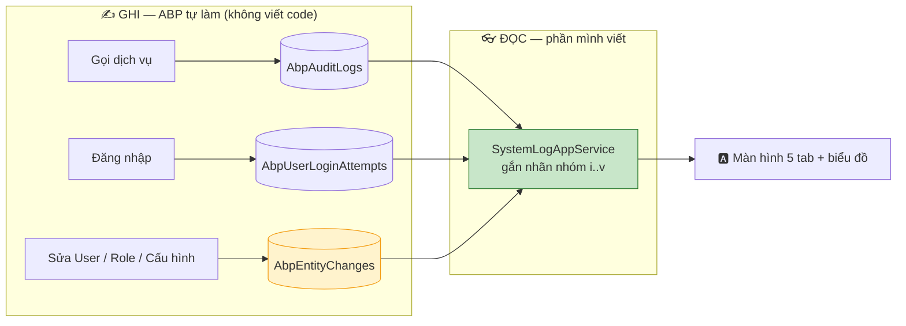
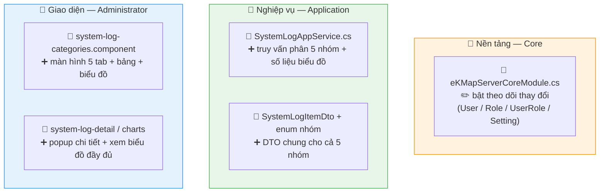

# Phân loại nhật ký hệ thống theo 05 nhóm

> Gom nhật ký sẵn có thành **5 nhóm** cho màn hình tra cứu. Không tạo bảng log mới, không migration.

## 1. Năm nhóm nhật ký

| # | Nhóm | Trả lời câu hỏi | Nguồn dữ liệu |
|---|---|---|---|
| i | Truy cập phần mềm | Ai gọi gì, lúc nào, từ đâu | `AbpAuditLogs` |
| ii | Đăng nhập quản trị | Ai đăng nhập admin, thành/bại | `AbpUserLoginAttempts` |
| iii | Lỗi phát sinh | Lỗi gì, ở đâu | `AbpAuditLogs` (có lỗi) + `Logs.txt` |
| iv | Quản lý tài khoản | Tài khoản/quyền đổi **từ gì → gì** | `AbpEntityChanges` |
| v | Thay đổi cấu hình | Tham số đổi **từ gì → gì** | `AbpEntityChanges` |

## 2. Cách hoạt động

**Hai điều cốt lõi:**

- **Không viết code ghi log** — ABP đã ghi sẵn ở tầng khung. Chỉ cần **bật theo dõi thay đổi** cho `User / Role / UserRole / Setting` (cho nhóm iv, v).
- **Phân nhóm lúc ĐỌC**, không phải lúc ghi. CSDL **không có bảng log hợp nhất, không có cột "nhóm"** — mỗi nhóm là một truy vấn trên nguồn tương ứng, cùng quy về một DTO.

## 3. File nào — sửa gì

> ➕ thêm mới · ✏️ sửa

> Quyền: **dùng lại** `Administration.Audit` sẵn có — không tạo quyền mới, không đụng phân quyền vai trò.

## 4. Cần nhớ

!!! question "Bảng lưu 5 nhóm ở đâu? — KHÔNG có bảng nào cả"
    Có chủ đích. Log đã nằm ở các bảng ABP sẵn có; chúng chỉ **thiếu nhãn nhóm**, mà nhãn đó suy ra 100% từ nội dung. Tạo bảng hợp nhất = nhân đôi dung lượng + phải sửa 3 chỗ ghi của ABP (vỡ khi nâng cấp).

!!! note "Nhóm iv/v ghi được 'từ gì → gì'"
    Nhờ bật **theo dõi thay đổi (EntityHistory)**: so giá trị cũ ↔ mới mỗi khi lưu. `AbpAuditLogs` thường chỉ có tham số **mới**, không có giá trị cũ để đối chiếu.

!!! warning "Giới hạn: chỉ bắt thay đổi qua ứng dụng"
    Theo dõi thay đổi móc lúc lưu qua ứng dụng, **không phải** ở tầng database. Sửa thẳng DB (SSMS/`psql`) hay sửa tay `appsettings.json` **không để lại vết**. → Ghi rõ giới hạn này khi nghiệm thu, kiểm soát bù bằng **phân quyền truy cập DB**.

!!! danger "Không hồi tố — bật càng sớm càng tốt"
    Nhóm iv/v **rỗng** cho tới khi có thay đổi mới sau khi bật; lịch sử trước đó không dựng lại được. Nên deploy bước "bật theo dõi thay đổi" **riêng và sớm** để tích lũy dữ liệu.

!!! tip "Không migration"
    3 bảng theo dõi thay đổi đã có sẵn trong schema (do ABP sinh). Chỉ bật cấu hình + build lại + restart, **không cần `dotnet ef`**.
