# Xác thực 2 bước (2FA) — nghiên cứu & thiết kế

**Ngày:** 2026-07-24 · **Trạng thái:** 📐 Đề xuất — chốt thiết kế trước khi code · **Mức độ:** 🔴 Cao (đụng thẳng luồng đăng nhập)

!!! abstract "Tóm tắt một dòng"
    Hạ tầng 2FA của ABP **đã có sẵn gần đủ** (cột DB, setting, service sinh/kiểm mã), nhưng **cổng đăng nhập đã bị viết lại và bỏ mất bước thử thách mã**. Việc cần làm không phải "xây từ đầu" mà là **nối lại 3 mắt xích còn thiếu** — theo đúng bản mẫu có sẵn trong dự án là luồng `ForceChangePassword`.

!!! info "Đây là hạng mục BẮT BUỘC"
    2FA nằm trong tài liệu bảo vệ dữ liệu của dự án ⇒ phải triển khai, không phải tùy chọn. **Áp dụng cho mọi tài khoản, gồm cả admin** — hạng mục tuân thủ bắt buộc không thể miễn cho tài khoản quyền cao nhất; miễn admin là điểm trừ nặng khi đánh giá. Đường khôi phục cho admin (§8, §10 bước 1) là cái làm cho việc "admin cũng phải bật" trở nên an toàn.

---

## 1. 2FA là gì (nhắc nhanh)

Xác thực dựa trên việc chứng minh 2 **yếu tố khác loại**:

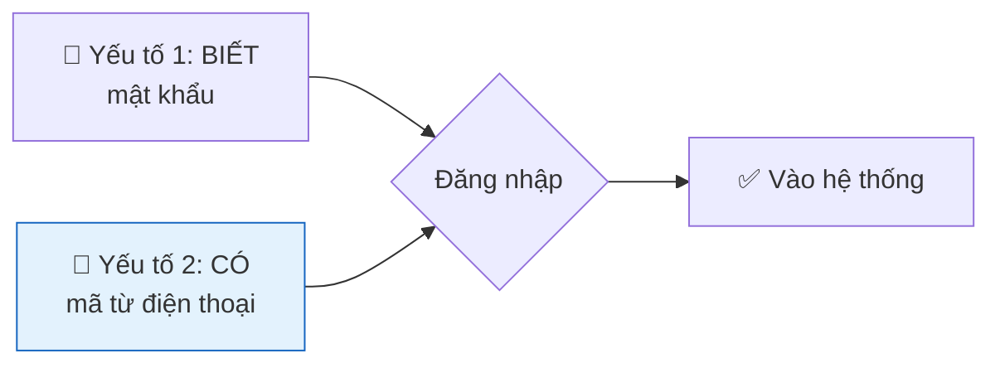

Kẻ trộm được mật khẩu vẫn chưa vào được vì thiếu điện thoại. Ba phương thức phổ biến, xếp theo độ ưu tiên đề xuất:

| Phương thức | Cần gì | Đánh giá cho dự án này |
|---|---|---|
| **Google Authenticator (TOTP)** | App trên điện thoại, không cần mạng | ⭐ Nên chọn đầu tiên — miễn phí, không phụ thuộc hạ tầng ngoài |
| **Email OTP** | SMTP hoạt động | Khả thi, nhưng SMTP hiện trỏ `127.0.0.1:25` — chưa chắc gửi được thật |
| **SMS OTP** | Cổng SMS trả phí | Chưa có nhà cung cấp — để sau |

---

## 2. Hiện trạng: khung có sẵn, dây bị đứt

### Cái ĐÃ có

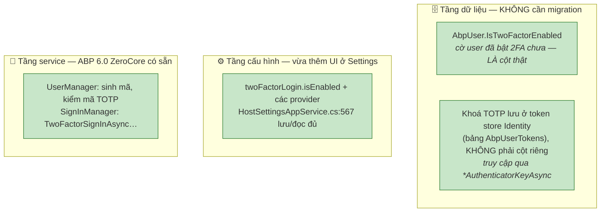

`User` kế thừa `AbpUser` (`User.cs:8`) nên `IsTwoFactorEnabled` có sẵn trong bảng `AbpUsers`, còn khoá TOTP nằm ở bảng `AbpUserTokens` (đã có sẵn trong schema ABP.Zero) — **không thêm cột, không migration**.

!!! warning "Đính chính (phát hiện lúc code Bước 1)"
    Bản đầu tài liệu này ghi "`AbpUser.GoogleAuthenticatorKey` là cột lưu khoá" — **SAI** với ABP 6.0 đang dùng. Compiler bắt lỗi ngay khi thử gán `user.GoogleAuthenticatorKey`: property đó không tồn tại. Sự thật: khoá authenticator lưu qua **token store của Identity**, thao tác bằng `GenerateNewAuthenticatorKeyAsync` / `GetAuthenticatorKeyAsync` / `ResetAuthenticatorKeyAsync` (Bước 2 dùng tới). Đây đúng là loại chi tiết mà [note cuối §10](#ke-hoach) đã dặn "phải đối chiếu lại với source khi code" — và compiler chính là cái đối chiếu đó.

### Cái ĐANG thiếu — vì sao 2FA hiện không chạy

Cổng đăng nhập đã được viết lại (thêm ép đổi mật khẩu, kiểm hết hạn) và trong lúc đó **đánh rơi** bước thử thách 2FA:

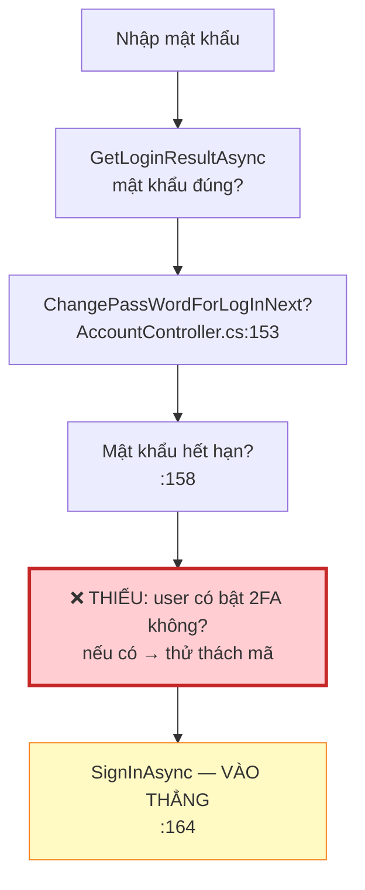

Đã grep toàn bộ `AccountController`: **không có** `TwoFactorSignInAsync`, `RequiresTwoFactor`, hay `GenerateTwoFactorToken`. Công tắc trong Settings hiện là **nút không nối dây** — bật lên chỉ lưu cấu hình.

---

## 3. Ba mắt xích phải nối

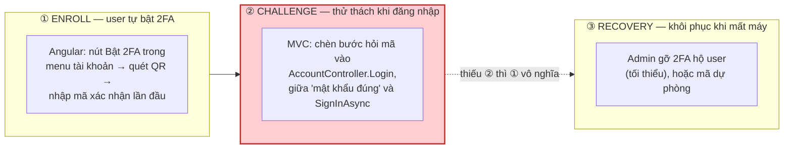

!!! danger "Thứ tự làm KHÔNG được tùy tiện"
    **Mảnh ② (challenge) phải xong trước hoặc cùng lúc với ① (enroll).** Nếu chỉ làm trang enroll, user quét QR và tưởng đã được bảo vệ, trong khi đăng nhập vẫn chỉ cần mật khẩu → **an toàn giả**, đúng dạng lỗi "báo thành công nhưng không có tác dụng" như bug đặt lại mật khẩu. Còn ③ là điều kiện bắt buộc để dám bật thật: không có đường khôi phục thì mất điện thoại = mất tài khoản vĩnh viễn.

---

## 4. Vị trí code: enroll ở Angular, challenge ở MVC

Điểm dễ nhầm nhất về kiến trúc. Đăng nhập là **MVC/Razor** (`/Account/Login`), Angular chỉ nạp **sau khi** đã đăng nhập xong. Do đó 2 mảnh nằm ở 2 nơi khác nhau:

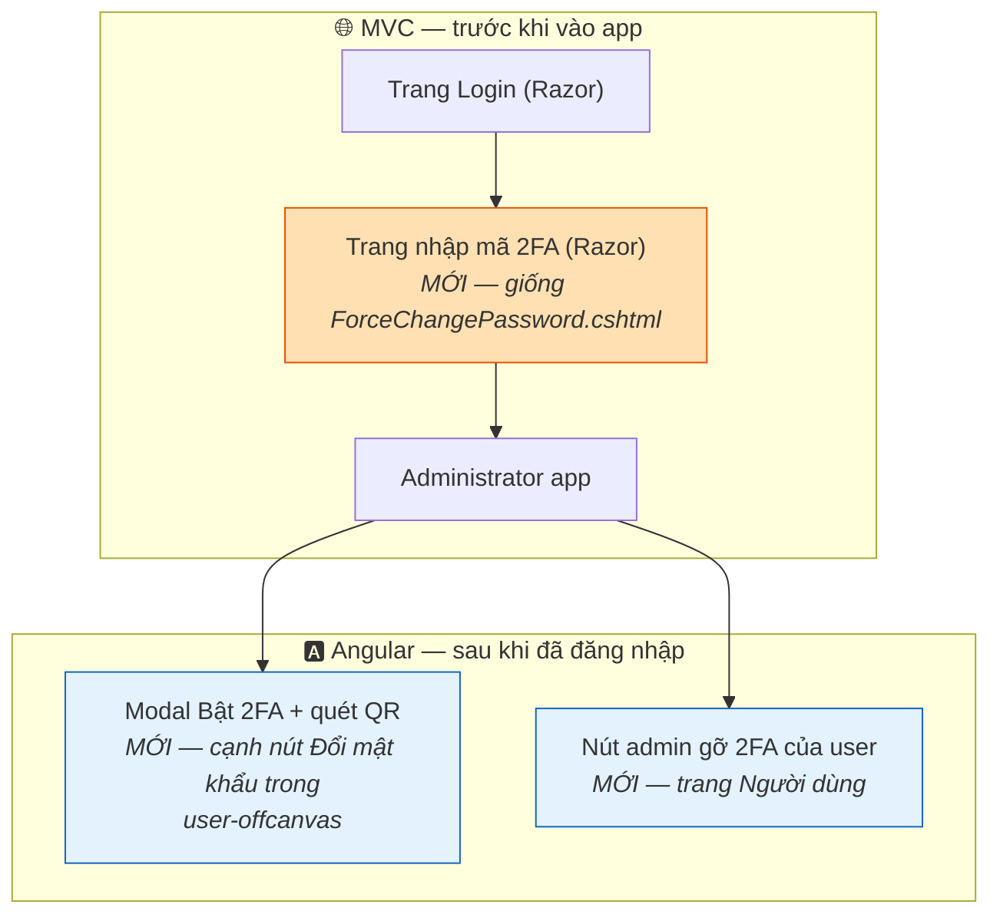

| Mắt xích | Tầng | File dự kiến |
|---|---|---|
| ② Challenge (trang nhập mã) | MVC | `AccountController` + `Views/Account/TwoFactorLogin.cshtml` + `.js` |
| ① Enroll (quét QR, xác nhận) | Angular + App service | `user-offcanvas/` + API mới trong `Application` |
| ③ Recovery (admin gỡ) | Angular + App service | trang Người dùng + API mới |

---

## 5. Bản mẫu có sẵn: luồng `ForceChangePassword`

Đây là chìa khóa khiến mảnh ② **không phải phát minh gì mới**. Dự án đã có sẵn một "bước trung gian dựa trên session chèn vào giữa login" — chính là ép đổi mật khẩu. 2FA đi theo y hệt khuôn đó:

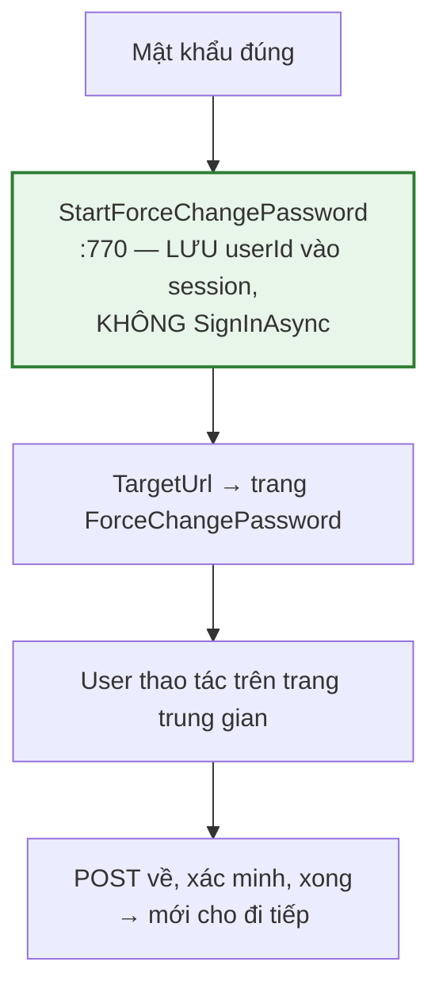

Ánh xạ sang 2FA — cùng bộ khung, chỉ đổi nội dung bước giữa:

| ForceChangePassword (đã có) | TwoFactorLogin (làm mới) |
|---|---|
| `StartForceChangePassword` lưu `ForcePwdUserId` vào session | `StartTwoFactor` lưu `TwoFactorUserId` vào session |
| `TryGetForceChangePasswordUserId` đọc + kiểm hết hạn 10 phút | `TryGetTwoFactorUserId` — copy nguyên |
| Trang `ForceChangePassword.cshtml` + `.js` | Trang `TwoFactorLogin.cshtml` + `.js` — copy khung |
| POST xác minh mật khẩu cũ → `UpdateAsync` | POST xác minh **mã 6 số** → `SignInAsync` |
| `ClearForceChangePasswordSession` | `ClearTwoFactorSession` |

!!! tip "Vì sao dùng session, không dùng cookie đăng nhập"
    Giữa 2 bước, user **chưa được đăng nhập** — mới chỉ chứng minh yếu tố 1. Nếu `SignInAsync` sớm rồi mới hỏi mã thì kẻ tấn công đã có cookie hợp lệ, thử thách thành vô nghĩa. Session giữ trạng thái "đang chờ mã" đúng như `ForcePwdUserId` giữ "đang chờ đổi mật khẩu". Có hạn 10 phút để không kẹt vĩnh viễn.

---

## 6. Luồng đăng nhập sau khi nối 2FA

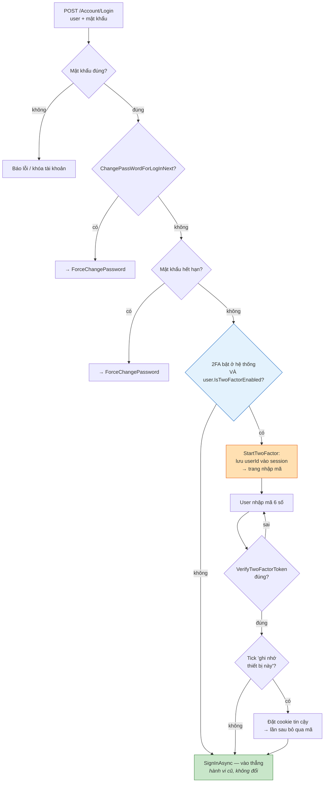

Điểm mấu chốt: nhánh `E → không → G` giữ **nguyên hành vi cũ**. User chưa bật 2FA đăng nhập y như trước. 2FA chỉ chen vào với ai đã tự bật — nên có thể triển khai dần, không ép toàn bộ.

---

## 7. Luồng thiết lập (enroll) — mảnh ①

TOTP hoạt động nhờ điện thoại và server **cùng giữ một khóa bí mật**. Bước enroll là lúc trao khóa đó cho điện thoại qua QR:

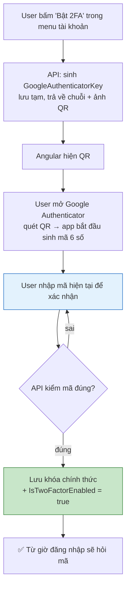

!!! warning "Bắt buộc có bước xác nhận mã trước khi bật"
    Không được bật 2FA ngay khi sinh QR. Phải đợi user nhập đúng một mã — đó là bằng chứng họ **đã quét thành công**. Bỏ bước này thì user quét hụt vẫn bị bật 2FA và tự khóa mình ngay lần đăng nhập sau.

---

## 8. Những quyết định phải chốt trước khi code {#quyet-dinh}

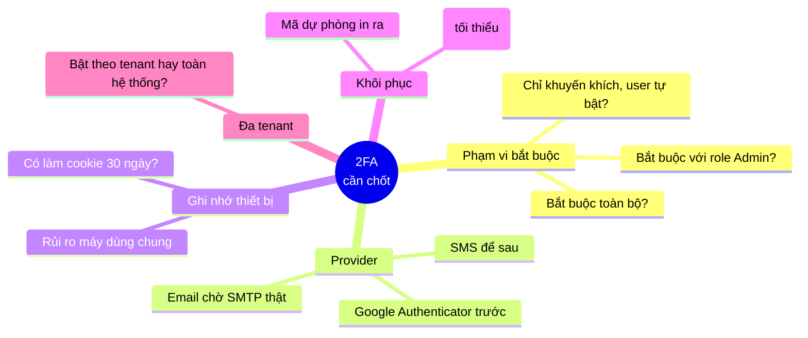

| Câu hỏi | Lựa chọn đề xuất | Vì sao |
|---|---|---|
| **Bắt buộc cho ai?** | ✅ ĐÃ CHỐT: **tất cả tài khoản, gồm cả admin** (hạng mục bắt buộc). Có thể bật dần theo nhóm nhưng admin KHÔNG được miễn | Yêu cầu tuân thủ; admin là tài khoản giá trị cao nhất |
| **Provider nào trước?** | ✅ ĐÃ CHỐT: **cả hai** — Google Authenticator + Email OTP | User chọn linh hoạt; lưu ý phải kiểm SMTP gửi thật trước khi bật Email |
| **Ghi nhớ thiết bị?** | Làm sau, mặc định tắt | Thêm bề mặt tấn công; không cần cho bản đầu |
| **Khôi phục?** | ✅ ĐÃ CHỐT: **cả ba** — mã dự phòng (user tự lo) + admin gỡ hộ + van khẩn cấp qua config cho admin | Hệ thống chỉ có 1 admin ⇒ van khẩn cấp là bắt buộc |
| **Đa tenant?** | Theo application (như setting hiện tại) | Khớp với `twoFactorLogin.isEnabled` đang lưu ở mức application |

!!! danger "Hệ thống chỉ có 1 tài khoản admin — van khẩn cấp là BẮT BUỘC, làm TRƯỚC TIÊN"
    Với một admin duy nhất, không có admin thứ hai để gỡ hộ. Nếu admin bật 2FA rồi mất/hỏng điện thoại **trước khi** có van khẩn cấp, toàn hệ thống mất quyền quản trị vĩnh viễn — sửa lại setting cũng là hành vi quản trị. Vì vậy:

    1. **Van khẩn cấp qua `appsettings.json`** (ví dụ `TwoFactor:BypassForAdmin` hoặc cờ tắt 2FA toàn cục) phải tồn tại và kiểm thử **trước khi** admin được phép bật 2FA. Mô hình giống hệt `alwaysAllowLoopback`/van trong `appsettings.json` của [Admin IP Allowlist](admin-ip-restriction-feature.md#self-lockout).
    2. **Mã dự phòng** phải được sinh và bắt admin lưu **ngay tại bước enroll**, không cho bỏ qua.
    3. Cân nhắc **tạo thêm 1 tài khoản admin dự phòng** trước khi bật — rẻ nhất và hiệu quả nhất để phá thế "single point of failure".

---

## 9. Rủi ro

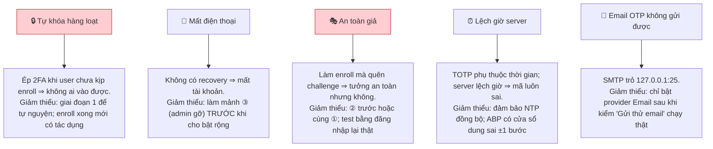

---

## 10. Kế hoạch triển khai đề xuất {#ke-hoach}

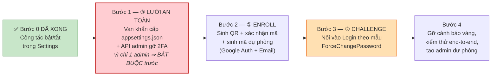

Thứ tự này chọn có chủ đích: **làm lưới an toàn (③) trước**, rồi mới enroll (①), cuối cùng mới bật thử thách (②). Nhờ vậy ở mọi thời điểm giữa chừng, không ai có thể tự khóa mình mà không có đường gỡ. Với ràng buộc **1 admin duy nhất**, bước 1 không chỉ là "nên làm trước" mà là **điều kiện tiên quyết** — chưa có van khẩn cấp thì tuyệt đối chưa cho admin bật 2FA.

!!! note "Điểm cần xác minh khi bắt tay code"
    Tài liệu này chốt *kiến trúc và luồng*. Tên API chính xác của ABP 6.0 ZeroCore cho phần sinh/kiểm mã TOTP (`GenerateNewAuthenticatorKeyAsync`, `VerifyTwoFactorTokenAsync`, `TwoFactorSignInAsync`…) cần đối chiếu lại với source ABP đang tham chiếu ở bước code — khung luồng thì không đổi dù tên method có khác chút.

---

*Xem thêm: [Hết hạn mật khẩu & Đổi mật khẩu bắt buộc](password-expiration-feature.md) — nơi có luồng `ForceChangePassword` được dùng làm bản mẫu cho mảnh ② ở đây.*
